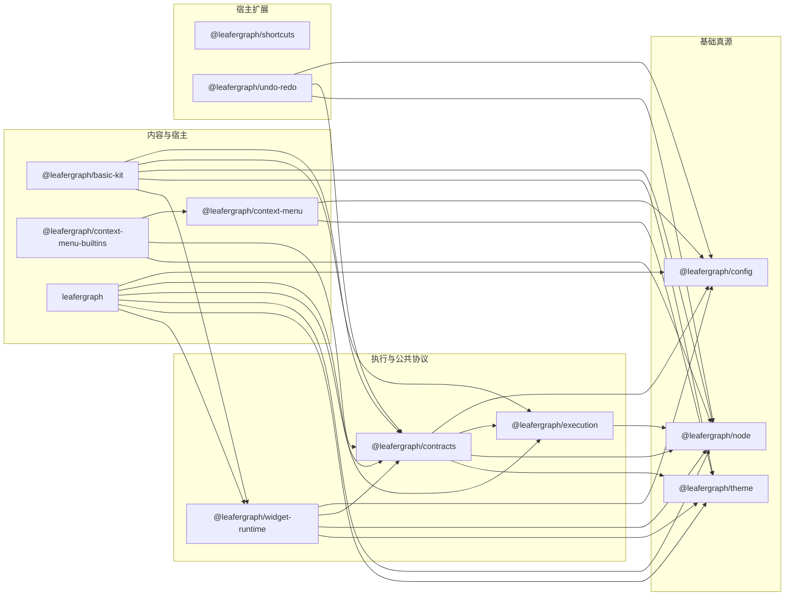

# LeaferGraph Workspace

`leafergraph` 当前是一个 Leafer-first 的多包 workspace。

这份根 README 只做三件事：

- 告诉你现在仓库里有哪些正式包、示例、模板和维护文档
- 说明这些包之间的职责边界和依赖方向
- 帮你快速判断“我现在应该先看哪个包 / 哪份文档”

如果你只想开始用，优先看各包 README。  
如果你在维护主包内部装配链，再继续看 `packages/leafergraph` 里的深层文档。  
如果你在整理未来演进路线，再看 `docs/索引.md` 和 `docs/工程导航索引.md`。

## 项目分层

当前 workspace 可以按六层理解：

| 层级 | 包 | 作用 |
| --- | --- | --- |
| 基础真源 | `@leafergraph/node`、`@leafergraph/theme`、`@leafergraph/config` | 定义模型、视觉主题和非视觉配置真源 |
| 执行与公共协议 | `@leafergraph/execution`、`@leafergraph/contracts` | 定义执行链、共享宿主类型、图 API 输入输出和 diff helper |
| 运行时支撑 | `@leafergraph/widget-runtime` | 提供 Widget registry、renderer lifecycle、editing 和 interaction helper |
| 内容与宿主 | `@leafergraph/basic-kit`、`leafergraph` | 提供默认内容包和 Leafer 图运行时主包 |
| 菜单与宿主扩展 | `@leafergraph/context-menu`、`@leafergraph/context-menu-builtins`、`@leafergraph/shortcuts`、`@leafergraph/undo-redo` | 提供右键菜单、菜单 builtins、快捷键和历史栈扩展 |
| 作者层与消费样例 | `@leafergraph/authoring`、`example/`、`templates/` | 提供作者层 SDK、示例工程和可复制模板 |

额外记住两个固定约束：

- `leafergraph` 已经收口成 runtime-only 主包，不再聚合 re-export 其它真源包。
- `@leafergraph/shortcuts`、`@leafergraph/undo-redo` 已进入默认 build/test 聚合，但文档定位仍然是“非核心维护包 / 宿主扩展层”。
- `RuntimeFeedbackEvent` 类型真源在 `@leafergraph/contracts`，主包根入口不再 re-export 该类型。

## 包关系

下面这张图只画 workspace 内部 `dependencies` 方向，不展开 `leafer-ui` 和 Leafer 官方插件依赖：



补充说明：

- `@leafergraph/authoring` 当前通过 `peerDependencies` 对齐 `@leafergraph/contracts`、`@leafergraph/execution`、`@leafergraph/node`、`@leafergraph/theme` 和 `leafergraph`。
- `@leafergraph/shortcuts` 当前无 workspace 内部依赖，通过结构兼容方式对接 `leafergraph`、右键菜单和历史栈。
- `@leafergraph/config` 只依赖外部 `leafer-ui`，不依赖任何其它 `@leafergraph/*` workspace 包。

## 我现在该先看哪里

### 我想直接跑一个图

1. [leafergraph README](./packages/leafergraph/README.md)
2. [使用与扩展指南](./packages/leafergraph/使用与扩展指南.md)
3. [mini-graph README](./example/mini-graph/README.md)

### 我想理解节点模型、文档和插件入口

1. [@leafergraph/node README](./packages/node/README.md)
2. [@leafergraph/contracts README](./packages/contracts/README.md)
3. [节点接入指南](./docs/API与插件接入.md)
4. [LeaferGraph 运行时](./docs/LeaferGraph运行时.md)

### 我想写节点类、Widget 类或对外模板

1. [@leafergraph/authoring README](./packages/authoring/README.md)
2. [authoring-basic-nodes README](./example/authoring-basic-nodes/README.md)
3. [Templates 总览](./templates/README.md)
4. [文档索引](./docs/索引.md)

### 我想接主题、配置、菜单、快捷键或历史栈

1. [@leafergraph/theme README](./packages/theme/README.md)
2. [@leafergraph/config README](./packages/config/README.md)
3. [@leafergraph/context-menu README](./extensions/context-menu/README.md)
4. [@leafergraph/context-menu-builtins README](./extensions/context-menu-builtins/README.md)
5. [@leafergraph/shortcuts README](./extensions/shortcuts/README.md)
6. [@leafergraph/undo-redo README](./extensions/undo-redo/README.md)

### 我在维护主包内部装配链

1. [leafergraph README](./packages/leafergraph/README.md)
2. [内部架构地图](./packages/leafergraph/内部架构地图.md)
3. [渲染刷新策略](./packages/leafergraph/渲染刷新策略.md)
4. [注意事项](./注意事项.md)

## 包入口导航

| 路径 | 什么时候看 | 你会在这里找到什么 |
| --- | --- | --- |
| [`packages/node`](./packages/node/README.md) | 需要模型真源时 | `NodeDefinition`、`NodeModule`、`GraphDocument`、`NodeRegistry` |
| [`packages/theme`](./packages/theme/README.md) | 需要视觉主题时 | `themePreset`、`themeMode`、graph/widget/context-menu token |
| [`packages/config`](./packages/config/README.md) | 需要行为配置时 | `graph`、`widget`、`context-menu`、`leafer` 配置和 normalize helper |
| [`packages/execution`](./packages/execution/README.md) | 需要执行内核时 | 执行上下文、传播语义、图级状态机和本地反馈适配器 |
| [`packages/contracts`](./packages/contracts/README.md) | 需要跨包共享协议时 | 插件协议、图 API 输入输出、Widget 契约、RuntimeFeedbackEvent、history/diff helper |
| [`packages/widget-runtime`](./packages/widget-runtime/README.md) | 需要 Widget runtime 真源时 | registry、renderer lifecycle、editing、interaction helper |
| [`packages/basic-kit`](./packages/basic-kit/README.md) | 需要默认内容时 | 基础 widgets、系统节点和一键安装 plugin |
| [`packages/leafergraph`](./packages/leafergraph/README.md) | 需要图运行时主包时 | `LeaferGraph`、`createLeaferGraph(...)` 和 runtime façade（`public/facade`） |
| [`extensions/context-menu`](./extensions/context-menu/README.md) | 需要纯 Leafer 菜单 runtime 时 | DOM 菜单 overlay、target 绑定、resolver 链 |
| [`extensions/context-menu-builtins`](./extensions/context-menu-builtins/README.md) | 需要节点图内建菜单动作时 | 复制、粘贴、删除、运行、历史和快捷键文案接线 |
| [`extensions/shortcuts`](./extensions/shortcuts/README.md) | 需要宿主快捷键时 | 功能注册表、按键注册表、graph 快捷键预设 |
| [`extensions/undo-redo`](./extensions/undo-redo/README.md) | 需要历史栈时 | undo/redo controller、graph history 绑定 |
| [`packages/authoring`](./packages/authoring/README.md) | 需要作者层 SDK 时 | `BaseNode`、`BaseWidget`、plugin / module 组装 |

## 深层文档

### 当前事实型专题

- [节点接入指南](./docs/API与插件接入.md)
- [LeaferGraph 运行时](./docs/LeaferGraph运行时.md)
- [工程导航索引](./docs/工程导航索引.md)

### 主包维护文档

- [使用与扩展指南](./packages/leafergraph/使用与扩展指南.md)
- [内部架构地图](./packages/leafergraph/内部架构地图.md)
- [渲染刷新策略](./packages/leafergraph/渲染刷新策略.md)

### 文档索引

- [文档索引](./docs/索引.md)

这里的分工固定为：

- README
  - 优先服务使用者，讲“什么时候依赖它、怎么接入、和谁配合”
- 深层维护文档
  - 优先服务维护者，讲“内部怎么装配、刷新链怎么走、边界怎么划”
- 文档索引
  - 只负责统一入口和阅读顺序，不和深读专题混写

## 示例与模板

### 示例

- [mini-graph](./example/mini-graph/README.md)
  - 当前最完整的公开 API 集成示例
  - 同时覆盖 `basic-kit`、菜单、shortcuts、undo-redo、bundle loader 和运行时动画
- [authoring-basic-nodes](./example/authoring-basic-nodes/README.md)
  - 纯作者层示例包
  - 适合看 `@leafergraph/authoring` 产物如何收口成 plugin / module

### 模板

| 模板 | 用途 | 产物形态 |
| --- | --- | --- |
| [`templates/node/authoring-node-template`](./templates/node/authoring-node-template/README.md) | 纯节点作者模板 | `module`、`plugin`、`dist/browser/node.iife.js` |
| [`templates/widget/authoring-text-widget-template`](./templates/widget/authoring-text-widget-template/README.md) | 纯 Widget 作者模板 | `widget entry`、`plugin`、`dist/browser/widget.iife.js` |
| [`templates/misc/authoring-browser-plugin-template`](./templates/misc/authoring-browser-plugin-template/README.md) | node / widget / demo 组合模板 | `dist/browser/widget.iife.js`、`node.iife.js`、`demo.iife.js` |

当前 `templates/` 下没有活动中的 backend 模板，这份根 README 也不再保留旧 backend 模板链接。

## 常用命令

在仓库根目录执行：

```bash
bun install
bun run check:boundaries
bun run build
bun run test:core
bun run test:smoke
bun run test
```

也可以按包或样例拆开执行：

```bash
bun run build:node
bun run build:execution
bun run build:theme
bun run build:config
bun run build:contracts
bun run build:widget-runtime
bun run build:basic-kit
bun run build:authoring
bun run build:context-menu
bun run build:context-menu-builtins
bun run build:shortcuts
bun run build:undo-redo
bun run build:leafergraph
bun run build:minimal-graph
bun run build:authoring-basic-nodes
```

命令约定：

- `build`
  - 只构建正式包，不自动构建 examples/templates
- `test:core`
  - 运行正式包测试
- `test:smoke`
  - 运行 example/template 的 `check/build` 级 smoke
- `test`
  - 先跑边界检查，再跑正式包测试和 smoke

## 文档维护约定

- 根 README 只保留现状入口，不再为已删除目录或历史兼容结构保留导航。
- 包 README 只讲该包自己的使用入口、职责边界和真实导出。
- `docs/` 下的事实型专题以当前源码和包 README 为准；如果二者冲突，优先相信当前源码。
- `注意事项.md` 用于维护跨任务复用的踩坑记录，不写成方案草案。
