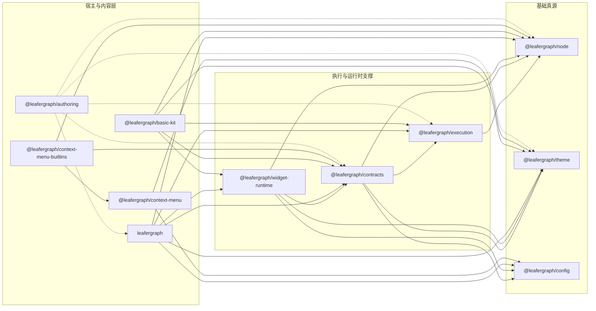

# LeaferGraph Workspace

`leafergraph` 当前是一个 Leafer-first workspace，正式内容已经按“模型、执行、主题、配置、公共契约、Widget runtime、默认内容包、作者层、交互扩展与运行时宿主”拆成多个独立包。

历史上围绕若干已删目录的设计稿已经不再是当前仓库入口，本文只保留和现状一致的导航。

## 当前目录

- `packages/node`
  - 节点定义、`NodeModule`、`NodeRegistry`、`GraphDocument` 等图模型真源
- `packages/theme`
  - 主题 preset 注册表与 graph/widget/context-menu 视觉主题真源
- `packages/config`
  - 非视觉配置真源、默认值解析与 Leafer 配置桥接，不依赖其它 workspace 包
- `packages/execution`
  - 纯执行内核，负责执行链、传播、图级运行状态机和执行反馈
- `packages/contracts`
  - workspace 公共契约真源，负责插件、宿主、Widget、Graph API 输入输出、交互提交与 diff 等共享协议，不承载 `LeaferGraph` 运行时实现
- `packages/widget-runtime`
  - Widget registry、生命周期、编辑、交互与缺失态 renderer 等 runtime 基础设施
- `packages/basic-kit`
  - 默认内容包，负责基础 widgets、系统节点与一键安装 plugin
- `packages/authoring`
  - 面向节点 / Widget 作者的 authoring SDK，服务 bundle、注册与开发者接入
- `packages/leafergraph`
  - Leafer-first 图运行时主包，负责场景装配、交互基础设施、视口和宿主 facade，不再聚合 re-export 其它真源包
- `packages/context-menu`
  - Leafer-first 右键菜单 runtime 包，负责 DOM 菜单运行时
- `packages/context-menu-builtins`
  - `leafergraph` 节点图右键菜单 builtins 集成层，负责复制、粘贴、删除、运行等内建动作
- `example/`
  - 当前仍在维护的示例工程，主要包括 `mini-graph` 与 `authoring-basic-nodes`
- `templates/`
  - 可复制出去的模板工程与模板分类入口
- `docs/`
  - 当前仍在维护的设计文档

## 包依赖关系

以下关系按当前各包 `package.json` 整理，只列 workspace 内部依赖；`leafer-ui` 和 Leafer 官方插件依赖不在这里展开。

可以先看这张总览图：



说明：

- 实线表示 `dependencies`
- 虚线表示 `peerDependencies`

可以先按分层理解：

- 基础真源：`@leafergraph/node`、`@leafergraph/theme`
- 配置层：`@leafergraph/config`
- 执行与契约层：`@leafergraph/execution`、`@leafergraph/contracts`
- 运行时支撑层：`@leafergraph/widget-runtime`
- 内容与宿主层：`@leafergraph/basic-kit`、`leafergraph`、`@leafergraph/context-menu`
- 菜单集成层：`@leafergraph/context-menu-builtins`
- 作者层：`@leafergraph/authoring`

其中 `@leafergraph/contracts` 可以直接理解成“跨包公共协议层”：

- 它位于模型、主题、配置和执行内核之上
- 它位于 `leafergraph` 主包、`authoring`、`widget-runtime` 等具体宿主实现之下
- 它的职责是统一这些包共享的公共输入输出和宿主协议，避免每个包各自定义一套接口

逐包依赖如下：

- `@leafergraph/node`
  - 无 workspace 内部依赖
- `@leafergraph/execution`
  - `@leafergraph/node`
- `@leafergraph/theme`
  - 无 workspace 内部依赖
- `@leafergraph/config`
  - 无 workspace 内部依赖
- `@leafergraph/contracts`
  - `@leafergraph/config`
  - `@leafergraph/execution`
  - `@leafergraph/node`
  - `@leafergraph/theme`
- `@leafergraph/widget-runtime`
  - `@leafergraph/config`
  - `@leafergraph/contracts`
  - `@leafergraph/node`
  - `@leafergraph/theme`
- `leafergraph`
  - `@leafergraph/config`
  - `@leafergraph/contracts`
  - `@leafergraph/execution`
  - `@leafergraph/node`
  - `@leafergraph/theme`
  - `@leafergraph/widget-runtime`
- `@leafergraph/basic-kit`
  - `@leafergraph/contracts`
  - `@leafergraph/execution`
  - `@leafergraph/node`
  - `@leafergraph/theme`
  - `@leafergraph/widget-runtime`
- `@leafergraph/context-menu`
  - `@leafergraph/config`
  - `@leafergraph/theme`
- `@leafergraph/context-menu-builtins`
  - `@leafergraph/context-menu`
  - `@leafergraph/contracts`
  - `@leafergraph/node`
- `@leafergraph/authoring`
  - 当前不通过 `dependencies` 直接绑定 workspace 包
  - 通过 `peerDependencies` 对齐 `@leafergraph/contracts`、`@leafergraph/execution`、`@leafergraph/node`、`@leafergraph/theme` 和 `leafergraph`

如果你想从底层往上理解当前仓库，建议先按 `node -> theme -> config -> execution -> contracts -> widget-runtime -> leafergraph -> context-menu -> context-menu-builtins / basic-kit / authoring` 这条链阅读。

## 推荐阅读顺序

1. [`packages/node/README.md`](./packages/node/README.md)
2. [`packages/theme/README.md`](./packages/theme/README.md)
3. [`packages/config/README.md`](./packages/config/README.md)
4. [`packages/execution/README.md`](./packages/execution/README.md)
5. [`packages/contracts/README.md`](./packages/contracts/README.md)
6. [`packages/widget-runtime/README.md`](./packages/widget-runtime/README.md)
7. [`packages/leafergraph/README.md`](./packages/leafergraph/README.md)
8. [`packages/basic-kit/README.md`](./packages/basic-kit/README.md)
9. [`packages/context-menu/README.md`](./packages/context-menu/README.md)
10. [`packages/context-menu-builtins/README.md`](./packages/context-menu-builtins/README.md)
11. [`packages/authoring/README.md`](./packages/authoring/README.md)
12. [`packages/leafergraph/使用与扩展指南.md`](./packages/leafergraph/使用与扩展指南.md)
13. [`packages/leafergraph/内部架构地图.md`](./packages/leafergraph/内部架构地图.md)
14. [`templates/README.md`](./templates/README.md)

如果你更关心当前仍在维护的设计文档，优先看：

- [`docs/节点API方案.md`](./docs/节点API方案.md)
- [`docs/节点插件接入方案.md`](./docs/节点插件接入方案.md)
- [`docs/开发者友好节点作者层与接入包方案.md`](./docs/开发者友好节点作者层与接入包方案.md)
- [`docs/连线路由.md`](./docs/连线路由.md)

## 常用命令

在仓库根目录执行：

```bash
bun install
bun run check:boundaries
bun run build:node
bun run build:execution
bun run build:theme
bun run build:config
bun run build:contracts
bun run build:widget-runtime
bun run build:basic-kit
bun run build:authoring
bun run build:leafergraph
bun run build:context-menu
bun run build:context-menu-builtins
bun run test:core
bun run test:smoke
bun run test
```

命令约定：

- `build:*`
  - 只覆盖正式包，以及当前仍在维护的 example 构建入口
- `test:core`
  - 运行正式包测试；当前已覆盖 `node`、`execution`、`theme`、`contracts`、`widget-runtime`、`basic-kit`、`authoring`、`context-menu`、`context-menu-builtins`
- `test:smoke`
  - 运行 `example/` 与活动模板的 `check/build` 级 smoke，不启动 dev server，也不替代 UI 行为测试
- `test`
  - 先跑边界检查，再跑正式包测试和 smoke

当前文档不再把 `editor`、`sync`、`openrpc`、旧 Python authority/backend 相关脚本写成推荐入口，因为这些入口已经不对应当前 workspace 结构。

## 测试分层

- 正式包测试
  - 锁定模型、执行、契约、runtime 支撑与集成包的单元/集成行为
- example/template smoke
  - 锁定真源导入、bundle 出口和 workspace 构建链不漂移

如果你在排查“某个 API 行为为什么坏了”，优先跑正式包测试。  
如果你在排查“迁移后 example 或模板为什么又构建坏了”，优先跑 smoke。

## 模板入口

当前可直接阅读的模板说明有：

- [`templates/node/authoring-node-template/README.md`](./templates/node/authoring-node-template/README.md)
- [`templates/widget/authoring-text-widget-template/README.md`](./templates/widget/authoring-text-widget-template/README.md)
- [`templates/misc/authoring-browser-plugin-template/README.md`](./templates/misc/authoring-browser-plugin-template/README.md)
- [`templates/misc/backend-node-package-template/README.md`](./templates/misc/backend-node-package-template/README.md)

补充说明：

- `templates/backend/` 当前保留目录结构，但没有活动中的模板 README。
- 已删除目录对应的旧文档已经从当前入口移除，避免再把历史结构误写成现状。
