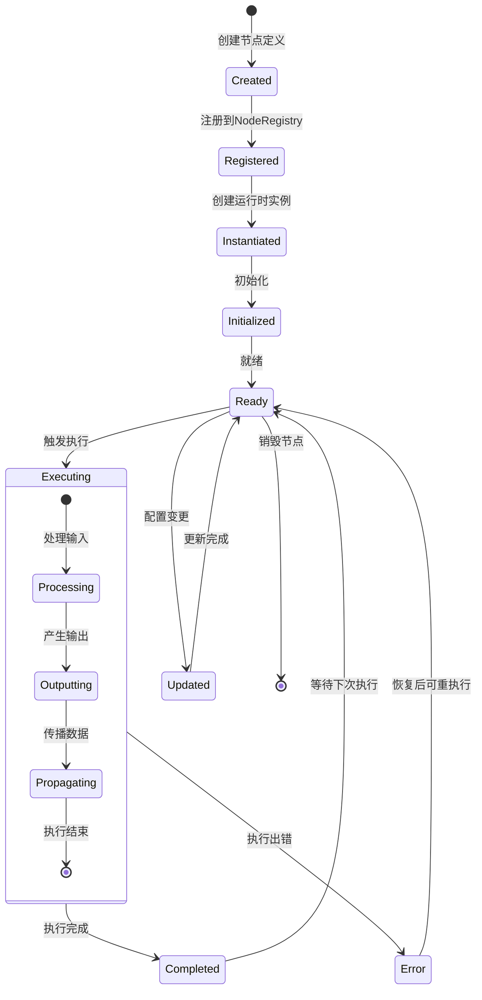
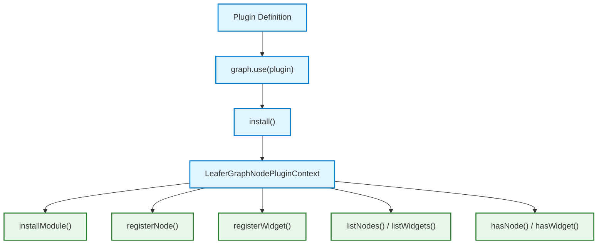
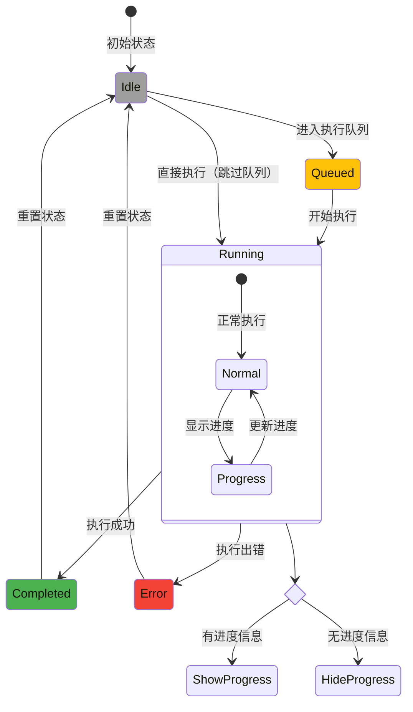

# 节点接入指南

## 节点生命周期流程图



## 插件接入流程图



## 连线路由算法图示


## 进度环和信号灯状态转换图



这份文档统一收口了以下四个主题：

- 节点 API 与节点外壳设计
- 外部节点包接入方案
- 连线路由
- 进度环与信号灯使用说明

它的目标不是删内容，而是把同类内容合并到一处主说明，并附带一份可直接跳转源码的代码索引。

## 适用内容

- `@leafergraph/node` 的模型和模块设计
- 节点外壳与宿主 API 的边界
- 插件和模块的接入约定
- 连线路由和连线路径行为
- 节点状态灯和进度环的显示规则

## 节点 API

当前节点 API 已经不是纯概念提案，而是围绕 `packages/node` 与 `packages/leafergraph` 形成了两层接口：

1. 模型层 API
   - `NodeDefinition`
   - `NodeModule`
   - `NodeRegistry`
   - `createNodeApi`
   - `installNodeModule(...)`
2. 宿主层 API
   - `LeaferGraph`
   - `registerWidget(entry)`
   - `createNode(...)`
   - `updateNode(...)`
   - `moveNode(...)`
   - `resizeNode(...)`
   - `removeNode(...)`
   - `getNodeSnapshot(...)`

这份文档的目标是把“当前已经存在的接口”与“仍然属于设计约束的外壳方案”拆开说明。

### 模型层接口

`NodeDefinition` 已经是正式节点类型入口，负责描述：

- `type`
- `title`
- `inputs`
- `outputs`
- `widgets`
- `properties`
- `resize`
- 生命周期钩子

`NodeModule` 是外部节点扩展的正式模型入口。当前推荐的能力分工是：

- 节点模块通过 `installNodeModule(...)` 进入注册表
- widget 通过 `registerWidget(entry)` 进入主包 widget registry
- editor bundle 只是接入方式，不替代正式模块接口

当前正式节点文档模型已经统一到 `GraphDocument`：

- 文档级身份：`documentId`、`revision`、`appKind`
- 节点集合：`nodes`
- 连线集合：`links`
- 可选能力：`capabilityProfile`
- 可选适配信息：`adapterBinding`

当前结构性编辑已经有正式操作模型：

- `node.create`
- `node.update`
- `node.move`
- `node.resize`
- `node.remove`
- `link.create`
- `link.remove`
- `link.reconnect`
- `document.update`

这意味着：

- 节点 API 不只是本地函数调用
- 它已经具备 authority、回放和确认语义的正式抽象基础

### 宿主层接口

`packages/leafergraph/src/index.ts` 当前对外提供的节点相关入口包括：

- `listNodes()`
- `getNodeSnapshot(nodeId)`
- `getNodeInspectorState(nodeId)`
- `createNode(...)`
- `updateNode(...)`
- `moveNode(...)`
- `resizeNode(...)`
- `removeNode(...)`
- `setNodeCollapsed(...)`
- `playFromNode(...)`

这些方法在内部通过 `packages/leafergraph/src/public/facade/*` 分组挂载到实例原型，但对外使用就是 `graph.xxx()`。

这层是宿主与场景层 API，不属于 `packages/node` 纯模型层。

### 节点生命周期

当前节点生命周期需要区分两层：

1. 节点定义层生命周期
   - `onCreated`
   - `onConfigure`
   - `onConnectionsChange`
   - `onAction`
   - `onExecute`
2. 宿主层运行反馈
   - 节点状态变化
   - 节点执行事件
   - 图执行状态
   - 连线传播事件

文档不应再把“本地执行函数能跑起来”写成唯一执行模型；当前已经有 `RuntimeFeedbackEvent` 作为更正式的反馈抽象（类型真源在 `@leafergraph/contracts`）。

### 节点外壳设计约束

下面这些内容仍然是设计约束，但已经明显贴近当前主包实现：

#### 节点壳是 retained-mode 场景对象，不是临时 DOM 拼装

当前节点壳由主包节点宿主维护，核心目标是：

- 节点根视图稳定存在
- 内容区、端口区、widget 区可以局部刷新
- 交互态、选中态、折叠态和 resize 能共享同一套壳结构

#### 节点壳刷新不等于整图替换

当前必须明确区分：

- `replaceGraphDocument(...)`：整图替换
- `refreshNodeView(...)`：单节点整壳重建
- widget 快速更新：局部 renderer `update(...)`

节点外壳设计必须服从这条刷新边界，避免把所有可见变化都做成整图替换。

#### slot / widget / header 是稳定结构，而不是自由堆叠

当前节点 UI 设计应继续围绕这些固定区块：

- Header
- 输入槽位区
- 输出槽位区
- Widget 区
- 折叠 / 信号 / resize 句柄等宿主交互区

这样才能让：

- 命中测试
- 折叠
- resize
- 连线锚点
- widget 交互

共享稳定几何。

### 视觉与实现边界

设计稿与代码接口必须分开写。

节点外壳的视觉方向、Figma 约束、token 建议仍然有价值，但它们属于：

- 视觉约束
- 交互体验目标
- 性能预算参考

不等于当前正式 TypeScript API。

当前不应再写成现状的内容：

- 尚未存在的 `GraphModel` 新包结构
- 与当前 `GraphDocument` 不一致的概念字段
- 把旧 demo 节点输入当成正式节点文档模型

### 对外部作者的建议

当前推荐顺序是：

1. 先写 `NodeDefinition`
2. 再把多个定义整理成 `NodeModule`
3. 再用 `installNodeModule(...)` 或主包插件入口接入
4. 如果是 editor 本地联调，再额外产出 bundle

当前 widget 的正式宿主入口是：

- `registerWidget(entry)`

而不是假想中的“节点定义里任意塞 renderer 实例”。

如果节点最终要进入 remote authority 链，当前应优先保证：

- 节点快照可序列化
- 节点更新能映射到 `GraphOperation`
- 运行态变化能映射到 `RuntimeFeedbackEvent`

## 插件接入

当前外部节点接入应明确分成两条路径：

1. 正式包接入
   - 基于 `NodeModule`
   - 通过 `installNodeModule(...)`、主包插件或主包注册入口进入系统
2. bundle 宿主装载接入
   - 基于 `demo / node / widget` bundle
   - 通过宿主 loader 和 `LeaferGraphEditorBundleBridge.registerBundle(...)` 进入系统

当前推荐优先级是：

- 长期能力、对外复用、稳定生态：优先正式包接入
- 本地联调、快速验证、演示交付：再补 browser bundle 接入

### 当前问题定义

外部节点接入当前要同时解决三件事：

1. 节点定义怎样进入统一注册表。
2. widget renderer 怎样进入统一 widget registry。
3. 外部宿主在不源码直连外部工程的情况下，怎样装入本地或远端 bundle。

如果不区分这三件事，最容易出现的问题就是：

- 把 bundle bridge 误当成主包长期 API
- 把宿主本地联调协议写成正式分发协议
- 把节点模块、widget 注册和蓝图文档混成一个“万能插件”

### 当前正式接入模型

当前推荐的模型中心仍然是：

- `NodeDefinition`
- `NodeModule`
- `NodeRegistry`
- `installNodeModule(...)`

这条路径的特点是：

- 语义清晰
- 不依赖浏览器脚本桥
- 可以稳定服务主包和后续外部应用接入

当前 widget 的正式宿主入口已经收口为：

- `registerWidget(entry)`

因此当前外部插件应默认理解为：

- 节点定义进入节点注册表
- widget 定义进入 widget registry
- 两者在宿主层汇合，而不是互相替代

当前 browser bundle 的职责是：

- 帮外部作者在浏览器内快速导入 node / widget / demo
- 帮 authority 推送前端 bundle
- 帮模板工程提供本地联调与演示产物

它不是用来替代 `NodeModule` 或正式包分发的唯一方案。

### 推荐边界

必须持续区分：

| 层 | 当前正式入口 |
| :--- | :--- |
| 模型层 | `NodeDefinition`、`NodeModule`、`installNodeModule(...)` |
| widget 宿主层 | `registerWidget(entry)` |
| bundle 宿主层 | `LeaferGraphEditorBundleBridge.registerBundle(...)`、模板内的 `registerAuthoring...Bundle(...)` 入口 |

当前 authority 或外层宿主常见会传递：

- 正式 `GraphDocument`
- `GraphDocumentDiff`
- `RuntimeFeedbackEvent`
- browser bundle manifest

但这不改变插件接入的长期边界：

- authority 同步的是会话和远端来源
- 插件接入定义的是节点与组件怎样进入系统

### 推荐目录与产物模型

当前正式包侧建议维持类似结构：

```text
your-node-package/
  src/
    index.ts
    module.ts
    nodes/
    widgets/
```

其中：

- `module.ts` 负责导出 `NodeModule`
- `nodes/` 放节点定义
- `widgets/` 放 widget entry 或配套逻辑
- `index.ts` 作为包公共入口

若需要 browser bundle 导入，则再额外补 browser 产物，例如：

```text
dist/browser/
  node.iife.js
  widget.iife.js
  demo.iife.js
  demo-alt.iife.js
```

当前这条链推荐直接使用：

- `templates/misc/authoring-browser-plugin-template`

### 模板与构建建议

当前模板工程不是“唯一正式分发方式”，而是：

- 外部作者样例
- browser bundle 样例
- ESM + IIFE 双产物样例

当前推荐保持：

- 正式 ESM 包构建
- browser IIFE bundle 构建

这样可以同时服务：

- 主包或其它工程 `import`
- 支持这些 bundle 的宿主或 authority 前端 bundle 同步

当前更推荐使用中性命名，例如：

- `@example/math-nodes`
- `@sample/image-tools`
- `@your-org/vision-nodes`

### bundle 语义与约束

当前 `node` bundle 负责：

- 节点插件安装
- 可选 `quickCreateNodeType`

当前 `widget` bundle 负责：

- widget renderer
- 组件配套逻辑

当前 `demo` bundle 负责：

- 一份正式 `GraphDocument`

当前最佳实践仍然是把三者分开，而不是做一个“大而全”单 bundle。

当前必须坚持：

- 节点注册表由宿主持有
- widget registry 由宿主持有
- 外部包只提供定义和安装逻辑
- `LeaferGraphEditorBundleBridge.registerBundle(...)` 只属于宿主装载层
- 主包长期公共 API 不依赖它

当前外部节点若要接 authority 链，应默认满足：

- 节点快照可序列化
- 节点更新可表达成 `GraphOperation`
- 运行态变化可映射到 `RuntimeFeedbackEvent`（类型真源在 `@leafergraph/contracts`）

当前不推荐的做法：

- 不要把 browser bundle 当成唯一正式发布格式
- 不要把 `demo` 槽位命名扩散成主包长期模型命名
- 不要让外部包自己持有 registry
- 不要把某个外部应用专属协议直接写进核心节点模型
- 不要继续在文档里把旧 demo registry 描述为现行主线

## 连线路由

连线路由是运行时问题，不是模型问题。

当前 LeaferGraph 的正式连线路径由 `packages/leafergraph/src/link/link.ts` 负责。它的实现特征可以概括为：

- 路径形态沿用 LiteGraph 风格的三次贝塞尔曲线思路
- 端点和控制点计算已经收口成共享几何函数
- 正式连线渲染和数据流动画应复用同一份曲线几何，而不是各算各的

### 当前端点计算

当前端点计算入口是：

- `resolveLinkEndpoints(...)`

它根据以下输入计算起点和终点：

- 源节点位置与宽度
- 目标节点位置
- 源端口 Y
- 目标端口 Y
- 端口尺寸

当前设计特点是：

- 端点计算只负责几何
- 节点布局与端口选择由外部宿主决定
- 连线模块不直接承担节点布局逻辑

### 当前控制点策略

当前控制点计算入口是：

- `buildLinkCurve(...)`
- `resolveLinkCurve(...)`

控制点策略仍然保持 LiteGraph 风格的方向外推：

- 根据起止方向确定控制柄偏移方向
- 根据距离计算一个稳定的 handle 长度
- 用两个控制点生成三次贝塞尔曲线

相关辅助函数：

- `applyDirectionalHandle(...)`

### 当前路径输出与采样

当前路径字符串入口是：

- `buildLinkPathFromCurve(...)`
- `buildLinkPath(...)`

也就是说，当前连线模块已经把：

- 曲线几何
- 路径字符串生成
- 曲线采样

拆成可复用的几层，而不是把路径字符串写死在单个视图里。

当前数据流动画或沿线采样会复用：

- `sampleLinkCurvePoint(...)`

这非常重要，因为它保证：

- 正式连线路径
- overlay 动画采样点

来自同一条共享曲线，避免视觉路径和动画路径发生漂移。

### 当前实现边界

这份连线几何模块当前只负责：

- 端点
- 控制点
- 路径字符串
- 曲线采样

它不负责：

- 连线是否创建成功
- 连线命中菜单
- 连线动画对象生命周期
- 节点端口命中判定

这些能力分别由主包其它宿主负责。

## 运行时反馈与进度环

这一节把节点状态灯、长任务模式和进度环统一收口，避免它们散落在不同文档里。

### 先记住结论

如果你只想快速判断，可以直接记这三条：

1. 左上角信号灯表示节点执行状态。
2. 节点外圈进度环表示长任务运行状态。
3. 只有当节点处于 `running`，并且节点属性 `progressMode` 被设置为 `determinate` 或 `indeterminate` 时，进度环才会显示。

### 状态映射

信号灯只看节点执行状态，不看节点是否被选中。

| 执行状态 | 颜色 | 含义 |
| --- | --- | --- |
| `idle` | 灰色 | 没有正在执行的任务 |
| `running` | 橙色 | 节点正在执行长任务或处于运行中 |
| `success` | 绿色 | 上一次执行成功 |
| `error` | 红色 | 上一次执行失败 |

进度环只在以下条件同时成立时显示：

- 节点执行状态是 `running`
- `progressMode === "determinate"` 或 `progressMode === "indeterminate"`
- 节点壳当前正在渲染

### 两种长任务模式

`@leafergraph/execution` 把长任务分成两类：

| 模式 | 适用场景 | 谁来更新进度 | 是否需要定时器 |
| --- | --- | --- | --- |
| `determinate` | 能明确知道进度，比如上传、批处理、导出 | 节点任务自己调用 `setProgress()` | 不需要 |
| `indeterminate` | 无法提前知道进度，比如轮询、等待外部回调、timer | 节点自己保持 running，进度环转圈 | 可以需要 |

`determinate` 是“可计算进度”的长任务：

- 任务开始时调用 `startLongTask()`
- 过程中多次调用 `setProgress(0..1)`
- 完成时调用 `complete()`
- 失败时调用 `fail(error)`

`indeterminate` 是“无法提前知道进度”的长任务：

- 节点进入 running 后就显示转圈
- 节点不需要自己报百分比
- 进度环由宿主的动画循环驱动

这个模式适合：

- timer
- 网络轮询
- 外部系统未返回完成信号的等待态

### 节点属性怎么控制

长任务显示由节点属性 `progressMode` 控制。

| 属性值 | 行为 |
| --- | --- |
| `determinate` | 显示可计算进度环 |
| `indeterminate` | 显示转圈型进度环 |
| 其他 / 缺省 | 不显示长任务进度环 |

这部分是宿主侧的显示开关，不是执行逻辑本身。

### 节点作者怎么写

#### 可观测长任务

适合：导出、压缩、扫描、同步、上传。

```ts
import type { LeaferGraphExecutionContext } from "@leafergraph/execution";

export function onExecute(
  node: { properties: { progressMode?: string } },
  context: LeaferGraphExecutionContext,
) {
  const task = context.startLongTask();

  node.properties.progressMode = "determinate";

  task.setProgress(0.1);
  task.setProgress(0.6);
  task.setProgress(1);

  task.complete();
}
```

关键点：

- `setProgress()` 只负责更新视觉进度，不会自己结束任务
- `complete()` 才会把状态收口到成功
- 如果失败，调用 `fail(error)`

#### timer / 等待型长任务

`system/timer` 是典型的 `indeterminate` 示例。

它在 `graph-play` 下可以进入 `WAIT`，之后由 tick 触发输出，输出后继续保持 running，外圈维持黄灯状态，等待下一次 tick。

`DelayEventNode`、`TimerEventNode` 也展示了类似的 timing 模式：

- 事件输入触发
- 运行状态更新
- timer payload 的注册
- 通过状态文案表达 `READY / ARMED / TICK`

### 典型使用场景

你想显示进度百分比，选 `determinate`。

适合：

- 文件上传
- 图片导出
- 资产打包
- 有明确步骤数的批处理

你只知道它在“忙”，选 `indeterminate`。

适合：

- 网络请求等待
- 外部系统阻塞
- 定时器循环
- 后台轮询

你不想显示环，就不要设置 `progressMode`，或者让节点不进入 `running`。

### 排查清单

#### 为什么不显示进度环

先按这个顺序检查：

1. 节点是否真的在 `running`
2. `progressMode` 是否是 `determinate` 或 `indeterminate`
3. 长任务是否真的通过 `startLongTask()` 开始
4. 节点是否已经被 `complete()` 或 `fail()`

#### 为什么信号灯没变色

信号灯跟的是执行状态，不跟 widget 文案。

所以：

- 只是改了 `status` 文案，不一定会变色
- 只是改了进度值，不一定会改变 `success / error`

## 代码索引

这份索引只保留最关键的源码入口，方便你从文档直接跳到实现。

### 节点模型

| 关注点 | 代码入口 |
| --- | --- |
| 节点类型、定义和模块 | `packages/node/src/index.ts`、`packages/node/src/definition.ts`、`packages/node/src/module.ts` |
| 节点注册表 | `packages/node/src/registry.ts` |
| 节点 API 和工厂 | `packages/node/src/api.ts`、`packages/node/src/factory.ts` |
| 节点序列化和图结构 | `packages/node/src/serialize.ts`、`packages/node/src/graph.ts` |
| 节点生命周期 | `packages/node/src/lifecycle.ts` |
| 节点 widget 相关类型 | `packages/node/src/widget.ts`、`packages/node/src/types.ts` |

### 宿主 API

| 关注点 | 代码入口 |
| --- | --- |
| 主包根入口 | `packages/leafergraph/src/index.ts` |
| 对外图 API 收口 | `packages/leafergraph/src/api/graph_api_host.ts` |
| API controller | `packages/leafergraph/src/api/host/controller.ts` |
| 注册、文档、变更、订阅 | `packages/leafergraph/src/api/host/registry.ts`、`packages/leafergraph/src/api/host/document.ts`、`packages/leafergraph/src/api/host/mutations.ts`、`packages/leafergraph/src/api/host/subscriptions.ts` |
| public façade | `packages/leafergraph/src/public/facade/*` |
| 运行时装配入口 | `packages/leafergraph/src/public/leafer_graph.ts`、`packages/leafergraph/src/graph/assembly/entry.ts`、`packages/leafergraph/src/graph/assembly/runtime.ts` |

### 插件与作者层

| 关注点 | 代码入口 |
| --- | --- |
| 共享插件契约 | `packages/contracts/src/index.ts`、`packages/contracts/src/plugin.ts` |
| 图 API 类型和 diff | `packages/contracts/src/graph_api_types.ts`、`packages/contracts/src/graph_document_diff.ts` |
| 作者层入口 | `packages/authoring/src/index.ts`、`packages/authoring/src/node_authoring.ts`、`packages/authoring/src/widget_authoring.ts` |
| 节点作者模板 | `templates/node/authoring-node-template/src/developer/module.ts`、`templates/node/authoring-node-template/src/developer/nodes/*` |
| Widget 作者模板 | `templates/widget/authoring-text-widget-template/src/developer/index.ts`、`templates/widget/authoring-text-widget-template/src/developer/widgets/*` |
| browser bundle 模板 | `templates/misc/authoring-browser-plugin-template/src/developer/module.ts`、`templates/misc/authoring-browser-plugin-template/src/browser/register_bundle.ts`、`templates/misc/authoring-browser-plugin-template/src/browser/demo_bundle.ts` |

### 连线与运行反馈

| 关注点 | 代码入口 |
| --- | --- |
| 连线几何 | `packages/leafergraph/src/link/link.ts`、`packages/leafergraph/src/link/curve.ts` |
| 连线宿主 | `packages/leafergraph/src/link/link_host.ts` |
| 连线动画 | `packages/leafergraph/src/link/animation/controller.ts`、`packages/leafergraph/src/link/animation/frame_loop.ts` |
| 节点运行时 | `packages/leafergraph/src/node/runtime/controller.ts`、`packages/leafergraph/src/node/runtime/execution.ts`、`packages/leafergraph/src/node/runtime/snapshot.ts` |
| 节点外壳 | `packages/leafergraph/src/node/shell/host.ts`、`packages/leafergraph/src/node/shell/view.ts`、`packages/leafergraph/src/node/shell/layout.ts`、`packages/leafergraph/src/node/shell/ports.ts`、`packages/leafergraph/src/node/shell/slot_style.ts` |
| 运行反馈投影 | `packages/leafergraph/src/graph/feedback/local_runtime_adapter.ts`、`packages/leafergraph/src/graph/feedback/projection.ts` |
| 进度环与信号灯 | `packages/leafergraph/src/node/shell/host.ts`、`packages/leafergraph/src/node/shell/view.ts`、`packages/leafergraph/src/node/runtime/controller.ts` |

## 结论

当前节点 API、插件接入、连线路由和进度环可以理解为：

- `packages/node` 负责节点模型
- `packages/leafergraph` 负责节点宿主与场景 API
- 外部节点接入优先走 `NodeModule + registerWidget(entry)`
- browser bundle 只作为额外接入形式
- 连线路径和进度环都是运行时实现的一部分，不是 demo 专用逻辑

因此后续更新这份文档时，默认顺序应该始终是：

1. 先写当前已存在的模型与宿主接口
2. 再写当前仍有效的插件接入边界
3. 再写连线几何和运行反馈
4. 最后才写外部 bundle 和模板实现细节

## 继续阅读

- [LeaferGraph 运行时](./LeaferGraph运行时.md)
- [工程导航索引](./工程导航索引.md)
- [索引](./索引.md)
