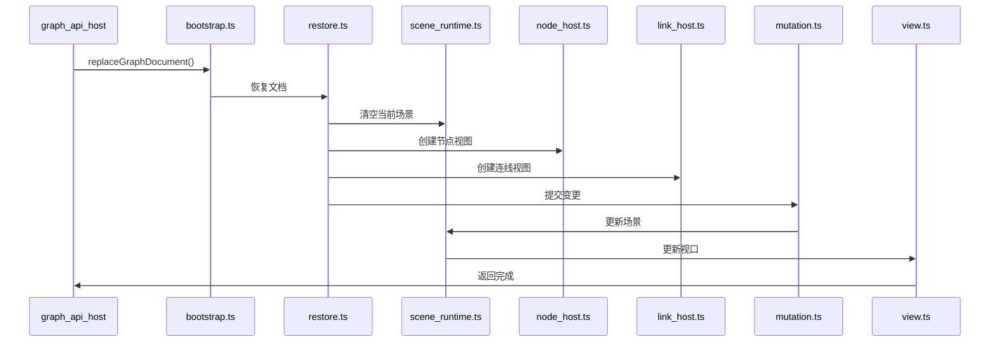
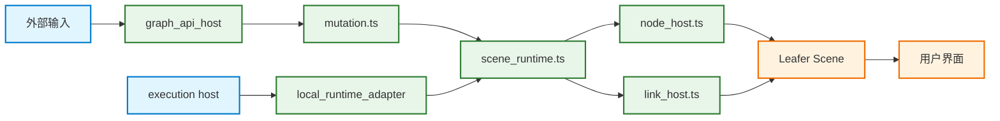

# LeaferGraph 运行时

这份文档合并了旧 `packages/leafergraph` 的 README、内部架构地图、使用与扩展指南、渲染刷新策略和进度环说明。

## 运行时装配链图

```mermaid
graph TB
    A[src/public/leafer_graph.ts<br/>(对外入口)] --> B[src/graph/assembly/entry.ts<br/>(入口装配)]
    B --> C[src/graph/assembly/runtime.ts<br/>(总装配器)]
    C --> D[src/graph/host/canvas.ts<br/>(画布宿主)]
    C --> E[src/graph/assembly/widget_environment.ts<br/>(Widget环境)]
    C --> F[NodeRegistry<br/>(节点注册表)]
    C --> G[src/graph/assembly/scene.ts<br/>(场景装配)]
    C --> H[src/graph/host/bootstrap.ts<br/>(启动引导)]
    C --> I[src/graph/feedback/local_runtime_adapter.ts<br/>(本地运行适配)]
    C --> J[src/api/graph_api_host.ts<br/>(API宿主)]
    
    G --> K[src/graph/host/scene_runtime.ts<br/>(场景运行时)]
    G --> L[src/node/runtime/controller.ts<br/>(节点控制器)]
    G --> M[src/interaction/graph_interaction_runtime_host.ts<br/>(交互运行时)]
    G --> N[LeaferGraphGraphExecutionHost<br/>(执行宿主)]
    G --> O[src/graph/host/restore.ts<br/>(文档恢复)]
    
    classDef public fill:#e1f5ff,stroke:#007acc,stroke-width:2px;
    classDef assembly fill:#e8f5e9,stroke:#2e7d32,stroke-width:2px;
    classDef host fill:#fff3e0,stroke:#ef6c00,stroke-width:2px;
    classDef api fill:#f3e5f5,stroke:#7b1fa2,stroke-width:2px;
    
    class A public;
    class B,C,E,G assembly;
    class D,H,I,K,L,M,N,O host;
    class J api;
```

## 文档恢复流程图



## 场景刷新数据流图



`leafergraph` 是 Leafer host / graph facade 主包。它负责把 `GraphDocument` 恢复成 Leafer 场景，装配交互和刷新，并通过 `LeaferGraph` / `createLeaferGraph(...)` 暴露对外实例 API。

## 公开入口

- `LeaferGraph`
- `createLeaferGraph(...)`

相关导入建议：

- `GraphDocument`、`NodeDefinition`、`NodeModule` 来自 `@leafergraph/node`
- 执行相关类型来自 `@leafergraph/execution`
- `RuntimeFeedbackEvent` 来自 `@leafergraph/contracts`

## 包结构

- `src/public/`：实例入口和 facade 安装
- `src/api/host/`：公共 API 的内部 host helper
- `src/graph/`：装配、恢复、刷新、主题和本地反馈投影
- `src/interaction/`：指针、手势和提交处理
- `src/node/`：节点运行时投影和壳层布局
- `src/link/`：连线几何和连线动画 overlay

## 运行时总装配链

当前主包从 `src/public/leafer_graph.ts` 进入，核心顺序是：

1. 安装 `src/public/facade/*`
2. 进入 `src/graph/assembly/entry.ts`
3. 进入 `src/graph/assembly/runtime.ts`
4. 创建画布、Widget 基础环境、`NodeRegistry`、场景运行时和 bootstrap host
5. 完成 document 恢复与本地反馈投影

这意味着：

- `@leafergraph/execution` 是图级执行状态机和执行反馈的真源
- `leafergraph` 负责把执行状态投影回节点壳、连线、Widget 和运行反馈 overlay

## 包结构补充

- `src/graph/assembly/`：装配顺序和对象接线
- `src/graph/feedback/`：运行反馈适配与投影
- `src/graph/host/`：场景宿主、恢复、变更、视口与画布
- `src/graph/theme/`：主题状态和主题切换协调刷新
- `src/node/runtime/`：节点运行时、执行、快照和连接变化
- `src/node/shell/`：节点壳、布局、端口和 slot 样式
- `src/link/animation/`：数据流动画宿主

## 使用方式

```ts
import type { GraphDocument } from "@leafergraph/node";
import { createLeaferGraph } from "leafergraph";
import { leaferGraphBasicKitPlugin } from "@leafergraph/basic-kit";

const initialDocument: GraphDocument = {
  documentId: "demo-document",
  revision: 1,
  appKind: "leafergraph-local",
  nodes: [],
  links: []
};

const graph = createLeaferGraph(container, {
  document: initialDocument,
  plugins: [leaferGraphBasicKitPlugin],
  themePreset: "default",
  themeMode: "dark"
});

await graph.ready;
```

## 刷新模型

- 整个文档替换
- 整个场景刷新
- 节点 / 连线 / Widget 的局部刷新
- 动画或 overlay 的纯渲染触发

最重要的边界是：

- 执行真源在 `@leafergraph/execution`
- 这个包负责把执行状态投影回节点、连线、Widget 和反馈 overlay

## 代码索引

### 运行时装配

| 关注点 | 代码入口 |
| --- | --- |
| 主包根入口 | `packages/leafergraph/src/public/leafer_graph.ts`、`packages/leafergraph/src/index.ts` |
| 实例装配入口 | `packages/leafergraph/src/graph/assembly/entry.ts`、`packages/leafergraph/src/graph/assembly/runtime.ts` |
| 场景装配 | `packages/leafergraph/src/graph/assembly/scene.ts`、`packages/leafergraph/src/graph/assembly/widget_environment.ts` |
| 图 API 主控制器 | `packages/leafergraph/src/api/graph_api_host.ts`、`packages/leafergraph/src/api/host/controller.ts` |
| public façade | `packages/leafergraph/src/public/facade/*` |

### 刷新与反馈

| 关注点 | 代码入口 |
| --- | --- |
| 文档恢复与整图替换 | `packages/leafergraph/src/graph/host/bootstrap.ts`、`packages/leafergraph/src/graph/host/restore.ts` |
| 局部变更与场景刷新 | `packages/leafergraph/src/graph/host/mutation.ts`、`packages/leafergraph/src/graph/host/scene_runtime.ts`、`packages/leafergraph/src/graph/host/view.ts` |
| 运行反馈投影 | `packages/leafergraph/src/graph/feedback/local_runtime_adapter.ts`、`packages/leafergraph/src/graph/feedback/projection.ts` |
| 主题与刷新协调 | `packages/leafergraph/src/graph/theme/host.ts`、`packages/leafergraph/src/graph/theme/runtime.ts` |
| 交互与提交 | `packages/leafergraph/src/interaction/interaction_host.ts`、`packages/leafergraph/src/interaction/graph_interaction_runtime_host.ts`、`packages/leafergraph/src/interaction/runtime/*` |

### 节点与连线

| 关注点 | 代码入口 |
| --- | --- |
| 节点运行时 | `packages/leafergraph/src/node/runtime/controller.ts`、`packages/leafergraph/src/node/runtime/execution.ts`、`packages/leafergraph/src/node/runtime/snapshot.ts`、`packages/leafergraph/src/node/runtime/state.ts` |
| 节点外壳 | `packages/leafergraph/src/node/shell/host.ts`、`packages/leafergraph/src/node/shell/view.ts`、`packages/leafergraph/src/node/shell/layout.ts`、`packages/leafergraph/src/node/shell/ports.ts`、`packages/leafergraph/src/node/shell/slot_style.ts` |
| 连线几何 | `packages/leafergraph/src/link/link.ts`、`packages/leafergraph/src/link/curve.ts` |
| 连线宿主与动画 | `packages/leafergraph/src/link/link_host.ts`、`packages/leafergraph/src/link/animation/controller.ts`、`packages/leafergraph/src/link/animation/frame_loop.ts`、`packages/leafergraph/src/link/animation/resolved_link.ts` |

## 进度环与信号灯

节点状态灯、长任务模式和进度环的完整说明已经并入 [节点接入指南](./API与插件接入.md#运行时反馈与进度环)。

这里保留运行时装配、刷新和投影说明；如果你只想查进度环怎么用，直接看主文档即可。

## 继续阅读

- [节点接入指南](./API与插件接入.md)
- [宿主扩展](./宿主扩展.md)
- [注意事项](./注意事项.md)
