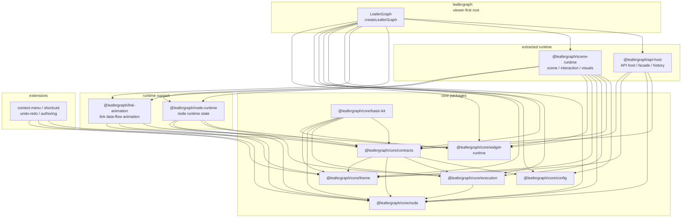
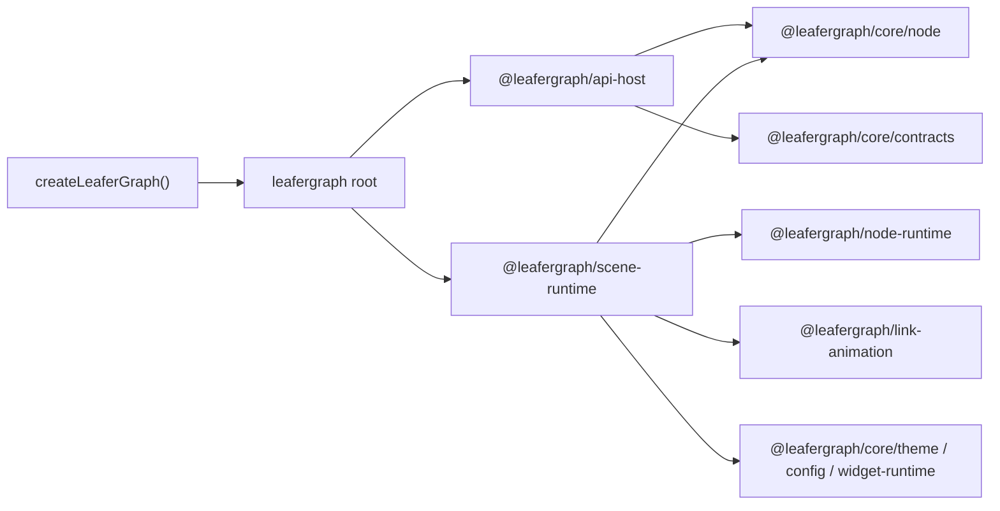
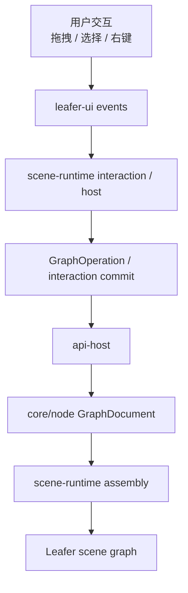
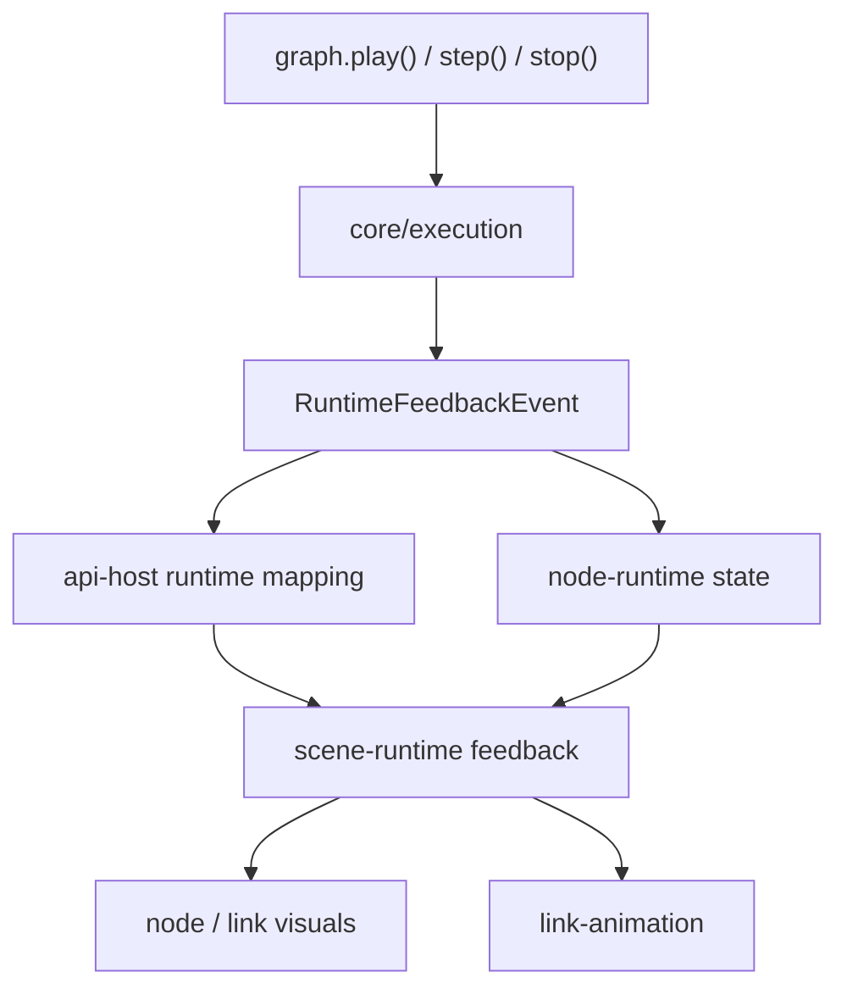

# LeaferGraph 包关系与数据流向指南

> 本文档梳理当前 LeaferGraph workspace 的正式包分层、依赖方向、运行时数据流和导入规范。
>
> 用途：帮助维护者判断改动应该落在哪个包、如何新增导出、以及改完后应该跑哪些验证命令。

---

## 当前事实速览

LeaferGraph 当前是一个 Leafer-first 的多包 workspace。根包 `leafergraph` 保持 viewer-first 入口，完整 runtime / editor 责任已经拆到 extracted packages；核心模型、执行、主题、配置和 Widget runtime 则位于 `@leafergraph/core/*`。

当前正式包按职责可分为七层：

| 层级 | 包 | 职责 |
| --- | --- | --- |
| core foundation | `@leafergraph/core/node`、`@leafergraph/core/execution`、`@leafergraph/core/contracts` | 节点模型、执行链、跨包共享协议 |
| core runtime | `@leafergraph/core/config`、`@leafergraph/core/theme`、`@leafergraph/core/widget-runtime`、`@leafergraph/core/basic-kit` | 配置、主题、Widget runtime 和默认内容包 |
| 主包根层 | `leafergraph` | viewer-first root；默认入口只导出 `LeaferGraph` / `createLeaferGraph(...)` |
| extracted runtime | `@leafergraph/scene-runtime`、`@leafergraph/api-host` | 场景交互视觉同步；API 宿主、facade、历史和 runtime 映射 |
| runtime support | `@leafergraph/node-runtime`、`@leafergraph/link-animation` | 节点运行时代理；连线数据流动画 |
| 宿主扩展层 | `@leafergraph/extensions/context-menu`、`@leafergraph/extensions/context-menu-builtins`、`@leafergraph/extensions/shortcuts`、`@leafergraph/extensions/undo-redo` | 菜单、内建动作、快捷键和历史栈扩展 |
| 作者层与消费层 | `@leafergraph/extensions/authoring`、`example/*`、`templates/*` | 节点 / Widget 作者 SDK、dogfood 示例和可复制模板 |

固定约束：

- `leafergraph` 不是历史 `litegraph.js` 的兼容搬运，不主动增加旧 API、全局变量桥接或 CommonJS 兼容出口。
- 当前仓库没有活动中的 `runtime-bridge` 包；仍提到它的旧文档应视为历史草案或待清理内容。
- 新代码优先使用 `@leafergraph/core/*` 和 `@leafergraph/extensions/*` 当前包路径；旧别名仍在 TS/Vite 中保留，主要服务迁移兼容。

---

## 包关系图



---

## 主要包职责与导出

### `leafergraph`

根包是 viewer-first 组合入口，公共入口只导出：

```typescript
export { LeaferGraph, createLeaferGraph } from "./public/leafer_graph";
```

根包还保留兼容子路径：

| 子路径 | 指向 | 用途 |
| --- | --- | --- |
| `leafergraph` | `packages/leafergraph/src/index.ts` | 默认入口 |
| `leafergraph/api/graph_api_host` | `packages/leafergraph/src/api/graph_api_host.ts` | 兼容旧导入 |

根包依赖 `api-host`、`scene-runtime`、`node-runtime`、`link-animation` 和 core 包，用于装配完整实例；但使用者不应把它当成运行时内部类型的转出口。

### `@leafergraph/api-host`

负责 API 宿主、facade 分组、文档操作、历史 helper、runtime API 和 runtime history 映射。

真实导出子路径：

| 子路径 | 入口 |
| --- | --- |
| `@leafergraph/api-host` | `src/index.ts` |
| `@leafergraph/api-host/graph_api_host` | `src/graph_api_host.ts` |
| `@leafergraph/api-host/facade/install` | `src/facade/install.ts` |
| `@leafergraph/api-host/host/controller` | `src/host/controller.ts` |
| `@leafergraph/api-host/host/types` | `src/host/types.ts` |
| `@leafergraph/api-host/history` | `src/history.ts` |
| `@leafergraph/api-host/runtime_api` | `src/runtime_api.ts` |
| `@leafergraph/api-host/runtime_history` | `src/runtime_history.ts` |
| `@leafergraph/api-host/runtime_types` | `src/runtime_types.ts` |
| `@leafergraph/api-host/types` | `src/types.ts` |

依赖方向：`api-host` 依赖 `@leafergraph/core/contracts`、`@leafergraph/core/node`、`@leafergraph/core/theme`、`@leafergraph/core/widget-runtime` 和 `leafer-ui`。不要让 core 包反向依赖 `api-host`。

### `@leafergraph/scene-runtime`

负责 Leafer 场景组装、交互宿主、节点/连线视觉外壳、样式、主题运行时和 runtime feedback 投影。

真实导出子路径：

| 子路径 | 入口 |
| --- | --- |
| `@leafergraph/scene-runtime` | `src/index.ts` |
| `@leafergraph/scene-runtime/assembly` | `src/assembly.ts` |
| `@leafergraph/scene-runtime/feedback` | `src/feedback.ts` |
| `@leafergraph/scene-runtime/host` | `src/host.ts` |
| `@leafergraph/scene-runtime/interaction` | `src/interaction.ts` |
| `@leafergraph/scene-runtime/link` | `src/link.ts` |
| `@leafergraph/scene-runtime/node` | `src/node.ts` |
| `@leafergraph/scene-runtime/style` | `src/style.ts` |
| `@leafergraph/scene-runtime/theme` | `src/theme.ts` |
| `@leafergraph/scene-runtime/types` | `src/types.ts` |

依赖方向：`scene-runtime` 可以依赖 core 包、`@leafergraph/node-runtime` 和 `@leafergraph/link-animation`。它是视觉/交互层，不应成为模型真源。

### `@leafergraph/node-runtime`

负责节点运行时状态、节点快照、连接变化通知和执行代理。它只依赖 core 包，不依赖 `scene-runtime` 或 `api-host`，因此可以作为 UI 无关的运行时支持层。

真实导出子路径：

| 子路径 | 入口 |
| --- | --- |
| `@leafergraph/node-runtime` | `src/index.ts` |
| `@leafergraph/node-runtime/controller` | `src/controller.ts` |
| `@leafergraph/node-runtime/connections` | `src/connections.ts` |
| `@leafergraph/node-runtime/execution` | `src/execution.ts` |
| `@leafergraph/node-runtime/snapshot` | `src/snapshot.ts` |
| `@leafergraph/node-runtime/state` | `src/state.ts` |
| `@leafergraph/node-runtime/types` | `src/types.ts` |

注意：当前主入口只重导出 `controller` 和 `types`；如果需要其他子模块，请显式使用对应子路径。

### `@leafergraph/link-animation`

负责连线数据流动画宿主、控制器、颜色计算、环境检测、动画效果和帧循环。

真实导出子路径：

| 子路径 | 入口 |
| --- | --- |
| `@leafergraph/link-animation` | `src/index.ts` |
| `@leafergraph/link-animation/controller` | `src/controller.ts` |
| `@leafergraph/link-animation/color` | `src/color.ts` |
| `@leafergraph/link-animation/environment` | `src/environment.ts` |
| `@leafergraph/link-animation/effects` | `src/effects.ts` |
| `@leafergraph/link-animation/frame_loop` | `src/frame_loop.ts` |
| `@leafergraph/link-animation/types` | `src/types.ts` |

注意：当前主入口只重导出 `controller` 和 `types`；效果、颜色、环境和帧循环能力应通过子路径导入。

### `@leafergraph/core/*`

core 包是真源层，不承载宿主 UI 行为：

| 包 | 职责 | 关键依赖 |
| --- | --- | --- |
| `@leafergraph/core/node` | `GraphDocument`、节点定义、模块、注册相关模型 | 无 workspace 依赖 |
| `@leafergraph/core/execution` | 执行上下文、传播语义、运行状态、执行反馈 | `@leafergraph/core/node` |
| `@leafergraph/core/contracts` | 图 API 输入输出、diff helper、runtime feedback 等跨包契约 | config、execution、node、theme |
| `@leafergraph/core/config` | runtime/config 真源 | 无 workspace 依赖 |
| `@leafergraph/core/theme` | 主题 token、样式类型 | 无 workspace 依赖 |
| `@leafergraph/core/widget-runtime` | Widget 定义、渲染上下文和 runtime 契约 | config、contracts、node、theme |
| `@leafergraph/core/basic-kit` | 默认节点、默认 Widget 和 basic kit plugin | contracts、execution、node、theme、widget-runtime |

`@leafergraph/core/contracts` 额外导出 `@leafergraph/core/contracts/graph-document-diff`；`@leafergraph/core/basic-kit` 额外导出 `@leafergraph/core/basic-kit/node` 和 `@leafergraph/core/basic-kit/widget`。

### `@leafergraph/extensions/*`

extensions 包承载宿主扩展，不把行为塞回 core 真源：

| 包 | 职责 |
| --- | --- |
| `@leafergraph/extensions/context-menu` | 右键菜单基础扩展接口和运行时 |
| `@leafergraph/extensions/context-menu-builtins` | 右键菜单内建动作 |
| `@leafergraph/extensions/shortcuts` | 快捷键扩展 |
| `@leafergraph/extensions/undo-redo` | 撤销/重做扩展 |
| `@leafergraph/extensions/authoring` | 节点 / Widget 作者层 SDK |

---

## 运行时数据流向

### 初始化



初始化阶段由根包装配 API host 和 scene runtime；scene runtime 再接入节点运行时代理与连线动画宿主。模型、契约、主题和 Widget runtime 始终来自 core 包。

### 文档变更与交互



交互层负责把 Leafer 事件转换为图操作或交互提交；API host 负责应用到文档模型；scene runtime 根据模型变更同步 retained-mode scene graph。

### 执行反馈与视觉投影



执行语义来自 `@leafergraph/core/execution`，反馈事件通过 contracts 穿过宿主层，再由 scene runtime 投影为节点状态、连线状态和动画。

---

## 导入与兼容规范

### 推荐导入

```typescript
import { createLeaferGraph } from "leafergraph";
import { leaferGraphBasicKitPlugin } from "@leafergraph/core/basic-kit";
import type { NodeDefinition } from "@leafergraph/core/node";
import type { RuntimeFeedbackEvent } from "@leafergraph/core/contracts";
```

维护内部 runtime 时，可以使用真实子路径：

```typescript
import { GraphApiHost } from "@leafergraph/api-host";
import type { GraphRuntimeState } from "@leafergraph/scene-runtime/types";
import { LeaferGraphLinkDataFlowAnimationHost } from "@leafergraph/link-animation";
```

### 迁移兼容别名

`tsconfig.base.json` 和 `vite.config.base.ts` 仍保留旧别名映射，例如：

| 旧别名 | 当前正式路径 |
| --- | --- |
| `@leafergraph/node` | `@leafergraph/core/node` |
| `@leafergraph/execution` | `@leafergraph/core/execution` |
| `@leafergraph/contracts` | `@leafergraph/core/contracts` |
| `@leafergraph/config` | `@leafergraph/core/config` |
| `@leafergraph/theme` | `@leafergraph/core/theme` |
| `@leafergraph/widget-runtime` | `@leafergraph/core/widget-runtime` |
| `@leafergraph/basic-kit` | `@leafergraph/core/basic-kit` |
| `@leafergraph/context-menu` | `@leafergraph/extensions/context-menu` |
| `@leafergraph/context-menu-builtins` | `@leafergraph/extensions/context-menu-builtins` |
| `@leafergraph/shortcuts` | `@leafergraph/extensions/shortcuts` |
| `@leafergraph/undo-redo` | `@leafergraph/extensions/undo-redo` |
| `@leafergraph/authoring` | `@leafergraph/extensions/authoring` |

新文档、新示例和新源码优先写当前正式路径。只有迁移兼容、旧测试或历史示例需要说明时，才使用旧别名。

### 避免的导入

```typescript
// 避免：把旧兼容面扩散到新代码
import { GraphApiHost } from "leafergraph/api/graph_api_host";

// 避免：导入 src 内部文件绕过 package exports
import { somethingInternal } from "@leafergraph/scene-runtime/src/internal";

// 避免：通过根包寻找运行时内部类型
import { NodeRuntimeController } from "leafergraph";
```

---

## 包边界规则

边界由 `scripts/workspace_boundaries.shared.mjs` 和相关测试维护。维护时按以下方向判断：

| 包 | 可以依赖 | 不应依赖 |
| --- | --- | --- |
| core foundation | 更底层 core 或无 workspace 依赖 | runtime、extensions、root |
| `@leafergraph/core/contracts` | config、execution、node、theme | scene-runtime、api-host、extensions |
| `@leafergraph/core/widget-runtime` | config、contracts、node、theme | scene-runtime、api-host |
| `@leafergraph/core/basic-kit` | contracts、execution、node、theme、widget-runtime | scene-runtime、api-host、extensions |
| `@leafergraph/node-runtime` | contracts、execution、node、widget-runtime | scene-runtime、api-host、link-animation |
| `@leafergraph/link-animation` | contracts、node、theme、Leafer 相关渲染依赖 | api-host、scene-runtime、node-runtime |
| `@leafergraph/scene-runtime` | core 包、node-runtime、link-animation、Leafer 插件 | api-host |
| `@leafergraph/api-host` | contracts、node、theme、widget-runtime | core 反向依赖它 |
| `leafergraph` | core 包、api-host、scene-runtime、node-runtime、link-animation | extensions 内部实现 |
| `@leafergraph/extensions/*` | core 包和目标扩展接口 | 向 core 增加 UI 反向依赖 |

验证命令：

```bash
bun run check:boundaries
bun run test:workspace-boundaries
```

---

## 改动落点决策表

| 需求 | 首选包 | 说明 |
| --- | --- | --- |
| 新增节点模型字段、节点定义能力 | `@leafergraph/core/node` | 模型真源 |
| 新增执行传播语义或运行状态 | `@leafergraph/core/execution` | 执行真源 |
| 新增跨包事件、diff 或 API 契约 | `@leafergraph/core/contracts` | 共享协议真源 |
| 新增主题 token 或样式类型 | `@leafergraph/core/theme` | 主题真源 |
| 新增 Widget runtime 能力 | `@leafergraph/core/widget-runtime` | Widget 契约层 |
| 新增默认节点或默认 Widget | `@leafergraph/core/basic-kit` | 默认内容包；主包不隐式安装 |
| 新增文档操作、history 或 facade | `@leafergraph/api-host` | API 宿主层 |
| 新增节点/连线视觉、交互、视口同步 | `@leafergraph/scene-runtime` | Leafer retained-mode 场景层 |
| 新增节点运行时状态代理 | `@leafergraph/node-runtime` | UI 无关运行时支持 |
| 新增连线数据流动画 | `@leafergraph/link-animation` | 动画专职包 |
| 新增右键菜单、快捷键、撤销重做 | `@leafergraph/extensions/*` | 宿主扩展层 |
| 新增作者 SDK 或模板能力 | `@leafergraph/extensions/authoring`、`templates/*` | 作者层 |

---

## 新增或移动公开路径时的维护清单

1. 更新目标包的 `package.json` `exports`。
2. 如需 workspace 内源码别名，同步 `tsconfig.base.json` `paths`。
3. 如需 Vite 示例或测试解析，同步 `vite.config.base.ts` alias。
4. 更新相关 README、本文档和 `docs/leafergraph-ai-index.md`。
5. 运行边界验证和目标包 build/test。

常用验证：

```bash
bun run check:boundaries
bun run build:leafergraph
bun run test:leafergraph
```

涉及示例或模板时追加：

```bash
bun run test:smoke:examples
bun run test:smoke:templates
```

---

## 相关文档

- [AGENTS.md](../AGENTS.md) - 开发原则和架构边界
- [README.md](../README.md) - workspace 总览和分层导航
- [docs/leafergraph-ai-index.md](./leafergraph-ai-index.md) - AI 维护导航索引
- [docs/viewer-first-root-split-manifest.md](./viewer-first-root-split-manifest.md) - viewer-first root 拆分清单
- [docs/viewer-first-root-migration.md](./viewer-first-root-migration.md) - root 拆分迁移说明
- [docs/package-split-verification.md](./package-split-verification.md) - package split 验证记录
- [scripts/workspace_boundaries.shared.mjs](../scripts/workspace_boundaries.shared.mjs) - workspace 边界规则

---

## 文档版本

| 版本 | 日期 | 更新内容 |
| --- | --- | --- |
| 2.0 | 2026-05-17 | 按当前 workspace 包清单、真实 exports 和边界规则重写 |
| 1.0 | 2026-05 | 初始版本 |

最后更新：2026-05-17