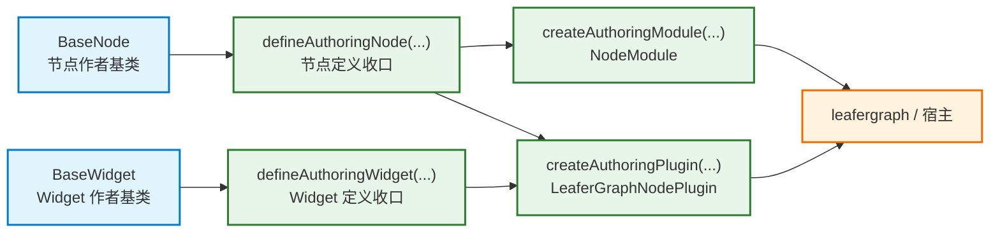
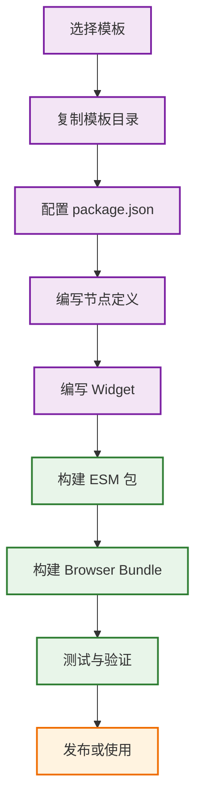

# 作者层与模板

## 作者层关系图

## 模板使用流程图

这份文档合并了作者层 README、模板 README 和示例 README。

## 作者层

`@leafergraph/authoring` 是类式作者层 SDK。

它适合用来写：

- `BaseNode`
- `BaseWidget`
- 打包作者节点和 Widget 的 module 或 plugin

这个包的边界很简单：

- authoring 负责产出正式运行时产物
- 它不应该变成宿主壳层或 bundle loader

## 模板矩阵

| 模板 | 适合什么 |
| --- | --- |
| `templates/node/authoring-node-template` | 只交付节点 |
| `templates/widget/authoring-text-widget-template` | 只交付 Widget |
| `templates/misc/authoring-browser-plugin-template` | 同时交付 node / widget / demo browser bundle |

## 示例包

| 示例 | 说明 |
| --- | --- |
| `example/authoring-basic-nodes` | 纯作者层包，导出 module / plugin |
| `example/mini-graph` | 最完整的 workspace 集成示例 |

`mini-graph` 是查看默认内容、右键菜单、快捷键、历史栈和作者层 bundle 如何一起接线的最佳位置。

## 推荐流程

1. 先从最小、最接近目标交付形态的模板开始。
2. 在 `src/developer/` 里写节点和 Widget。
3. 导出正式 module 或 plugin。
4. 在 `leafergraph` 或 `mini-graph` 里验证。

## 交付判断

如果你在犹豫该用哪种模板，可以直接这样判断：

- 只想交付节点，选 node template
- 只想交付 Widget，选 widget template
- 想同时演示 node / widget / demo bundle，选 browser plugin template
