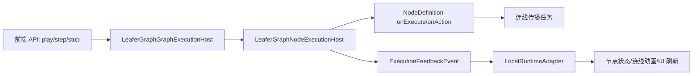
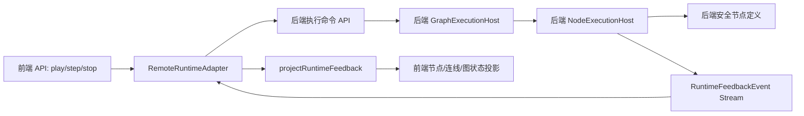

# 后端接管 `@leafergraph/core/execution` 可行性分析

## 结论

可行，但推荐表述为：**后端接管执行权威，前端保留执行反馈投影与可视化运行时**，而不是简单“删除/替换 `packages/core/execution`”。

原因是当前 `@leafergraph/core/execution` 已经被拆成相对纯净的执行内核：它负责图级状态机、节点执行、连线传播、timer 和执行反馈，不依赖 DOM、Canvas、Leafer 渲染或交互层。后端可以复用这套内核或实现同构内核；前端则通过现有的 `projectRuntimeFeedback(...)` / `projectExternal*` 入口接收后端反馈，把执行状态投影回节点壳、连线动画和运行日志。

## 代码证据

| 证据 | 路径 | 含义 |
| --- | --- | --- |
| 执行包定位为纯执行内核 | `packages/core/execution/README.md` | 只负责“节点如何执行、数据如何传播、图级运行如何推进、反馈事件如何汇总”，不负责渲染、交互、主题或菜单。 |
| 依赖边界干净 | `packages/core/execution/package.json` | 仅依赖 `@leafergraph/core/node`，没有依赖主包、DOM runtime 或 UI 包。 |
| 节点执行宿主 | `packages/core/execution/src/node/node_execution_host.ts` | 执行 `onExecute/onAction`、维护节点执行状态、收集传播任务、发出节点执行和连线传播事件。 |
| 图执行宿主 | `packages/core/execution/src/graph/graph_execution_host.ts` | 提供 `play/step/stop/resetState`，维护 run、queue、step、timer 状态。 |
| 外部图执行投影 | `packages/core/execution/src/graph/graph_execution_host.ts` | `projectExternalGraphExecution(...)` 可把外部图执行事件投影到本地图状态。 |
| 外部节点/连线投影 | `packages/core/execution/src/node/node_execution_host.ts` | `projectExternalNodeExecution(...)` 与 `projectExternalLinkPropagation(...)` 可把外部执行结果写回前端 runtime。 |
| 统一反馈类型 | `packages/core/contracts/src/graph_api_types.ts` | `RuntimeFeedbackEvent` 已统一图执行、节点执行、连线传播、节点状态反馈。 |
| 前端投影入口 | `packages/leafergraph/src/api/host/subscriptions.ts` | `projectLeaferGraphApiRuntimeFeedback(...)` 已能把外部 feedback 投影回当前图运行时。 |
| 主包运行时装配 | `packages/leafergraph/src/graph/assembly/runtime.ts`、`packages/leafergraph/src/graph/assembly/scene.ts` | 当前默认仍装配本地 `LeaferGraphGraphExecutionHost` 和本地 feedback adapter。 |

## 当前执行链简图



## 后端接管后的目标形态



核心变化：

- `play/step/stop/playFromNode` 不再直接调用前端本地执行 host，而是发送命令给后端。
- 后端持有本次运行的权威 `runId`、队列、timer、节点执行状态和传播状态。
- 后端把执行结果以 `RuntimeFeedbackEvent` 或其超集持续推送给前端。
- 前端调用已有 `projectRuntimeFeedback(...)`，只做状态投影和视觉刷新。

## 可行性判断

### 1. 环境可行

`packages/core/execution/src` 中没有发现 `window`、`document`、DOM、Canvas 依赖。主要宿主环境能力是：

- `Date.now()`：生成时间戳和 run/chain ID。
- `setTimeout/clearTimeout`：图级 timer 节点。
- `console.error/warn`：错误记录。
- Promise/thenable：异步节点执行。

这些能力 Node.js 后端都具备。因此，如果后端也是 TypeScript/JavaScript runtime，复用当前执行内核成本最低。

### 2. 边界可行

执行包已经独立于主包：

- 不依赖 `leafergraph` 主包。
- 不依赖场景、主题、交互、Widget runtime。
- 只需要 `NodeRegistry`、`WidgetDefinitionReader`、`graphNodes`、`graphLinks`。

这意味着后端可以从图文档恢复 `graphNodes/graphLinks` 和节点注册表，然后创建自己的 `LeaferGraphNodeExecutionHost` / `LeaferGraphGraphExecutionHost`。

### 3. 前端投影可行

前端已有外部反馈投影入口：

- `projectRuntimeFeedback(feedback)` 对外公开。
- 内部会分发到：
  - `projectExternalGraphExecution(...)`
  - `projectExternalNodeExecution(...)`
  - `projectExternalNodeState(...)`
  - `projectExternalLinkPropagation(...)`

因此后端只要按 `RuntimeFeedbackEvent` 发送事件，前端就有现成通道刷新图执行状态、节点执行状态、输入/输出值、连线传播动画。

## 不建议的替代方式

### 不建议 1：直接删掉前端本地 execution 包

原因：

- 前端仍需要执行事件类型、状态类型和投影方法。
- 当前 `projectExternal*` 是前端消费后端反馈的关键基础设施。
- 本地执行仍可作为开发、离线、测试、回退模式。

推荐保留 `@leafergraph/core/execution`，但把“执行权威”从前端本地 host 切换到后端。

### 不建议 2：让后端依赖 `packages/leafergraph`

原因：

- 主包包含 DOM/Leafer/Canvas/HTMLElement 等前端宿主能力。
- 后端只应依赖 `@leafergraph/core/node`、`@leafergraph/core/execution`、必要的节点定义包和 contracts。

### 不建议 3：只同步最终结果，不同步过程事件

原因：

- 现有 UI 包含节点 running/success/error、进度、连线传播动画、图级 started/advanced/drained/stopped 等过程反馈。
- 若只同步最终图文档，会丢失运行体验，也难以支持 step/debug。

## 推荐操作方案

### 阶段 0：定义模式边界

明确运行模式为：

- 前端：编辑、展示、交互、历史、反馈投影。
- 后端：Play/Step/Stop、节点执行、数据传播、timer、运行队列、执行状态真源。
- 共享：图文档、节点定义元数据、运行反馈协议。

### 阶段 1：补齐远端运行协议

在 contracts 层新增远端执行控制协议，建议包括：

```ts
export type RuntimeCommand =
  | { type: "graph.play"; graphId: string; documentVersion: string }
  | { type: "graph.step"; graphId: string; runId?: string }
  | { type: "graph.stop"; graphId: string; runId?: string }
  | { type: "node.play"; graphId: string; nodeId: string; payload?: unknown };
```

同时定义后端事件流：

```ts
export interface RuntimeFeedbackEnvelope {
  graphId: string;
  runId?: string;
  sequence: number;
  documentVersion: string;
  feedback: RuntimeFeedbackEvent;
}
```

协议需要覆盖：

- `graph.play`
- `graph.step`
- `graph.stop`
- `node.play`
- `node.action`（如果 Widget action 也要走后端）
- session/run 取消
- 事件序号、幂等、重连 resume
- document version 校验

### 阶段 2：后端运行时服务

后端创建一个 runtime service：

1. 接收前端提交的图文档快照或 graph ID。
2. 恢复 `graphNodes` / `graphLinks`。
3. 构建 `NodeRegistry`，注册后端允许执行的节点定义。
4. 创建 `LeaferGraphNodeExecutionHost`。
5. 创建 `LeaferGraphGraphExecutionHost`。
6. 订阅 node / graph / link propagation feedback。
7. 将 feedback 包成 `RuntimeFeedbackEnvelope` 推送到前端。

伪代码：

```ts
const nodeExecutionHost = new LeaferGraphNodeExecutionHost({
  nodeRegistry,
  widgetRegistry,
  graphNodes,
  graphLinks
});

const graphExecutionHost = new LeaferGraphGraphExecutionHost({
  nodeExecutionHost
});

nodeExecutionHost.subscribeNodeExecution((event) => publish({
  type: "node.execution",
  event
}));

graphExecutionHost.subscribeGraphExecution((event) => publish({
  type: "graph.execution",
  event
}));

nodeExecutionHost.subscribeLinkPropagation((event) => publish({
  type: "link.propagation",
  event
}));
```

### 阶段 3：前端 RemoteRuntimeAdapter

在前端新增远端 runtime adapter，职责是：

- 把 `play/step/stop/playFromNode` 转成远端命令。
- 监听 WebSocket/SSE/自定义流中的 `RuntimeFeedbackEnvelope`。
- 对每个 `feedback` 调用现有 `projectRuntimeFeedback(feedback)`。
- 维护连接状态、后端运行状态、重连和错误提示。

当前 `packages/leafergraph/src/api/host/execution.ts` 直接调用：

- `context.options.runtime.graphExecutionHost.play()`
- `context.options.runtime.graphExecutionHost.step()`
- `context.options.runtime.graphExecutionHost.stop()`
- `context.options.runtime.nodeRuntimeHost.playFromNode(...)`

改造方向是增加一层 runtime controller/adapter：

```ts
runtime.executionController.playGraph()
runtime.executionController.stepGraph()
runtime.executionController.stopGraph()
runtime.executionController.playNode(nodeId, payload)
```

本地模式实现调用现有 host；远端模式实现发送后端命令。

### 阶段 4：把本地 host 从“权威执行器”降级为“投影容器”

即使远端模式启用，前端仍保留本地：

- `nodeRuntimeHost.projectExternalNodeExecution(...)`
- `nodeRuntimeHost.projectExternalLinkPropagation(...)`
- `graphExecutionHost.projectExternalGraphExecution(...)`
- `projectRuntimeFeedback(...)`

但不再从前端本地 `play/step/stop` 推进执行队列。

### 阶段 5：节点定义能力分级

后端完全接管执行的最大风险不在 execution host，而在节点定义：

| 节点类型 | 后端接管策略 |
| --- | --- |
| 纯数据计算节点 | 可直接后端执行。 |
| HTTP/IO/爬虫/AI 节点 | 适合后端执行，但要加鉴权、限流、审计和超时。 |
| 依赖浏览器 DOM/Canvas/File API 的节点 | 不能直接后端执行，需要改写为后端安全版本或标记为 frontend-only。 |
| UI Widget action | 若会改变业务状态，应走后端；若只是本地编辑预览，可留前端。 |
| Timer 节点 | 应由后端持有权威 timer，前端只投影进度和 tick。 |

建议为 NodeDefinition 增加执行能力声明，例如：

```ts
executionTarget?: "backend" | "frontend" | "both";
capabilities?: Array<"pure" | "network" | "filesystem" | "browser" | "timer">;
```

远端模式下拒绝执行 `frontend` / `browser` 节点，或要求提供 backend implementation。

## 必须处理的关键风险

### 1. 图文档版本一致性

后端执行的图必须和前端显示的图一致。建议每次运行绑定：

- `graphId`
- `documentVersion`
- `runId`
- `startedAt`

如果前端在运行中编辑图：

- 简单策略：运行中禁止结构性编辑。
- 中等策略：后端运行固定快照，前端继续编辑下一版本。
- 高级策略：支持运行中 patch，但需要复杂一致性控制。

推荐第一阶段采用“运行固定快照”。

### 2. 事件顺序与幂等

后端事件流必须有单调 `sequence`。前端应：

- 丢弃重复 sequence。
- 检测缺口并触发重同步。
- 在 runId 不匹配时拒绝投影过期事件。

### 3. Timer 权威

当前 `LeaferGraphGraphExecutionHost` 内部使用 `setTimeout` 管理 timer。后端接管后：

- timer 必须只在后端运行。
- 前端不要再启动本地 graph execution timer。
- 后端需要在 stop/disconnect/session close 时清理 timer。

### 4. 安全边界

后端执行节点意味着节点定义可能访问网络、文件、密钥或外部 API。必须补齐：

- 节点白名单。
- 参数校验。
- 超时和取消。
- 资源配额。
- 审计日志。
- 用户/租户隔离。
- 禁止任意代码执行，除非有沙箱。

### 5. 错误模型

当前本地执行失败主要形成 `node.execution` error 状态，并 `console.error`。后端模式应把错误标准化为：

- 节点执行 error state。
- 可展示错误消息。
- 后端日志 trace id。
- 可选的开发调试详情。

不要把敏感堆栈直接推给普通前端用户。

## 推荐落地顺序

1. **文档与协议先行**：把远端 command / feedback envelope 写入 contracts 文档或类型草案。
2. **本地 mock remote adapter**：不接真实后端，先用内存队列模拟 command + event stream，验证前端投影链路。
3. **后端复用 core execution**：在服务端引入 `@leafergraph/core/node` 和 `@leafergraph/core/execution`，跑现有 execution tests 的后端等价测试。
4. **WebSocket/SSE 事件流**：打通 `RuntimeFeedbackEvent` 推送到前端，并调用 `projectRuntimeFeedback`。
5. **切换 play/step/stop**：为 API host 增加 execution controller，把本地 host 调用替换成 adapter 调用。
6. **节点能力分级**：先支持 `system/on-play`、`system/timer` 和纯计算节点，再扩展 IO/业务节点。
7. **一致性与恢复**：补齐 documentVersion、sequence、run resume、stop cleanup。
8. **安全加固**：节点白名单、超时、取消、资源限制、审计。

## 最小可验证切片

建议第一个 PR 只做以下闭环：

- 后端或 mock 后端接收 `graph.play`。
- 后端执行包含 `system/on-play -> 纯计算节点` 的图。
- 后端发出：
  - `graph.execution: started`
  - `node.execution: running/success`
  - `link.propagation`
  - `graph.execution: drained/stopped`
- 前端通过 `projectRuntimeFeedback` 投影后，节点状态和连线传播 UI 正常更新。
- 本地模式仍可工作。

验收标准：

- 本地 execution 测试仍通过：`bun run test:execution`。
- 新增 remote adapter/mock 测试覆盖 play/step/stop 和事件乱序/重复处理。
- 前端不再在远端模式下调用本地 `graphExecutionHost.play/step/stop` 推进队列。
- 后端 stop 后 timer 全部清理。

## 需要新增或调整的代码位置

| 目标 | 建议位置 |
| --- | --- |
| 远端命令/反馈 envelope 类型 | `packages/core/contracts/src/graph_api_types.ts` 或新 runtime protocol 文件 |
| 后端 runtime service | 新 package，例如 `packages/runtime/backend-execution` 或独立服务仓库 |
| 前端 remote adapter | `packages/leafergraph/src/graph/feedback` 或 `packages/leafergraph/src/runtime/remote` |
| API host 执行入口抽象 | `packages/leafergraph/src/api/host/execution.ts` 与 runtime types |
| 运行模式配置 | `packages/core/config` 或主包初始化 config |
| 节点能力声明 | `packages/core/node` 的 NodeDefinition 类型 |

## 最终建议

可以做后端完全接管，但不要把它做成“把 execution 包从前端删掉”。更稳的架构是：

1. `@leafergraph/core/execution` 继续作为可复用执行内核。
2. 后端成为执行权威，运行同构 execution host。
3. 前端新增 remote execution adapter，发送命令、消费反馈。
4. 前端继续使用现有 `projectRuntimeFeedback` 投影后端反馈。
5. 通过节点能力分级、安全沙箱、事件序号和图文档版本控制保证可靠性。

这样改造成本最低，也最符合当前代码已经形成的包边界和反馈投影设计。
