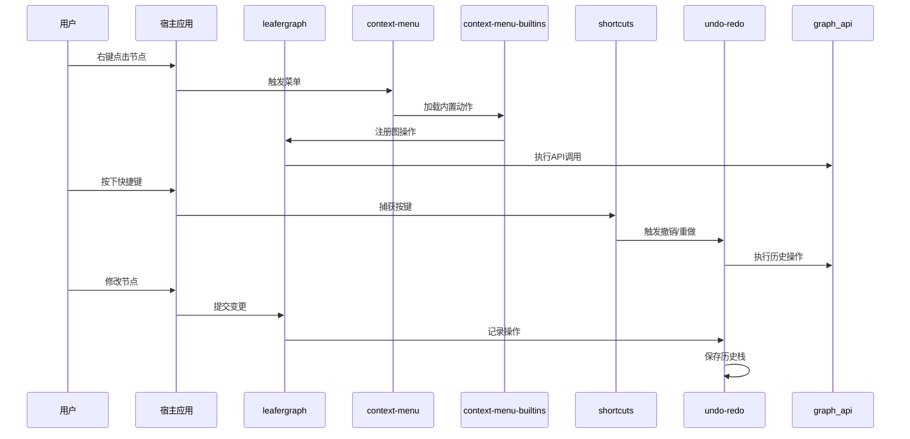
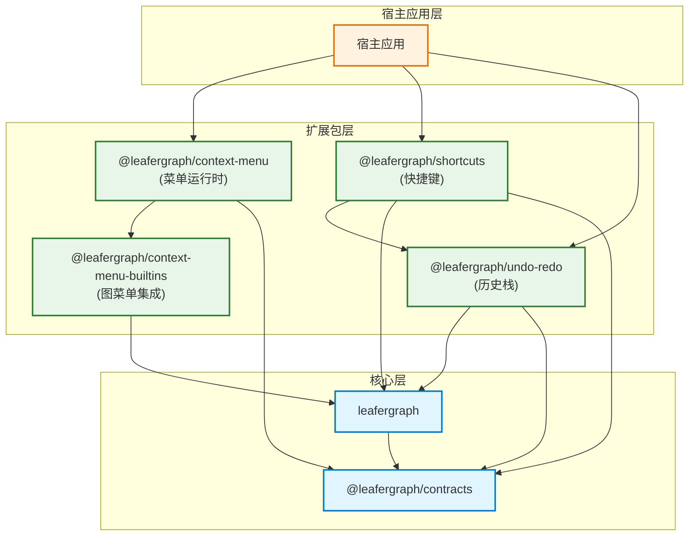

# 宿主扩展

## 宿主扩展协作图

## 扩展包集成关系图

这份文档合并了右键菜单、菜单 builtins、快捷键和历史栈的 README。

## 包职责

| 包 | 主要职责 |
| --- | --- |
| `@leafergraph/context-menu` | 纯 Leafer-first 菜单 runtime |
| `@leafergraph/context-menu-builtins` | 节点图菜单动作集成 |
| `@leafergraph/shortcuts` | 快捷键 runtime 和图快捷键预设 |
| `@leafergraph/undo-redo` | 历史控制器和图历史绑定 |

## 它们如何协作

- `context-menu` 负责创建菜单壳。
- `context-menu-builtins` 负责把图动作接到菜单壳上。
- `shortcuts` 负责把按键组合映射成函数。
- `undo-redo` 负责提供快捷键和按钮可以驱动的历史控制器。

## 推荐组合方式

一个典型的 `leafergraph` 宿主里，可以按这个顺序接：

1. 创建图
2. 必要时安装默认内容
3. 创建菜单 runtime
4. 绑定 builtins
5. 绑定快捷键
6. 绑定 undo / redo

## 读法

如果你只想理解职责边界：

- 先看 `@leafergraph/context-menu`
- 再看 `@leafergraph/context-menu-builtins`
- 然后看 `@leafergraph/shortcuts`
- 最后看 `@leafergraph/undo-redo`
