# 工作区总览

`leafergraph` 是一个 Leafer-first 的多包 workspace，目标是把图运行时、模型真源、作者层和宿主扩展分开维护。

## 整体架构图

```mermaid
graph TB
    subgraph "宿主层 (Host Layer)"
        Editor["Editor / 宿主应用"]
        MiniGraph["example/mini-graph"]
    end

    subgraph "扩展层 (Extension Layer)"
        ContextMenu["@leafergraph/context-menu"]
        ContextMenuBuiltins["@leafergraph/context-menu-builtins"]
        Shortcuts["@leafergraph/shortcuts"]
        UndoRedo["@leafergraph/undo-redo"]
    end

    subgraph "运行时层 (Runtime Layer)"
        LeaferGraph["leafergraph (主包)"]
        BasicKit["@leafergraph/basic-kit"]
        Authoring["@leafergraph/authoring"]
    end

    subgraph "核心层 (Core Layer)"
        Node["@leafergraph/node"]
        Contracts["@leafergraph/contracts"]
        Execution["@leafergraph/execution"]
        WidgetRuntime["@leafergraph/widget-runtime"]
        Theme["@leafergraph/theme"]
        Config["@leafergraph/config"]
    end

    subgraph "模板层 (Template Layer)"
        NodeTemplate["templates/node/*"]
        WidgetTemplate["templates/widget/*"]
        BrowserPluginTemplate["templates/misc/*"]
    end

    Editor --> LeaferGraph
    MiniGraph --> LeaferGraph
    MiniGraph --> BasicKit
    MiniGraph --> ContextMenu
    MiniGraph --> ContextMenuBuiltins
    MiniGraph --> Shortcuts
    MiniGraph --> UndoRedo
    
    LeaferGraph --> Node
    LeaferGraph --> Contracts
    LeaferGraph --> Execution
    LeaferGraph --> WidgetRuntime
    LeaferGraph --> Theme
    LeaferGraph --> Config
    
    BasicKit --> Node
    BasicKit --> Authoring
    
    Authoring --> Node
    Authoring --> WidgetRuntime
    Authoring --> Contracts
    
    ContextMenuBuiltins --> ContextMenu
    ContextMenuBuiltins --> Contracts
    
    NodeTemplate --> Authoring
    WidgetTemplate --> Authoring
    BrowserPluginTemplate --> Authoring

    classDef core fill:#e1f5ff,stroke:#007acc,stroke-width:2px;
    classDef runtime fill:#e8f5e9,stroke:#2e7d32,stroke-width:2px;
    classDef extension fill:#fff3e0,stroke:#ef6c00,stroke-width:2px;
    classDef template fill:#f3e5f5,stroke:#7b1fa2,stroke-width:2px;
    
    class Node,Contracts,Execution,WidgetRuntime,Theme,Config core;
    class LeaferGraph,BasicKit,Authoring runtime;
    class ContextMenu,ContextMenuBuiltins,Shortcuts,UndoRedo extension;
    class NodeTemplate,WidgetTemplate,BrowserPluginTemplate template;
```



## 包依赖关系图

```mermaid
graph LR
    A[leafergraph] --> B[@leafergraph/node]
    A --> C[@leafergraph/contracts]
    A --> D[@leafergraph/execution]
    A --> E[@leafergraph/widget-runtime]
    A --> F[@leafergraph/theme]
    A --> G[@leafergraph/config]
    
    H[@leafergraph/basic-kit] --> B
    H --> I[@leafergraph/authoring]
    
    I --> B
    I --> E
    I --> C
    
    J[@leafergraph/context-menu-builtins] --> K[@leafergraph/context-menu]
    J --> C
    
    L[example/mini-graph] --> A
    L --> H
    L --> K
    L --> J
    L --> M[@leafergraph/shortcuts]
    L --> N[@leafergraph/undo-redo]
    
    O[templates/node/*] --> I
    P[templates/widget/*] --> I
    Q[templates/misc/*] --> I
    
    style A fill:#e8f5e9,stroke:#2e7d32,stroke-width:2px
    style H fill:#e8f5e9,stroke:#2e7d32,stroke-width:2px
    style I fill:#e8f5e9,stroke:#2e7d32,stroke-width:2px
    style B fill:#e1f5ff,stroke:#007acc,stroke-width:2px
    style C fill:#e1f5ff,stroke:#007acc,stroke-width:2px
    style D fill:#e1f5ff,stroke:#007acc,stroke-width:2px
    style E fill:#e1f5ff,stroke:#007acc,stroke-width:2px
    style F fill:#e1f5ff,stroke:#007acc,stroke-width:2px
    style G fill:#e1f5ff,stroke:#007acc,stroke-width:2px
    style K fill:#fff3e0,stroke:#ef6c00,stroke-width:2px
    style J fill:#fff3e0,stroke:#ef6c00,stroke-width:2px
    style M fill:#fff3e0,stroke:#ef6c00,stroke-width:2px
    style N fill:#fff3e0,stroke:#ef6c00,stroke-width:2px
    style O fill:#f3e5f5,stroke:#7b1fa2,stroke-width:2px
    style P fill:#f3e5f5,stroke:#7b1fa2,stroke-width:2px
    style Q fill:#f3e5f5,stroke:#7b1fa2,stroke-width:2px
```

## 总体分层

| 层级 | 主要内容 |
| --- | --- |
| 基础真源 | `@leafergraph/node`、`@leafergraph/theme`、`@leafergraph/config` |
| 执行与协议 | `@leafergraph/execution`、`@leafergraph/contracts` |
| 运行时支撑 | `@leafergraph/widget-runtime` |
| 内容与宿主 | `@leafergraph/basic-kit`、`leafergraph` |
| 宿主扩展 | `@leafergraph/context-menu`、`@leafergraph/context-menu-builtins`、`@leafergraph/shortcuts`、`@leafergraph/undo-redo` |
| 作者层与样例 | `@leafergraph/authoring`、`example/`、`templates/` |

## 目录分工

| 区域 | 主要内容 |
| --- | --- |
| `packages/` | 核心运行时、模型、协议、执行、主题、配置、Widget runtime 和默认内容包 |
| `extensions/` | 右键菜单、快捷键、历史栈等宿主扩展 |
| `example/` | 持续维护的示例工程 |
| `templates/` | 可复制的作者层模板 |
| `docs/` | 合并后的正式文档 |

## 读文顺序

如果你第一次进入这个 workspace，可以按下面顺序看：

1. [核心包总览](./核心包总览.md)
2. [LeaferGraph 运行时](./LeaferGraph运行时.md)
3. [API 与插件接入](./API与插件接入.md)
4. [作者层与模板](./作者层与模板.md)
5. [宿主扩展](./宿主扩展.md)
6. [工程导航索引](./工程导航索引.md)

## 常用命令

在仓库根目录执行：

```bash
bun install
bun run check:boundaries
bun run build
bun run test:core
bun run test:smoke
bun run test
```
