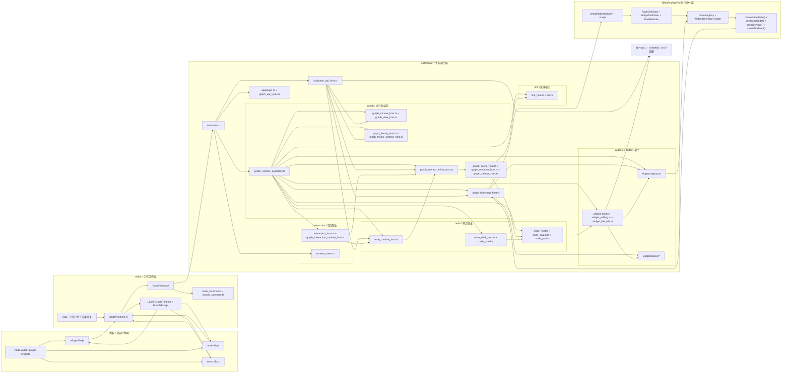
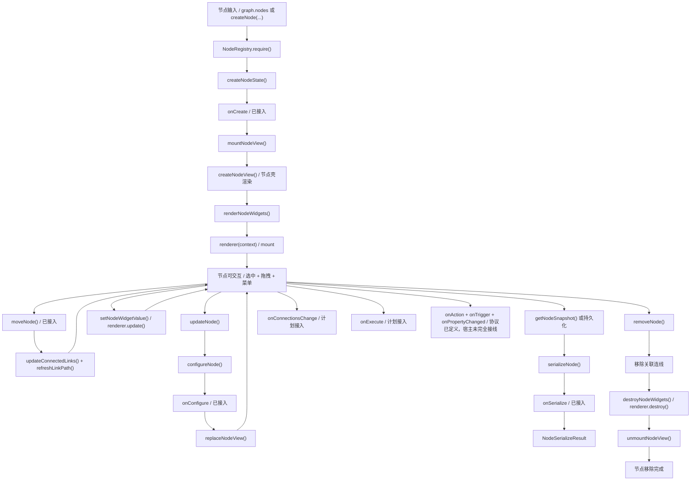

# 当前节点计划书

## 文档信息

- 日期：`2026-03-14`
- 适用对象：`@leafergraph/node`、`leafergraph` 主包、`editor`、未来外部节点包
- 当前阶段：`Phase 2.0 / 正式图输入与节点快照已收敛，唯一 Widget 注册表、现代化基础 Widget、editor 本地 bundle 工作分页与模板工程已落地`
- 关联文档：
  - `./范围与设计选项.md`
  - `./架构蓝图.md`
  - `./节点API方案.md`
  - `./节点插件接入方案.md`
  - `./连线路由.md`
  - `./右键菜单管理方案.md`

---

## 1. 计划目标

这份计划书不再讨论“节点系统要不要做”，而是明确回答下面四个问题：

1. 当前节点体系已经真正落地了哪些能力
2. 当前哪些内容虽然可见，但本质上仍然属于 demo 或过渡实现
3. 下一步最应该先补什么，而不是继续横向加功能
4. 哪些能力应该属于 `@leafergraph/node`，哪些应该属于主包和 editor

一句话总结：

- **当前项目已经完成“节点 SDK、正式图输入、唯一 Widget 注册中心、正式图 API、基础编辑交互、现代化内建 Widget、editor 本地 bundle 装载、外部模板工程”的第一阶段，但统一命令总线、执行闭环和宿主进一步拆层仍未完成。**

---

## 2. 当前状态总览

结合当前代码，可以把现状拆成四层来看：

1. `@leafergraph/node`
   - 已经是独立 SDK 包
   - 已具备节点定义、注册、实例化、配置、序列化、模块安装、生命周期类型
   - `NodeModule` 已只负责节点定义，Widget 不再混入模块协议
2. `leafergraph` 主包
   - 已作为唯一宿主持有 `NodeRegistry + LeaferGraphWidgetRegistry`
   - 已能安装外部模块与插件，渲染节点、连线、Widget，并持有缺失态 fallback
   - 已接入 Widget 主题与编辑宿主、节点拖拽、resize、右键菜单等基础设施
3. `editor`
   - 已把主包图实例挂进 Preact 组件树
   - 已形成 `Bundle 接入 / 主画布` 工作分页
   - 已通过本地文件选择器 + IIFE bridge 动态装载 `demo / node / widget` 三类 bundle
   - 已抽出节点命令控制器与画布命令控制器
4. `templates/node-widget-plugin-template`
   - 已成为当前推荐的外部作者参考工程
   - 同时输出 ESM 包与 browser IIFE 三类产物
   - 已覆盖“节点模块 + 外部 Widget + demo 图数据”三条最小接入路径

也就是说，当前的真实结论应该是：

- **节点 SDK 已成立**
- **主包唯一 Widget 注册中心已成立**
- **正式图 API 与最小编辑交互已成立**
- **现代化基础 Widget、主题和编辑宿主已成立**
- **editor 工作分页与本地 bundle 装载链已成立**
- **模板工程与 browser IIFE 接入样例已成立**
- **但统一命令总线、执行系统和宿主进一步拆层还没有闭环**

### 2.1 当前节点能力矩阵

为了避免后续讨论时把“已经做了”和“准备做”混在一起，这里先给出基于当前代码的能力矩阵。

状态约定：

- `已完成`：已经进入真实代码路径，且当前阶段可以直接被主包或 editor 使用
- `部分完成`：已经有协议或最小实现，但还没有形成完整闭环
- `未开始`：当前仍停留在规划、声明或明显缺失阶段

| 能力域 | 当前状态 | 现状说明 |
| --- | --- | --- |
| 节点定义与注册 | 已完成 | 已有 `NodeDefinition`、`NodeResizeConfig`、`NodeRegistry`、主包 `LeaferGraphWidgetRegistry`、模块安装与作用域解析 |
| 节点实例化与配置 | 已完成 | 已有 `createNodeState()`、`configureNode()`、`serializeNode()`、`createNodeApi()` |
| 生命周期基础钩子 | 部分完成 | `onCreate`、`onConfigure`、`onSerialize` 已接线；`onExecute`、`onConnectionsChange` 仍未调度 |
| 图模型基础结构 | 已完成 | 主包已持有节点/连线统一状态容器，并以正式 `LeaferGraphData`、`LeaferGraphLinkData` 驱动 |
| 节点增删改移动 | 已完成 | 已有 `createNode()`、`removeNode()`、`updateNode()`、`moveNode()`，editor 菜单和快捷键已接入 |
| 连线增删查 | 已完成 | 已有 `createLink()`、`removeLink()`、`findLinksByNode()`，并能在节点移动后刷新路径 |
| 节点壳渲染 | 已完成 | 已抽出 `node_layout.ts`、`node_shell.ts`、`node_port.ts`，节点壳、端口与锚点已分层，并开始收敛固定色主题与折叠态布局 |
| Widget 正式注册表 | 已完成 | 主包 `LeaferGraphWidgetRegistry` 已统一持有 definition + renderer，缺失类型也有 fallback renderer |
| Widget 渲染宿主 | 已完成 | 主包已具备 Widget renderer 的 `mount / update / destroy` 调度链 |
| Widget 正式交互 | 部分完成 | 已内建 `input / textarea / select / checkbox / toggle / slider / button / radio` 与只读字段；外部作者范式仍在沉淀 |
| Widget 编辑宿主 | 部分完成 | 已有 `theme`、`editing`、`WidgetEditingManager`，接通文本编辑与候选菜单；更完整焦点与键盘协议仍待收敛 |
| Widget 自适应布局 | 部分完成 | 节点 Widget 区已接入 `@leafer-in/flow` 第一版纵向布局，但复合 Widget 范式仍未统一 |
| 节点拖拽 | 已完成 | 已通过正式 `moveNode()` 路径更新节点位置与关联连线 |
| 节点 resize | 部分完成 | 已有 resize 句柄、约束协议、重置尺寸入口；命令层和快捷键尚未完全覆盖 |
| 节点选区 | 已完成 | 已有最小单选/多选模型，支持 `Ctrl/Cmd/Shift + 点击` 和空白取消选中 |
| 节点菜单与快捷键 | 部分完成 | 删除、复制、粘贴、duplicate、重置尺寸已接到真实命令；更完整命令层与历史记录未接入 |
| editor 命令控制器 | 部分完成 | 已形成 `createEditorNodeCommandController()` 与 `createEditorCanvasCommandController()`，但尚未统一成命令总线 |
| 画布命令 | 部分完成 | 已支持 bundle-aware 快速创建、粘贴、`fitView()` 与 `quickCreateNodeType` 解析；仍缺事务与撤销重做 |
| editor 本地 bundle 装配 | 已完成 | 已有 `loader/runtime.ts`、工作分页、依赖分析、开始 / 停止渲染与 `LeaferGraphEditorBundleBridge` |
| 执行系统 | 未开始 | 尚未建立真正的执行调度、输入输出传播与运行状态反馈闭环 |
| 连接变化生命周期 | 未开始 | `onConnectionsChange` 还没有由连线增删路径触发 |
| 外部节点生态 | 部分完成 | 已有模板工程、ESM + browser IIFE 双产物与 editor 本地加载链路；版本协商和分发策略未完成 |

### 2.2 当前节点架构图

下面这张图已经按当前代码结构更新，重点表达四件事：

1. `@leafergraph/node` 继续承担定义、注册、实例化、配置、序列化和模块作用域协议
2. `leafergraph` 主包已经整理成 `api / graph / interaction / node / link / widgets` 六类目录，并由 `graph_runtime_assembly.ts` 统一装配
3. `editor` 继续负责工作分页、本地 bundle loader、`GraphViewport` 接线和最小命令控制器
4. 模板工程已经成为外部接入样例，而执行闭环、统一命令总线和更细的宿主拆层仍属于下一阶段

### 2.3 当前节点生命周期图

下面这张图只画当前代码里已经存在的真实节点流转，并明确区分“已经接入”和“协议存在但未正式调度”的部分：

- 已接入：
  - `onCreate`
  - `onConfigure`
  - `onSerialize`
  - Widget renderer 的 `mount / update / destroy`
  - `moveNode(...)` 触发的连线路径刷新
- 未正式接入：
  - `onConnectionsChange`
  - `onExecute`
  - `onAction`
  - `onTrigger`
  - `onPropertyChanged`

---

## 3. 当前已落地的能力

### 3.1 `@leafergraph/node` 已经具备的能力

当前 `packages/node/src/index.ts` 已经形成稳定公共入口，至少包含以下能力：

- 类型层：
  - `NodeDefinition`
  - `NodeResizeConfig`
  - `WidgetDefinition`
  - `NodeRuntimeState`
  - `NodeModule`
  - `NodeModuleScope`
  - `NodeApi`
  - `NodeLifecycle`
- 注册层：
  - `NodeRegistry`
  - `WidgetDefinitionReader`
  - `BUILTIN_WIDGET_TYPES`
- 实例层：
  - `createNodeState()`
  - `configureNode()`
  - `serializeNode()`
  - `createNodeApi()`
- 模块层：
  - `installNodeModule()`
  - `resolveNodeModule()`
  - `resolveNodeModuleScope()`
  - `resolveScopedNodeType()`
  - `applyNodeModuleScope()`
- 约束与错误层：
  - 节点重复注册
  - Widget 重复注册
  - 未知节点类型
  - 未知 Widget 类型

这说明 `@leafergraph/node` 已经不是草稿，而是一个真正可被主包和外部作者共同消费的 SDK 雏形。

### 3.2 生命周期层已经定义，但还没有完整调度

当前 `NodeLifecycle` 已经包含：

- `onCreate`
- `onConfigure`
- `onSerialize`
- `onExecute`
- `onConnectionsChange`

其中已经真正接进调用链的，是：

- `onCreate`
- `onConfigure`
- `onSerialize`

仍然没有进入真实运行时调度的，是：

- `onExecute`
- `onConnectionsChange`

这意味着生命周期定义已经够完整，但宿主还没有把它们全部变成活的行为。

### 3.3 主包 `leafergraph` 已具备的能力

当前主包已经不只是“静态 demo 渲染”，而是具备了清晰的宿主职责：

- 注册与安装能力：
  - `installModule(module)`
  - `use(plugin)`
  - `registerNode()`
  - `registerWidget()`
  - `getWidget()` / `listWidgets()`
  - `listNodes()`
- 渲染与宿主能力：
  - 使用唯一 `NodeRegistry + LeaferGraphWidgetRegistry`
  - Widget 已改为“definition + renderer”单次完整注册
  - 用真实 `NodeRuntimeState` 创建节点实例
  - 调度 Widget renderer 的 `mount / update / destroy`
  - 提供 `setThemeMode(...)`
  - 提供 `widgetEditing` 宿主入口与 `WidgetEditingManager`
  - 提供 `getNodeView(nodeId)`
  - 提供 `setNodeWidgetValue(nodeId, widgetIndex, value)`
- 交互基础设施：
  - 节点拖拽
  - 节点 resize
  - `getNodeResizeConstraint(nodeId)`
  - `canResizeNode(nodeId)`
  - `resetNodeSize(nodeId)`
  - 右键菜单基础设施 `createLeaferGraphContextMenu()`
  - 节点级菜单挂载 `bindNode()`
  - 画布级菜单挂载 `bindCanvas()`

### 3.4 editor 已具备的工作区与装配能力

当前 `packages/editor` 已经不再只是“GraphViewport 演示页”，而是具备了更完整的壳层职责：

- `App.tsx`
  - 提供 `Bundle 接入 / 主画布` 工作分页
  - 提供开始 / 停止渲染开关
  - 在本地文件选择后动态注入 `demo / node / widget` IIFE bundle
- `loader/runtime.ts`
  - 暴露 `LeaferGraphRuntime` 与 `LeaferGraphEditorBundleBridge`
  - 负责 manifest 校验、依赖分析、graph + plugins 装配
- `GraphViewport.tsx`
  - 创建 `LeaferGraph`
  - 创建主包右键菜单管理器
  - 绑定画布菜单和节点菜单
  - 同步主题到主包 `setThemeMode(...)`
  - 组件销毁时同步销毁 graph 和 menu
- 命令控制器：
  - `createEditorNodeCommandController()`
  - `createEditorCanvasCommandController()`

这一步非常重要，因为它意味着：

- 交互基础设施已经不是“只存在于文档”
- 主包与 editor 的职责边界已经进一步兑现到目录和代码结构
- editor 已不再源码直连模板工程，而是走真正的外部装载链路

### 3.5 当前已经落地但容易被低估的部分

从计划角度看，下面这些能力虽然看起来不大，但其实已经把系统往前推了一步：

1. 节点包已经从主包中拆出为 `@leafergraph/node`
2. Widget 已从“双轨 definition + renderer”收敛为主包唯一正式注册表
3. `NodeModule` 已只承载节点，Widget 不再混入模块协议
4. editor 已不再源码直连模板工程，而是走本地 bundle 注入链
5. 模板工程已经能同时输出 ESM 包和 browser IIFE 三类产物
6. `getNodeView(nodeId)` 已经建立了“宿主 -> editor 交互”的观察入口
7. 节点壳已经开始以“局部刷新当前 view”而不是“整体替换 view”的方式响应尺寸变化

这些都说明当前项目已经从“纯 demo 页面”进入“有层次的系统化重构阶段”。

---

## 4. 当前还属于过渡实现的部分

虽然能力已经不少，但下面这些地方仍然明显属于过渡态。

### 4.1 正式图输入已经收敛，但 demo 过渡文件仍待进一步处理

当前主包初始化已经只接受正式 `graph` 输入，模板里的演示图也已经直接改用正式 `LeaferGraphData` 结构：

- 节点集合使用可恢复快照语义
- 位置与尺寸统一走 `layout`
- `subtitle / accent / category / status` 一类展示字段统一收敛到 `properties`

但仍然还有一笔尾部技术债：

1. `packages/node/src/demo.ts` 仍然作为内部过渡文件存在
2. editor / template 之外如果未来还要保留更多演示输入工具，需要继续明确私有边界
3. 文档和作者示例还需要持续强调“正式输入”和“演示样例”是两套语义

### 4.2 主包里的节点宿主仍然过于集中

当前主包 `packages/leafergraph/src/index.ts` 同时承担了很多事情：

- 节点定义安装
- 插件安装
- 节点实例创建
- 节点壳绘制
- 端口布局
- Widget 区绘制
- 节点拖拽
- 场景同步

这说明当前最大的结构性风险不是“功能不够”，而是**主包大文件继续膨胀**。

### 4.3 Widget 已有正式宿主协议，但外部作者范式仍需继续沉淀

现在已经有：

- `mount`
- `update`
- `destroy`
- `setValue(...)`
- `requestRender()`
- `emitAction(...)`

主包也已经提供：

- `setNodeWidgetValue(...)`

主包还已经补上了更完整的一组上下文：

- `theme`
- `editing`

并且现在已经补上了多类真实闭环：

1. `input / textarea` 已可通过编辑宿主进入真实文本编辑
2. `select` 已可打开候选菜单并回写值
3. `checkbox / toggle / slider / button / radio` 已进入统一的基础控件库
4. Widget 命中区域会主动阻断事件，避免把交互误传递到节点拖拽层
5. `destroy()` 已显式解绑交互监听，避免交互型 Widget 累积事件残留

但问题仍然有：

1. 外部作者如何系统化复用主题 token、焦点绑定和编辑入口，仍需要更清晰的约定
2. Widget 如何声明更复杂的组合交互与键盘协议，还没有统一规范
3. `emitAction(...)` 目前只完成最小桥接，还没有进入完整命令与执行体系

因此不能把现在的 Widget 系统误判为“已经全部做完”，但它已经从“单一交互示例”推进到了“基础控件库 + 编辑宿主 + 外部模板示例”阶段。

### 4.3.1 Widget 区自适应布局已经进入第一版

当前主包已经开始把节点 Widget 区容器切到 `@leafer-in/flow`：

- Widget 区容器已改为 `Box + flow: "y"` 的纵向堆叠结构
- Widget 区高度已开始按控件首选高度、间距和内边距计算
- 节点宽度变化后，Widget 宽度会跟随节点壳重新布局

但这一层仍是第一版：

- Widget 内部具体控件仍主要由 renderer 手工排布
- 还没有形成“所有自定义 Widget 都默认基于 Flow 容器排布”的统一范式
- 更复杂的复合 Widget 还没有进入这一套布局协议

### 4.4 最小命令链已经落地，但统一命令总线还没有落地

当前 editor 中已经有真实命令，不再是日志占位：

- 画布菜单：
  - 创建节点
  - 粘贴节点
  - `fitView()`
- 节点菜单与快捷键：
  - 删除
  - 复制
  - 剪切
  - duplicate
  - 重置节点尺寸
- 控制器层：
  - `createEditorNodeCommandController()`
  - `createEditorCanvasCommandController()`

但它仍然只是“最小命令链”，还没有上升为正式命令系统，因为仍缺：

- 统一事务边界
- 撤销重做
- 拖拽、resize、菜单动作共享同一命令总线
- 更完整的命令元数据和历史记录

### 4.5 节点拖拽已经接进正式 API，但还没有历史与事务系统

现在节点拖拽已经不再是纯局部视图行为：

- 节点移动已统一走 `moveNode(...)`
- 节点移动时会同步刷新相关连线
- editor 多选态、菜单动作和复制粘贴已经开始共享正式图状态

但它还不是最终方案，因为仍缺：

- 事务型移动命令
- 撤销重做
- 与 resize、duplicate、批量删除一致的统一历史记录

所以当前拖拽应被理解为“已经接入正式 API 的最小交互”，而不是“完整编辑器命令系统已经完成”。

### 4.5.1 节点 resize 已进入约束协议第一版，但命令层仍未接上

当前节点已经具备：

- 选中态下显示右下角 resize 句柄
- 拖拽句柄时更新节点显式 `width / height`
- 节点壳、端口、Widget 区和关联连线跟随局部刷新
- 节点定义已可通过 `NodeDefinition.resize` 声明：
  - `enabled`
  - `lockRatio`
  - `minWidth / minHeight`
  - `maxWidth / maxHeight`
  - `snap`
- 主包已可查询节点的正式 resize 约束，并按约束决定是否显示 resize 句柄

但它还不是最终方案：

- 当前仍是项目内的自定义 handle 实现，尚未进入 editor 命令层
- `resetNodeSize(...)` 已接入 editor 节点菜单，但快捷键和独立命令层还未接入
- 后续仍需要继续评估如何把 `@leafer-in/resize` 更深地纳入正式编辑协议

### 4.6 节点执行与连接回调还没有进入真实闭环

当前连线已经可以绘制、节点移动时也会更新曲线，但仍然没有下面这些正式能力：

- `onConnectionsChange` 被宿主调度
- `onExecute` 被图运行时调度
- 输入输出传播和执行顺序
- 运行态 UI 反馈

这也是当前节点系统离“真正可运行”还差的核心部分。

---

## 5. 当前最关键的问题

基于当前代码状态，下一阶段最关键的不是补更多 demo，而是解决下面六个问题。

### 5.1 正式输入已收敛，但宿主拆层仍然没有跟上

当前正式图输入、节点快照和模板 demo 图已经完成收敛，这一块最大的结构性风险已经明显下降。

因此现在最关键的问题不再是“输入模型是不是还在用 demo 类型”，而是：

- 主包宿主仍然过于集中
- editor 命令链还没有进入统一总线
- 执行与连接生命周期还没有正式闭环

### 5.2 主包宿主仍然过于集中在 `packages/leafergraph/src/index.ts`

当前主包 `index.ts` 仍同时承担：

- 图状态容器
- 节点视图创建与局部刷新
- 连线渲染
- Widget 生命周期调度
- 拖拽与 resize
- 缺失态 fallback

这说明现在最大的结构性风险，依然是主包大文件继续膨胀。

### 5.3 editor 已有最小命令控制器，但还没有统一命令总线与历史记录

现在已经有 `node_commands.ts` 和 `canvas_commands.ts`，但仍缺：

- 统一事务模型
- 撤销重做
- 拖拽、resize、菜单、快捷键共享同一条命令链
- 更稳定的命令元数据与调试入口

### 5.4 执行系统与连接生命周期还没有开始真正闭环

当前最明显的空缺已经不再是“能不能渲染”，而是：

- `onConnectionsChange` 还没有调度来源
- `onExecute` 还没有调度来源
- 输入输出传播和执行顺序还没有建立
- 执行态反馈还没有进入 UI

### 5.5 外部生态已经具备最小作者体验，但分发与兼容约束还没有成型

当前外部作者已经可以：

- 使用标准模板工程
- 通过 `ctx.installModule(...)` 安装节点模块
- 通过 `ctx.registerWidget(entry)` 注册完整 Widget
- 输出 ESM 包与 browser IIFE bundle
- 在 editor 中用本地文件直接验证接入结果

但还没有：

- 版本协商与兼容约束
- 更明确的 bundle 元信息扩展策略
- 叠加多个同类 bundle 时的产品化规则
- 更完整的安装反馈和调试面板

### 5.6 Widget 外部作者规范仍需要继续沉淀

当前最需要补的已经不是“再加一个内建控件”，而是让外部作者更容易复用当前能力，例如：

- 如何稳定复用主题 token
- 如何接入文本编辑和候选菜单
- 如何声明 focus / keydown / action
- 如何组织复合 Widget 的布局与状态

---

## 6. 接下来必须遵守的原则

### 6.1 先收敛节点输入模型，再继续横向加壳层功能

当前最需要克制的，不是再补几个面板或再扩几个 demo 节点，而是避免继续把 `packages/node/src/demo.ts` 里的演示输入当作事实标准。

接下来新增能力时，优先级应该固定为：

1. 正式图数据入口与持久化边界
2. 主包宿主拆层
3. editor 命令总线与历史记录
4. 连接与执行闭环

### 6.2 `@leafergraph/node` 继续保持宿主无关，只承接 Node SDK

这个包接下来仍应只负责：

- `NodeDefinition / WidgetDefinition` 等数据契约
- `NodeRegistry`、模块安装与作用域解析
- `createNodeState()`、`configureNode()`、`serializeNode()`、`createNodeApi()`
- 生命周期类型与宿主无关的约束协议

这个包不应该再继续吸收：

- Leafer 图元与渲染宿主
- DOM bridge、IIFE bundle 协议
- editor 工作分页、面板状态、命令面

### 6.3 `leafergraph` 主包继续做唯一运行时宿主，不回退到双轨结构

主包当前已经形成了比较清晰的边界，后续应该继续强化，而不是反向混乱：

- 继续由主包唯一持有 `NodeRegistry + LeaferGraphWidgetRegistry`
- 继续由主包承接节点、连线、Widget、编辑宿主与主题宿主
- 继续由主包承接缺失节点 / 缺失 Widget fallback、右键菜单基础设施、正式图 API

同时必须避免重新出现这些回退：

- Widget definition 和 renderer 再次分开注册
- `NodeModule` 再次混入 Widget 协议
- demo 初始化逻辑重新塞回主包公共 API

### 6.4 `editor` 继续负责工作分页、本地 bundle 装载和命令接线

当前 editor 的职责已经比早期更清楚，后续应继续保持：

- `App.tsx` 负责工作分页、开始 / 停止渲染和本地 bundle 面板
- `loader/runtime.ts` 负责 `LeaferGraphRuntime`、`LeaferGraphEditorBundleBridge` 与 manifest 校验
- `GraphViewport.tsx` 负责挂载主包实例、菜单、快捷键和主题同步
- `node_commands.ts`、`canvas_commands.ts` 负责最小命令面

其中需要特别强调：

- IIFE bundle bridge 属于 editor 接入层协议，不进入主包公共 API
- editor 可以控制装载与命令，但不应重复实现图模型和渲染宿主

### 6.5 外部生态优先走标准路径，不把 sandbox 协议误当主包协议

当前已经存在两条对外路径，但语义不同，后续要坚持区分：

1. 标准包接入：
   - 节点通过 `NodeModule`
   - Widget 通过 `ctx.registerWidget(entry)`
2. editor sandbox 接入：
   - 通过本地 dist IIFE
   - 通过 `LeaferGraphEditorBundleBridge.registerBundle(...)`

前者是长期生态接口，后者只是 editor 的本地调试 / 演示装配协议。

---

## 7. 分阶段计划

接下来建议按五个更贴近当前现状的阶段推进。

---

## 阶段 A：收敛节点输入模型与持久化入口

### 目标

把当前仍然偏 demo 的节点输入，收敛成正式图数据和恢复输入模型。

### 需要完成

- 明确三类输入的边界：
  - editor / template 演示输入
  - 主包正式图数据输入
  - 持久化恢复输入
- 逐步把 `packages/node/src/demo.ts` 从 SDK 语义中心移出
- 明确节点、连线、可选分组、可选视口元信息的序列化边界
- 让新增公共 API 和文档不再依赖 demo 类型作为默认入口

### 完成标准

- 主包新的公共入口不再以 demo 类型为中心设计
- editor 和模板 demo 数据通过适配层接入，而不是直接影响核心协议
- 文档中的“正式输入”和“演示输入”不再混写

### 这一阶段不做

- 执行调度
- 历史记录
- 产品化属性面板

---

## 阶段 B：继续拆分主包宿主

### 目标

把当前仍然集中在 `packages/leafergraph/src/index.ts` 的宿主逻辑继续拆开，形成更稳定的 runtime 结构。

### 需要完成

- 进一步拆出：
  - 节点宿主
  - 连线宿主
  - Widget 宿主
  - Widget 编辑宿主
  - 缺失态 fallback 宿主
- 让 `LeaferGraphWidgetRegistry`、`WidgetEditingManager`、节点视图装配各自边界更清楚
- 收敛节点挂载、更新、销毁与局部刷新路径，避免 index 继续膨胀

### 完成标准

- `index.ts` 更接近“组装层 + 对外 API”
- 节点、连线、Widget、编辑宿主可以分别理解和演进
- 宿主拆层后不影响当前 editor 和模板接入路径

### 这一阶段不做

- 产品级 Inspector UI
- 多窗口协作
- 大规模主题系统扩展

---

## 阶段 C：editor 命令总线与历史记录

### 目标

把当前 `node_commands.ts + canvas_commands.ts` 的最小控制器，升级为真正可扩展的命令面和事务面。

### 需要完成

- 定义统一命令协议：
  - create / remove / copy / cut / paste / duplicate
  - move / resize / fitView
- 让右键菜单、键盘快捷键、未来工具栏动作共享同一条命令链
- 建立最小事务与历史记录入口，为撤销 / 重做做准备
- 收敛多选拖拽、多选粘贴、尺寸重置等批量动作的命令语义

### 完成标准

- 当前 editor 里的核心动作都能落到统一命令入口
- 命令和视图事件绑定解耦
- 撤销 / 重做具备明确接入点

### 这一阶段不做

- 完整历史面板 UI
- 多视图同步
- 权限系统

---

## 阶段 D：连接与执行闭环

### 目标

让节点系统从“可渲染、可交互、可装配”推进到“可连接、可执行、可反馈”。

### 需要完成

- 让连线创建 / 删除驱动 `onConnectionsChange`
- 建立最小执行入口，驱动 `onExecute`
- 明确输入读取、输出写回与最小执行顺序
- 让 `emitAction(...)`、Widget 值回写和节点执行反馈进入同一运行时闭环
- 至少跑通一个来自外部模板工程的可执行节点样例

### 完成标准

- `onConnectionsChange` 有正式调度来源
- `onExecute` 有正式调度来源
- 执行结果能反映到节点运行时状态或 UI 反馈

### 这一阶段不做

- 复杂调度器
- 分布式执行
- 远程协作执行

---

## 阶段 E：生态与分发收敛

### 目标

把当前已经存在的模板工程、ESM 包和 browser IIFE bundle，收敛成更稳定的外部作者路径。

### 需要完成

- 继续整理模板工程说明与作者示例
- 明确 `NodeModule`、`registerWidget(entry)`、`demo/node/widget` bundle 三条路径的职责
- 补 bundle manifest、版本兼容、错误提示与推荐加载顺序说明
- 验证独立工程打包后的 node / widget / demo 能稳定被 editor 本地加载

### 完成标准

- 外部作者能用独立工程打包并接入 editor
- 错误的 bundle 类型、缺失依赖、版本不匹配能得到清晰提示
- 标准包接入和 editor sandbox 接入的边界在文档里清楚稳定

### 这一阶段不做

- 插件市场
- 在线分发平台
- 远程 bundle 仓库

---

## 8. 当前优先级建议

如果按“现在最值得做什么”排序，我建议是：

1. 阶段 A：收敛节点输入模型与持久化入口
2. 阶段 B：继续拆分主包宿主
3. 阶段 C：editor 命令总线与历史记录
4. 阶段 D：连接与执行闭环
5. 阶段 E：生态与分发收敛

原因如下：

1. 当前真正的结构短板不是“还缺几个 widget”，而是正式输入模型仍被 demo 类型牵着走
2. 当前最大的维护风险不是功能少，而是主包宿主逻辑仍然偏集中
3. 命令总线、执行闭环和生态分发，都建立在前两项边界先收稳的前提上

---

## 9. 现阶段执行单元拆分

为了避免“阶段方向正确，但不知道下一步落哪一刀”，这里把工作继续拆成更小的执行单元。

### 9.1 A 阶段执行单元：收敛节点输入模型

#### A-1：收敛 demo 输入边界

目标：

- 明确 `packages/node/src/demo.ts` 只属于演示输入，而不是核心协议中心

交付物：

- 演示输入说明
- 正式输入说明
- 二者之间的适配关系

完成标准：

- 新文档与新 API 不再把 demo 输入当作默认正式入口

#### A-2：明确正式图数据与持久化恢复模型

目标：

- 让“运行时图数据”和“持久化恢复输入”边界清楚

交付物：

- 图级输入 / 输出结构
- 节点、连线、可选分组和元信息约定

完成标准：

- editor、模板、主包对图数据的描述口径一致

#### A-3：为 editor / template 建立适配层

目标：

- 让演示数据通过适配层进入主包，而不是直接绑死核心协议

交付物：

- demo 数据适配入口
- 对应文档示例

完成标准：

- 后续替换 demo 数据时不需要改主包核心 API

### 9.2 B 阶段执行单元：主包宿主拆层

#### B-1：拆节点宿主装配层

目标：

- 把节点挂载、更新、移除与局部刷新继续从 index 中剥离

交付物：

- 节点宿主装配模块
- 清晰的挂载 / 更新 / 销毁路径

完成标准：

- 节点视图相关代码不再继续集中堆进 `index.ts`

#### B-2：拆 Widget 宿主与编辑宿主

目标：

- 让 Widget 注册表、渲染宿主、编辑宿主和 fallback 行为边界更清晰

交付物：

- Widget mount/update/destroy 调度层
- 编辑宿主边界
- 缺失 Widget fallback 边界

完成标准：

- 外部作者能更容易理解 Widget 运行时是如何被主包承接的

#### B-3：拆连线、resize 与选择态联动

目标：

- 收敛节点移动、尺寸变化、连线刷新和选区反馈之间的宿主关系

交付物：

- 连线刷新入口
- resize 联动入口
- 选区反馈入口

完成标准：

- 视图联动逻辑不再依赖分散的局部闭包

### 9.3 C 阶段执行单元：editor 命令总线与历史记录

#### C-1：定义统一命令接口

目标：

- 把节点命令和画布命令收敛到统一抽象

交付物：

- 命令接口
- 命令上下文
- 最小事务包裹结构

完成标准：

- 创建、删除、复制、粘贴、duplicate、fitView 都能走统一命令链

#### C-2：接通菜单、快捷键与未来工具栏

目标：

- 让不同入口共享同一命令实现，而不是各自写一套动作

交付物：

- 右键菜单接线
- 键盘快捷键接线
- 预留工具栏接线点

完成标准：

- editor 交互入口和命令实现不再互相耦死

#### C-3：建立历史记录入口

目标：

- 为撤销 / 重做建立第一版事务和回滚点

交付物：

- 历史记录结构
- 最小 undo / redo 接口

完成标准：

- 至少核心节点操作具备进入历史系统的能力

### 9.4 D 阶段执行单元：连接与执行闭环

#### D-1：连接变化接入生命周期

目标：

- 让连线的增删真正驱动节点生命周期

交付物：

- `onConnectionsChange` 调度入口
- 连线增删到生命周期的映射规则

完成标准：

- 节点作者可以观察输入 / 输出连接变化

#### D-2：建立最小执行运行时

目标：

- 让 `onExecute` 从类型声明变成真实调度

交付物：

- 最小执行入口
- 输入 / 输出状态读写
- 最小执行顺序约定

完成标准：

- 至少一类节点可以真实执行

#### D-3：把执行反馈接回 UI

目标：

- 让执行结果不只存在于内部状态

交付物：

- 节点运行反馈
- Widget / 节点状态可视反馈

完成标准：

- 执行结果能在 editor 中被看见或调试

### 9.5 E 阶段执行单元：生态与分发收敛

#### E-1：沉淀外部 Widget 作者模板

目标：

- 让外部作者更容易复用当前的主题、编辑和注册范式

交付物：

- Widget 作者示例
- 推荐目录结构
- 常见能力说明

完成标准：

- 外部作者不需要阅读主包实现细节就能写出一个完整 widget

#### E-2：整理 bundle manifest 与兼容说明

目标：

- 让本地 bundle 加载时的兼容关系更可预期

交付物：

- manifest 字段说明
- 依赖和版本约束说明
- 常见错误示例

完成标准：

- 错误 bundle、缺依赖 bundle、错误槽位 bundle 都有统一说明

#### E-3：验证独立工程分发路径

目标：

- 确保外部工程可以真正独立打包再被 editor 装入

交付物：

- 独立工程构建验证
- 本地加载验证记录

完成标准：

- Node / Widget / Demo 三类产物都能脱离当前 workspace 独立构建并被 editor 加载

---

## 10. TodoList

下面的 TodoList 按“已完成 / 正在推进 / 下一步 / 后续阶段”混合记录，方便后续直接更新状态。

### 10.1 已完成

- [X] 拆分出 `@leafergraph/node` 包
- [X] 建立 `NodeRegistry`、`NodeModule` 纯节点模块协议、模块安装与作用域解析能力
- [X] 建立 `createNodeState()`、`configureNode()`、`serializeNode()`、`createNodeApi()`
- [X] 在主包中建立唯一 `LeaferGraphWidgetRegistry`，Widget 改为单次完整注册
- [X] 在主包中接入正式图 API：`createNode(...)`、`removeNode(...)`、`updateNode(...)`、`moveNode(...)`、`createLink(...)`、`removeLink(...)`、`findLinksByNode(...)`
- [X] 使用真实 `NodeRuntimeState` 驱动节点实例渲染和更新
- [X] 建立 Widget renderer 的 `mount / update / destroy` 调度链
- [X] 建立 `theme`、`editing`、`WidgetEditingManager` 等 Widget 宿主能力
- [X] 将基础 widgets 拆到 `packages/leafergraph/src/widgets/basic/` 并完成统一注册
- [X] 接入内建 `input / textarea / select / checkbox / toggle / slider / button / radio` 与只读字段
- [X] 接入缺失节点和缺失 Widget 的红色 fallback 占位
- [X] 接入节点拖拽、折叠、resize、缺失态和固定主题色规则
- [X] 接入主包右键菜单基础设施
- [X] 抽出 `node_layout.ts`、`node_shell.ts`、`node_port.ts`，开始收敛节点壳分层
- [X] 在节点 Widget 区接入 `@leafer-in/flow` 第一版纵向布局
- [X] 在 editor 中建立单选、多选、框选、批量复制 / 剪切 / 删除 / duplicate / 粘贴链路
- [X] 在 editor 中形成 `createEditorNodeCommandController()` 与 `createEditorCanvasCommandController()`
- [X] 在 editor 中接入画布菜单、节点菜单、点击空白取消选中、`Ctrl/Cmd/Shift + 点击`、`Ctrl/Cmd+A` 等最小控制链
- [X] 在 editor 中建立工作分页、开始 / 停止渲染开关和本地 bundle 加载面板
- [X] 在 editor 中接入本地文件选择器 + IIFE bridge 的 `demo / node / widget` 三槽位装载
- [X] 移除 editor 对模板源码 alias 的直接依赖，改为以本地 dist 产物装载
- [X] 在模板工程中形成 `build:esm` + `build:browser` 双产物构建
- [X] 在模板工程中输出 `dist/browser/demo.iife.js`、`node.iife.js`、`widget.iife.js`
- [X] 将正式图输入、节点快照和模板 demo 图从 `LeaferGraphNodeData` 过渡类型中剥离
- [X] 让主包初始化只接受正式 `graph` 输入，不再保留 `options.nodes`
- [X] 让 editor 复制 / 粘贴 / duplicate 改为消费 `snapshot.layout`

### 10.2 正在推进

- [ ] 将主包节点、连线、Widget、编辑宿主进一步从 `index.ts` 拆开
- [ ] 将最小命令控制器推进为统一命令总线与历史记录入口
  当前已补上统一 `execute(...)` 执行记录对象，并新增 editor 历史记录入口，核心节点命令已可进入第一版 undo / redo
- [ ] 将外部 Widget 作者的主题、编辑、焦点和交互范式继续沉淀成稳定接口
- [ ] 将 `onConnectionsChange`、`onExecute` 与运行反馈接入真实调度

### 10.3 下一步优先事项

- [ ] 将节点宿主、Widget 宿主、Widget 编辑宿主继续拆分为更窄模块
- [ ] 为 editor 建立统一命令接口、事务结构和历史记录入口
- [ ] 让连线增删真正驱动 `onConnectionsChange`
- [ ] 提供一个可执行的外部节点样例并验证执行反馈链

### 10.4 后续阶段

- [ ] 完成 bundle manifest、版本兼容和错误提示文档
- [ ] 沉淀标准的外部 Widget 作者模板与最佳实践
- [ ] 验证独立工程的 ESM 包消费与 browser IIFE 本地加载双路径
- [ ] 视需要再评估更完整的产品化 editor 面板层

---

## 11. Changelog

这里的 Changelog 不是 Git 提交记录，而是“节点系统现阶段里程碑记录”，用于帮助后续快速判断当前已经完成到哪一步。

### 2026-03-14

- editor 已新增 `commands/command_bus.ts`，开始把节点命令、画布命令和选区动作收口到统一执行入口，`GraphViewport` 的菜单和快捷键分发已改为走命令总线第一版
- editor 命令总线已补上 `EditorCommandExecution` 最小执行记录结构，统一输出 `success / changed / recordable / summary / timestamp`，并预留 `onDidExecute(...)` 作为后续历史记录接入口
- editor 已新增 `commands/command_history.ts`，基于正式节点快照为创建、删除、剪切、粘贴、duplicate、重置尺寸建立第一版历史栈，并在 `GraphViewport` 接入 `Ctrl/Cmd+Z`、`Ctrl/Cmd+Shift+Z`、`Ctrl/Cmd+Y`
- 主包已新增 `graph_widget_runtime_host.ts`、`graph_scene_runtime_assembly.ts` 与 `graph_entry_runtime.ts`，继续把主题 / Widget 环境、场景运行时接线和入口默认装配从主装配器与 `index.ts` 中拆出
- `graph_runtime_assembly.ts` 已进一步收窄为更纯的运行时串联层，`index.ts` 构造函数已改为复用入口运行时创建模块
- 主包初始化已只接受正式 `graph` 输入，不再保留 `options.nodes`
- `LeaferGraphData.nodes` 已切到正式可恢复节点快照结构，模板 demo 图也同步迁移
- `getNodeSnapshot(...)` 已直接返回正式序列化快照，editor 复制 / 粘贴 / duplicate 改为消费 `snapshot.layout`
- 主包已新增 `graph_scene_runtime_host.ts`，把节点刷新、连线刷新、Widget 值写回和正式图变更收敛到统一场景运行时壳面
- 主包 `graph_api_host.ts` 已改为优先依赖 `bootstrapRuntime + sceneRuntime`，不再直接串接 `sceneHost / mutationHost / nodeRegistry / widgetRegistry`
- 主包已将 Widget 收敛为唯一正式注册表 `LeaferGraphWidgetRegistry`，不再走 definition / renderer 双轨
- `NodeModule` 已正式收敛为纯节点模块，Widget 统一改走 `ctx.registerWidget(entry)`
- 主包已形成 `theme + editing + WidgetEditingManager` 的 Widget 宿主上下文
- 主包内建基础 widgets 已拆到 `widgets/basic/`，并形成更现代化的统一控件族
- editor 已形成 `Bundle 接入 / 主画布` 工作分页，并支持开始 / 停止渲染
- editor 已改为通过本地文件选择器和 IIFE bridge 动态装载 `demo / node / widget` bundle
- 模板工程已形成 `build:esm` 与 `build:browser` 双产物，并输出三类 browser bundle
- 当前计划主线已从“补最小渲染能力”转为“收敛正式输入模型、继续拆宿主、建立命令与执行闭环”

### 2026-03-12 / 2026-03-13

- 新增并稳定 `@leafergraph/node` 包，形成统一公共入口
- 建立节点定义、注册、实例化、配置、序列化、模块安装与生命周期类型
- 将主包改为持有唯一节点注册表，并打通插件安装路径
- 为主包补上最小正式图模型：`LeaferGraphData`、`LeaferGraphLinkData`
- 在主包内部建立统一图状态容器，开始从正式 `links` 数据驱动渲染
- 建立 Widget renderer 最小生命周期协议，并在主包宿主中接入
- 主包补上 `getNodeView(nodeId)`、`setNodeWidgetValue(...)` 等宿主级能力
- 主包补上正式图操作 API：`createNode(...)`、`removeNode(...)`、`updateNode(...)`、`moveNode(...)`、`createLink(...)`、`removeLink(...)`
- 主包补上 `findLinksByNode(...)`，为 editor 后续命令和联动查询提供最小入口
- 主包补上 `getNodeSnapshot(...)`，让 editor 可以基于宿主快照实现复制与粘贴
- 节点移动时已能刷新关联连线，证明“最小交互 + 场景同步”链路已打通
- 节点拖拽已改为统一复用 `moveNode(...)` 路径，消除了内部拖拽和正式 API 的双轨更新
- 主包补上 `setNodeSelected(...)`，节点已具备最小选中视觉反馈能力
- 右键菜单基础设施已回归主包，形成 `createLeaferGraphContextMenu()` 能力
- editor 已把画布菜单“创建节点”和节点菜单“删除节点”接到真实图 API
- editor 已补节点菜单绑定助手，新建节点后会自动接入节点级右键菜单
- editor 已接入“复制节点”“复制并粘贴”“粘贴已复制节点”三条最小复制链路
- editor 已补最小复制态与选区态清理逻辑，删除节点时会同步处理对应状态
- editor 已接入最小单选态，左键按下节点或打开节点菜单时会同步更新选中反馈
- editor 已支持点击画布空白区域取消当前选中节点，补齐最小单选态的收束路径
- editor 已抽出最小单选状态控制器，开始把选区逻辑从 `GraphViewport` 业务接线中解耦
- editor 已升级为“多选集合 + 主选中节点”模型，为后续框选和批量命令预留正式选区结构
- editor 已支持 `Ctrl/Cmd/Shift + 点击节点` 切换节点选区，右键命中已选中节点时会保留当前选区
- editor 已接入左键框选，框选命中会按节点当前世界包围盒批量更新选区
- editor 已支持 `Delete` 快捷键删除当前选中节点，并带输入焦点保护
- editor 已支持 `Ctrl/Cmd+C`、`Ctrl/Cmd+D`、`Ctrl/Cmd+V` 快捷键复用当前复制链路
- editor 已支持多选态下的 `Ctrl/Cmd+C`、`Ctrl/Cmd+X`、`Delete`、`Ctrl/Cmd+D` 与整组粘贴，且会保留选区内部相对布局
- 主包已抽出 `node_layout.ts`、`node_shell.ts`、`node_port.ts`，节点壳、端口和锚点开始脱离主包大文件
- 主包已为 Widget renderer 上下文补上 `setValue(...)`、`requestRender()`、`emitAction(...)` 三个最小 Host 能力
- 主包已把 Widget `emitAction(...)` 接回节点生命周期 `onAction(...)`
- 主包已把内建 `slider` Widget 升级为正式双向交互示例，打通 `pointer -> setValue(...) -> renderer.update(...) -> forceRender()` 闭环
- 主包已为 `slider` Widget 增加命中层事件阻断，避免拖动控件时误触发节点拖拽
- 主包已在 `slider` Widget 的 `destroy()` 中显式解绑交互事件，为后续交互型 Widget 提供最小销毁规范样例
- 主包已抽出 `widget_interaction.ts`，统一管理 Widget 命中、事件阻断、线性拖拽和按压交互绑定
- 主包已补上默认 `toggle` Widget renderer，形成“拖拽型 + 按压型”两种首批正式交互件
- 主包已在节点 Widget 区接入 `@leafer-in/flow` 的第一版纵向容器布局，开始按控件首选高度和间距计算 Widget 区尺寸
- 主包已补上节点右下角 resize 句柄，并打通“尺寸更新 -> 节点壳局部刷新 -> 端口与连线同步更新”链路
- 主包节点拖拽与 resize 已补上浏览器实测修正，保证二者不会互相误触发
- `@leafergraph/node` 已补上 `NodeDefinition.resize` 正式约束协议，开始从宿主最小实现过渡到稳定的尺寸声明层
- 主包已补上 `getNodeResizeConstraint(...)`、`canResizeNode(...)`、`resetNodeSize(...)` 三个正式 resize 能力入口
- 主包 `resizeNode(...)` 已开始统一消费 `enabled / lockRatio / min / max / snap` 约束，并将 resize 句柄收敛为“只在允许缩放节点上可见”
- 主包已固定节点选中描边、信号球与默认端口主题色，减少节点强调色对基础结构反馈的干扰
- 主包已让 slot 按 `slot.color > slot.type > 输入输出默认色` 规则解析颜色，并让 demo 默认节点开始携带类型信息
- 主包已让左上角信号球接入正式折叠交互，点击后会同步收缩节点壳、隐藏内容区并刷新关联连线锚点
- editor 已在节点右键菜单中接入“重置节点尺寸”，开始消费主包的正式 resize 约束与重置能力
- editor 已抽出最小 `node_commands.ts`，开始把节点创建、复制、粘贴、duplicate 与尺寸重置从 `GraphViewport` 闭包中收敛出来
- editor 已形成最小 `createEditorNodeCommandController()`，让删除、复制、粘贴、duplicate 与尺寸重置开始共享统一命令入口
- editor 已让删除、复制、粘贴、duplicate 快捷键开始复用统一节点命令控制器，`GraphViewport` 更接近纯事件接线层
- 当前计划书已从“阶段级描述”细化为“执行单元 + TodoList + Changelog”模式

---

## 12. 风险与控制

### 风险 1：继续在 demo 类型上堆字段

后果：

- `packages/node/src/demo.ts` 会继续占据 SDK 语义中心
- 正式图输入和持久化恢复模型会越来越难独立出来

控制方式：

- 新需求优先落到正式图数据和恢复模型
- demo 输入只在 editor / template 适配层继续扩展
- 文档中显式区分“演示输入”和“正式输入”

### 风险 2：主包继续变成“所有事情的大文件”

后果：

- 节点、连线、Widget、编辑宿主越来越难独立演进
- `index.ts` 会重新变成高耦合汇总文件

控制方式：

- 优先推进宿主拆层，不把新能力继续堆进组装层
- 拆层时明确“节点宿主 / 连线宿主 / Widget 宿主 / 编辑宿主”边界

### 风险 3：把最小命令控制器和本地 bundle loader 误判为“产品化 editor 已完成”

后果：

- 会高估当前系统成熟度
- 延后命令总线、历史记录、执行闭环这些真正核心工作

控制方式：

- 明确当前 editor 仍是工作区壳层与调试壳，不是产品化完整编辑器
- 不把“能加载 bundle、能点击菜单”误判为“命令系统已完成”

### 风险 4：外部 bundle 协议和主包公共 API 混淆

后果：

- editor 本地调试协议会反向污染主包
- 外部作者会搞不清楚该用 `NodeModule`、`registerWidget(entry)` 还是 bundle bridge

控制方式：

- 明确 IIFE bundle bridge 仅属于 editor 接入层
- 主包文档继续把标准包接入作为长期主路径

### 风险 5：外部 Widget 作者各自发明一套主题与交互范式

后果：

- 外部 widgets 的观感、焦点行为和编辑体验会迅速分裂
- 主包已经提供的 `theme / editing / lifecycle` 能力很难被复用

控制方式：

- 继续沉淀标准 Widget 作者模板
- 补清楚主题 token、编辑宿主和焦点绑定的推荐写法
- 尽量让内建 widgets 成为外部作者可直接模仿的样板

---

## 13. 阶段性验收标准

从当前 `Phase 1.9` 往下一阶段推进时，建议以这些条件作为阶段验收线：

- 主包新的公共输入和文档不再依赖 `packages/node/src/demo.ts` 作为默认正式入口
- 主包继续保持 Widget 单轨完整注册，外部 Widget 可通过 `ctx.registerWidget(entry)` 独立接入
- editor 可以稳定加载本地 `widget.iife.js -> node.iife.js -> demo.iife.js`，并在主画布分页开始 / 停止渲染
- 创建、删除、复制、剪切、粘贴、duplicate、重置尺寸、`fitView()` 等动作能共享统一命令链
- 主包的节点、连线、Widget、编辑宿主边界比当前更清楚，`index.ts` 更接近组装层
- `onConnectionsChange` 和 `onExecute` 至少各有一条真实调度链路跑通
- 至少一个独立工程可以同时验证标准 ESM 接入和 browser IIFE 本地加载接入

---

## 14. 当前结论

当前节点系统已经明确跨过了“概念阶段”和“只有文档没有实现的阶段”，现在的真实状态更接近：

- `@leafergraph/node` 已成立
- 主包唯一 Widget 注册中心已成立
- 现代化基础 Widget 与编辑宿主已成立
- editor 工作分页与本地 bundle 装载链已成立
- 外部模板工程与 browser IIFE 接入样例已成立
- 但正式输入模型、命令总线、执行闭环和更细的宿主拆层还没有完成

因此，接下来最重要的主线应该明确为：

**节点输入模型收敛 -> 主包宿主拆层 -> editor 命令总线 / 历史记录 -> 连接与执行闭环 -> 生态与分发收敛**

只要这条主线稳住，后续的搜索、属性面板、执行反馈、模板作者体验和分发体系都会顺很多。
