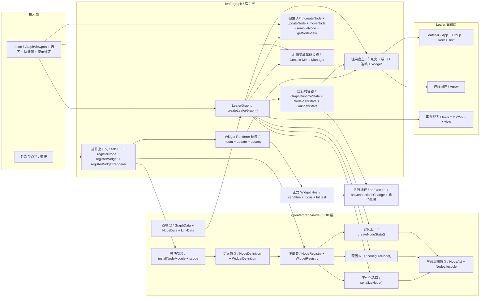
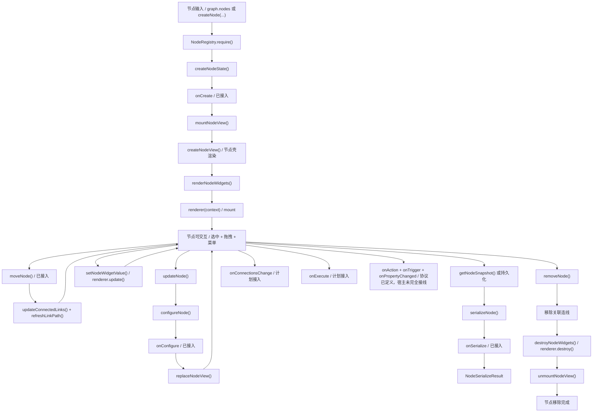

# 当前节点计划书

## 文档信息

- 日期：`2026-03-13`
- 适用对象：`@leafergraph/node`、`leafergraph` 主包、`editor`、未来外部节点包
- 当前阶段：`Phase 1.7 / 节点 SDK、插件接入、最小编辑交互已落地，节点壳固定色与折叠交互第一版已接入`
- 关联文档：
  - `./范围与设计选项.md`
  - `./架构蓝图.md`
  - `./节点API方案.md`
  - `./节点插件接入方案.md`
  - `./连线路由.md`
  - `./右键菜单管理方案.md`

---

## 1. 计划目标

这份计划书不再讨论“节点系统要不要做”，而是明确回答下面四个问题：

1. 当前节点体系已经真正落地了哪些能力
2. 当前哪些内容虽然可见，但本质上仍然属于 demo 或过渡实现
3. 下一步最应该先补什么，而不是继续横向加功能
4. 哪些能力应该属于 `@leafergraph/node`，哪些应该属于主包和 editor

一句话总结：

- **当前项目已经完成“节点定义与注册、模块安装、插件接入、宿主渲染、最小节点拖拽、最小右键菜单基础设施、首批正式交互 Widget”的第一阶段，但还没有进入真正的节点命令层和节点执行闭环。**

---

## 2. 当前状态总览

结合当前代码，可以把现状拆成三层来看：

1. `@leafergraph/node`
   - 已经是一个独立包
   - 已具备节点定义、注册、实例化、配置、序列化、模块安装、生命周期类型
2. `leafergraph` 主包
   - 已能作为唯一宿主持有注册表
   - 已能安装外部模块与插件
   - 已能渲染节点、连线、Widget
   - 已补上节点拖拽与右键菜单基础设施
3. `editor`
   - 已把主包图实例挂进 Preact 组件树
   - 已接入画布菜单和节点菜单
   - 但目前仍是最小 demo 接线，菜单动作还没有真正进入命令系统

也就是说，当前的真实结论应该是：

- **节点 SDK 已成立**
- **主包宿主能力已成立**
- **最小编辑交互已经成立**
- **Widget 正式交互已经跑通第一条闭环**
- **节点内部 Widget 区已经开始接入 `@leafer-in/flow`，支持更稳定的自适应布局**
- **节点已经具备最小可用的 resize 能力**
- **但节点命令层和执行系统还没有闭环**

### 2.1 当前节点能力矩阵

为了避免后续讨论时把“已经做了”和“准备做”混在一起，这里先给出基于当前代码的能力矩阵。

状态约定：

- `已完成`：已经进入真实代码路径，且当前阶段可以直接被主包或 editor 使用
- `部分完成`：已经有协议或最小实现，但还没有形成完整闭环
- `未开始`：当前仍停留在规划、声明或明显缺失阶段

| 能力域 | 当前状态 | 现状说明 |
| --- | --- | --- |
| 节点定义与注册 | 已完成 | 已有 `NodeDefinition`、`NodeResizeConfig`、`NodeRegistry`、`WidgetRegistry`、模块安装与作用域解析 |
| 节点实例化与配置 | 已完成 | 已有 `createNodeState()`、`configureNode()`、`serializeNode()`、`createNodeApi()` |
| 生命周期基础钩子 | 部分完成 | `onCreate`、`onConfigure`、`onSerialize` 已接线；`onExecute`、`onConnectionsChange` 仍未调度 |
| 图模型基础结构 | 已完成 | 主包已持有节点/连线统一状态容器，并以正式 `LeaferGraphData`、`LeaferGraphLinkData` 驱动 |
| 节点增删改移动 | 已完成 | 已有 `createNode()`、`removeNode()`、`updateNode()`、`moveNode()`，editor 菜单和快捷键已接入 |
| 连线增删查 | 已完成 | 已有 `createLink()`、`removeLink()`、`findLinksByNode()`，并能在节点移动后刷新路径 |
| 节点壳渲染 | 已完成 | 已抽出 `node_layout.ts`、`node_shell.ts`、`node_port.ts`，节点壳、端口与锚点已分层，并开始收敛固定色主题与折叠态布局 |
| Widget 渲染宿主 | 已完成 | 主包已具备 Widget renderer 的 `mount / update / destroy` 调度链 |
| Widget 正式交互 | 部分完成 | `slider`、`toggle` 已跑通真实回写；更多 Widget 类型和完整输入协议仍未形成 |
| Widget 自适应布局 | 部分完成 | 节点 Widget 区已接入 `@leafer-in/flow` 第一版纵向布局，但复合 Widget 范式仍未统一 |
| 节点拖拽 | 已完成 | 已通过正式 `moveNode()` 路径更新节点位置与关联连线 |
| 节点 resize | 部分完成 | 已有 resize 句柄、约束协议、重置尺寸入口；命令层和快捷键尚未完全覆盖 |
| 节点选区 | 已完成 | 已有最小单选/多选模型，支持 `Ctrl/Cmd/Shift + 点击` 和空白取消选中 |
| 节点菜单与快捷键 | 部分完成 | 删除、复制、粘贴、duplicate、重置尺寸已接到真实命令；更完整命令层与历史记录未接入 |
| editor 命令控制器 | 部分完成 | 已形成最小 `createEditorNodeCommandController()`，但画布命令与更通用命令体系还未拆开 |
| 画布命令 | 部分完成 | 画布菜单已有创建节点、粘贴、适配视图，但尚未形成独立画布命令控制器 |
| 执行系统 | 未开始 | 尚未建立真正的执行调度、输入输出传播与运行状态反馈闭环 |
| 连接变化生命周期 | 未开始 | `onConnectionsChange` 还没有由连线增删路径触发 |
| 外部节点生态 | 部分完成 | 外部包可注册节点、Widget 与 renderer，但模板、约束说明和完整作者体验还未完善 |

### 2.2 当前节点架构图

下面这张图对应当前代码里的真实分层关系，重点表达四件事：

1. `@leafergraph/node` 已经承担定义、注册、实例化、配置、序列化和生命周期协议
2. `leafergraph` 主包已经承担宿主、渲染、插件上下文和 Widget renderer 调度
3. `editor` 目前负责界面壳层、选区、快捷键和菜单接线，而不是节点运行时本体
4. `onExecute`、`onConnectionsChange`、正式命令系统和正式 Widget Host 仍然属于下一阶段

### 2.3 当前节点生命周期图

下面这张图只画当前代码里已经存在的真实节点流转，并明确区分“已经接入”和“协议存在但未正式调度”的部分：

- 已接入：
  - `onCreate`
  - `onConfigure`
  - `onSerialize`
  - Widget renderer 的 `mount / update / destroy`
  - `moveNode(...)` 触发的连线路径刷新
- 未正式接入：
  - `onConnectionsChange`
  - `onExecute`
  - `onAction`
  - `onTrigger`
  - `onPropertyChanged`

---

## 3. 当前已落地的能力

### 3.1 `@leafergraph/node` 已经具备的能力

当前 `packages/node/src/index.ts` 已经形成稳定公共入口，至少包含以下能力：

- 类型层：
  - `NodeDefinition`
  - `NodeResizeConfig`
  - `WidgetDefinition`
  - `NodeRuntimeState`
  - `NodeModule`
  - `NodeModuleScope`
  - `NodeApi`
  - `NodeLifecycle`
- 注册层：
  - `NodeRegistry`
  - `WidgetRegistry`
  - `BUILTIN_WIDGET_TYPES`
- 实例层：
  - `createNodeState()`
  - `configureNode()`
  - `serializeNode()`
  - `createNodeApi()`
- 模块层：
  - `installNodeModule()`
  - `resolveNodeModule()`
  - `resolveNodeModuleScope()`
  - `resolveScopedNodeType()`
  - `applyNodeModuleScope()`
- 约束与错误层：
  - 节点重复注册
  - Widget 重复注册
  - 未知节点类型
  - 未知 Widget 类型

这说明 `@leafergraph/node` 已经不是草稿，而是一个真正可被主包和外部作者共同消费的 SDK 雏形。

### 3.2 生命周期层已经定义，但还没有完整调度

当前 `NodeLifecycle` 已经包含：

- `onCreate`
- `onConfigure`
- `onSerialize`
- `onExecute`
- `onConnectionsChange`

其中已经真正接进调用链的，是：

- `onCreate`
- `onConfigure`
- `onSerialize`

仍然没有进入真实运行时调度的，是：

- `onExecute`
- `onConnectionsChange`

这意味着生命周期定义已经够完整，但宿主还没有把它们全部变成活的行为。

### 3.3 主包 `leafergraph` 已具备的能力

当前主包已经不只是“静态 demo 渲染”，而是具备了清晰的宿主职责：

- 注册与安装能力：
  - `installModule(module)`
  - `use(plugin)`
  - `registerNode()`
  - `registerWidget()`
  - `registerWidgetRenderer()`
  - `listNodes()`
- 渲染与宿主能力：
  - 使用唯一 `NodeRegistry`
  - 用真实 `NodeRuntimeState` 创建节点实例
  - 调度 Widget renderer 的 `mount / update / destroy`
  - 提供 `getNodeView(nodeId)`
  - 提供 `setNodeWidgetValue(nodeId, widgetIndex, value)`
- 交互基础设施：
  - 节点拖拽
  - 节点 resize
  - `getNodeResizeConstraint(nodeId)`
  - `canResizeNode(nodeId)`
  - `resetNodeSize(nodeId)`
  - 右键菜单基础设施 `createLeaferGraphContextMenu()`
  - 节点级菜单挂载 `bindNode()`
  - 画布级菜单挂载 `bindCanvas()`

### 3.4 editor 已具备的最小接线能力

当前 `packages/editor/src/GraphViewport.tsx` 已经完成下面这些最小接线：

- 创建 `LeaferGraph`
- 创建主包右键菜单管理器
- 绑定画布菜单
- 在 `graph.ready` 后绑定节点菜单
- 组件销毁时同步销毁 graph 和 menu

这一步非常重要，因为它意味着：

- 交互基础设施已经不是“只存在于文档”
- 主包与 editor 的职责边界已经开始形成

### 3.5 当前已经落地但容易被低估的部分

从计划角度看，下面这些能力虽然看起来不大，但其实已经把系统往前推了一步：

1. 节点包已经从主包中拆出为 `@leafergraph/node`
2. 外部插件可以拿到 `sdk + ui + registerWidgetRenderer`
3. 主包右键菜单已经回到主包基础设施层，而不是挂在 editor 私有实现里
4. `getNodeView(nodeId)` 已经建立了“宿主 -> editor 交互”的观察入口
5. 节点壳已经开始以“局部刷新当前 view”而不是“整体替换 view”的方式响应尺寸变化

这些都说明当前项目已经从“纯 demo 页面”进入“有层次的系统化重构阶段”。

---

## 4. 当前还属于过渡实现的部分

虽然能力已经不少，但下面这些地方仍然明显属于过渡态。

### 4.1 节点数据入口仍然偏 demo

当前主包初始化仍然依赖 `LeaferGraphNodeData`，而这个类型现在仍然放在 `packages/node/src/demo.ts` 中，并且带有大量演示字段，例如：

- `subtitle`
- `accent`
- `category`
- `status`
- `controlLabel`
- `controlValue`
- `controlProgress`

这说明：

1. 当前“节点实例输入”还没有正式图模型承接
2. `LeaferGraphNodeData` 仍然更像页面演示层数据，而不是正式图数据结构
3. `demo.ts` 继续留在节点包中，本身也是一笔边界上的技术债

### 4.2 主包里的节点宿主仍然过于集中

当前主包 `packages/leafergraph/src/index.ts` 同时承担了很多事情：

- 节点定义安装
- 插件安装
- 节点实例创建
- 节点壳绘制
- 端口布局
- Widget 区绘制
- 节点拖拽
- 场景同步

这说明当前最大的结构性风险不是“功能不够”，而是**主包大文件继续膨胀**。

### 4.3 Widget 已有渲染协议，但缺正式交互协议

现在已经有：

- `mount`
- `update`
- `destroy`
- `setValue(...)`
- `requestRender()`
- `emitAction(...)`

主包也已经提供：

- `setNodeWidgetValue(...)`

并且现在已经补上了一条真实闭环：

1. `slider` Widget 已可以通过 `pointer.down / pointer.move / pointer.up` 双向回写运行时值
2. `toggle` Widget 已可以通过按压交互直接回写布尔状态
3. Widget 命中区域会主动阻断事件，避免把交互误传递到节点拖拽层
4. `destroy()` 已显式解绑交互监听，避免交互型 Widget 累积事件残留

但问题仍然有：

1. 当前 `slider / toggle` 已经完成首批正式交互，但更多 Widget 类型还没有全部接到统一范式
2. Widget 如何声明焦点、键盘输入、组合交互，还没有统一规范
3. `emitAction(...)` 目前只完成最小桥接，还没有进入完整命令与执行体系

因此不能把现在的 Widget 系统误判为“已经全部做完”，但 Phase C 已经从“单一示例”推进到了“首批交互件 + 交互工具层”阶段。

### 4.3.1 Widget 区自适应布局已经进入第一版

当前主包已经开始把节点 Widget 区容器切到 `@leafer-in/flow`：

- Widget 区容器已改为 `Box + flow: "y"` 的纵向堆叠结构
- Widget 区高度已开始按控件首选高度、间距和内边距计算
- 节点宽度变化后，Widget 宽度会跟随节点壳重新布局

但这一层仍是第一版：

- Widget 内部具体控件仍主要由 renderer 手工排布
- 还没有形成“所有自定义 Widget 都默认基于 Flow 容器排布”的统一范式
- 更复杂的复合 Widget 还没有进入这一套布局协议

### 4.4 右键菜单已经落地，但命令系统还没落地

当前右键菜单已经有：

- 事件监听
- 坐标归一化
- DOM 菜单渲染
- 画布 / 节点挂载
- 外部关闭、`Escape`、resize 等关闭生命周期

但当前 editor 中的菜单项动作仍然只是：

- `console.log`

也就是说：

- 菜单基础设施已经完成
- 菜单命令语义还没有完成

### 4.5 节点拖拽已经有了，但只是局部交互

现在节点拖拽已经可用，移动节点也会刷新相关连线。

但它仍然只是一个 demo 级行为，因为还缺：

- 正式的 `moveNode(...)` API
- 命令层
- 撤销重做
- 统一图数据源

所以当前拖拽不应被理解为“图编辑系统已经完成”，而应视为“最小交互已经验证通过”。

### 4.5.1 节点 resize 已进入约束协议第一版，但命令层仍未接上

当前节点已经具备：

- 选中态下显示右下角 resize 句柄
- 拖拽句柄时更新节点显式 `width / height`
- 节点壳、端口、Widget 区和关联连线跟随局部刷新
- 节点定义已可通过 `NodeDefinition.resize` 声明：
  - `enabled`
  - `lockRatio`
  - `minWidth / minHeight`
  - `maxWidth / maxHeight`
  - `snap`
- 主包已可查询节点的正式 resize 约束，并按约束决定是否显示 resize 句柄

但它还不是最终方案：

- 当前仍是项目内的自定义 handle 实现，尚未进入 editor 命令层
- `resetNodeSize(...)` 已接入 editor 节点菜单，但快捷键和独立命令层还未接入
- 后续仍需要继续评估如何把 `@leafer-in/resize` 更深地纳入正式编辑协议

### 4.6 节点执行与连接回调还没有进入真实闭环

当前连线已经可以绘制、节点移动时也会更新曲线，但仍然没有下面这些正式能力：

- 节点集合与连线集合共享统一图模型
- 连接创建 / 删除进入正式 API
- `onConnectionsChange` 被宿主调度
- `onExecute` 被图运行时调度

这也是当前节点系统离“真正可运行”还差的核心部分。

---

## 5. 当前最关键的问题

基于当前代码状态，下一阶段最关键的不是补更多 demo，而是解决下面六个问题。

### 5.1 缺少正式图模型

当前真正缺的不是再画一个节点，而是建立图级数据源，例如：

- 节点集合
- 连线集合
- 选区
- 可选分组

如果没有它，下面这些能力都会变得难以持续：

- 节点增删改
- 连线增删改
- 菜单命令
- 历史记录
- 执行调度

### 5.2 缺少正式节点实例 API

现在主包还没有一组统一的节点命令入口，例如：

- `createNode(...)`
- `removeNode(...)`
- `updateNode(...)`
- `moveNode(...)`
- `duplicateNode(...)`

当前这些行为要么还不存在，要么只在 demo 交互里隐式发生。

### 5.3 节点宿主抽象还没开始真正拆层

虽然计划里一直强调要拆节点壳，但代码上目前节点壳仍然直接写在主包大文件里。

如果不尽快开始拆层，后面每加一种节点视觉变体、每加一种交互状态，成本都会指数上升。

### 5.4 Widget 仍缺少更完整的正式 host 协议

当前 Widget 最大的问题已经不再是“能不能显示”或“能不能回写”，而是：

- 如何规范回写值
- 如何请求重渲染
- 如何触发宿主动作
- 如何参与命中和输入系统

其中线性拖拽型与按压触发型两条最小回写链路已经跑通，但更完整的输入与焦点协议仍需要继续补齐。

### 5.5 主包、editor、节点包边界虽然明确了，但还没完全兑现到代码结构

当前文档上的分层已经越来越清楚：

- `@leafergraph/node` 负责宿主无关的节点 SDK
- `leafergraph` 负责宿主与渲染
- `editor` 负责产品化交互与命令接线

但代码上仍有一些过渡态残留，比如：

- demo 类型仍在 `@leafergraph/node`
- 主包内节点宿主逻辑仍过大
- editor 中菜单动作仍是占位实现

### 5.6 插件生态已经有注册入口，但还没有真正的作者体验

当前外部作者已经可以：

- 安装节点模块
- 注册节点
- 注册 Widget
- 注册 Widget renderer

但还没有：

- 标准模板工程
- 最小样例包
- 兼容性约束说明
- 节点搜索与分组的正式消费面
- 插件安装结果可视化反馈

因此“可扩展”已经成立，但“好用的外部生态”还没有成立。

---

## 6. 接下来必须遵守的原则

### 6.1 先把图模型与节点实例层做实，再继续堆编辑器体验

当前最危险的误区是继续加更多菜单、更多 demo 面板、更多展示动画。

真正应该先做的是：

1. 图模型
2. 节点实例 API
3. 节点宿主拆层
4. Widget host 协议

### 6.2 `@leafergraph/node` 继续保持宿主无关

这个包应该继续只负责：

- 定义
- 状态
- 注册
- 配置
- 序列化
- 模块安装
- 生命周期声明

不要把 Leafer 图元、Pointer 事件、DOM 浮层、editor 面板状态继续塞进去。

### 6.3 主包继续承接交互基础设施，但不要吞掉 editor 命令层

主包合理承接的内容包括：

- 节点宿主
- 连线宿主
- Widget renderer 宿主
- 右键菜单基础设施
- 节点视图暴露

但主包不应该直接负责：

- 复制 / 删除 / 粘贴命令策略
- 搜索面板
- 历史面板
- 产品级面板状态

### 6.4 少扩展 `LeaferGraphNodeData`，多建设正式图数据结构

如果下一步仍然继续往 `LeaferGraphNodeData` 上堆字段，会把 demo 类型永久化。

更合理的做法是：

1. 保持它只作为 demo / editor 沙盒输入
2. 尽快引入正式图模型结构
3. 逐步让主包内部从 demo 输入切到正式模型输入

---

## 7. 分阶段计划

接下来建议按五个阶段推进。

---

## 阶段 A：图模型与节点实例入口正式化

### 目标

把当前“demo 节点数组 + 顺序连线”的入口，升级为正式图数据入口。

### 需要完成

- 定义图级数据结构：
  - 节点集合
  - 连线集合
  - 可选分组集合
- 在主包增加正式 API：
  - `createNode(...)`
  - `removeNode(...)`
  - `updateNode(...)`
  - `moveNode(...)`
  - `createLink(...)`
  - `removeLink(...)`
- 让节点移动、创建、删除全部走统一数据源

### 完成标准

- 主包不再依赖默认顺序自动连线
- 节点和连线都来自统一图数据
- editor 的拖拽和菜单动作可以接到真实 API，而不是临时逻辑

### 这一阶段不做

- 完整执行引擎
- 子菜单系统
- 历史回放

---

## 阶段 B：节点宿主拆层

### 目标

把当前主包里的节点大函数拆成可维护的宿主层。

### 需要完成

- 抽出节点壳层布局结构，例如：
  - `NodeShellLayout`
  - `NodePortLayout`
  - `NodeWidgetLayout`
- 抽出节点壳层渲染入口，例如：
  - `createNodeShell(...)`
  - `updateNodeShell(...)`
- 把端口位置计算、标题区域、Widget 区域从主包单文件中拆出

### 完成标准

- 节点壳层不再散落在主包大文件中
- Widget 区和节点壳边界明确
- 后续改主题或样式变体不需要继续挤进一个文件

### 这一阶段不做

- 完整主题系统
- 复杂动画系统
- 节点全部视觉变体

---

## 阶段 C：Widget 正式交互协议

### 目标

把当前的 Widget renderer 从“只可展示”推进到“可编辑、可回写、可调度”。

### 需要完成

- 为 renderer 上下文补正式宿主接口，例如：
  - `setValue(...)`
  - `requestRender()`
  - `emitAction(...)`
- 明确 widget 值同步流程：
  - 用户交互
  - 回写运行时状态
  - 宿主触发实例更新
- 明确 widget 销毁时的解绑责任

### 完成标准

- 至少有一个 Widget 类型可真正双向工作
- 宿主不再需要靠外部补丁式方法维持值同步
- Widget 生命周期和宿主状态同步关系明确

### 这一阶段不做

- 富文本编辑 Widget
- HTML Overlay Widget
- 全量焦点管理系统

---

## 阶段 D：命令层与 editor 接线正式化

### 目标

把当前 editor 里的最小交互从 demo 行为升级为正式命令。

### 需要完成

- 定义 editor 命令层：
  - 创建节点
  - 删除节点
  - 复制节点
  - 移动节点
  - 适配视图
- 让右键菜单项不再只是 `console.log`
- 让拖拽行为进入正式 `moveNode(...)` 路径

### 完成标准

- 节点菜单和画布菜单接到真实命令
- editor 不再直接依赖 demo 占位动作
- 后续撤销重做具备接入点

### 这一阶段不做

- 完整历史面板
- 多视图同步
- 面板级复杂状态管理

---

## 阶段 E：连接与执行闭环

### 目标

让节点系统从“可显示、可编辑”进入“可连接、可执行”。

### 需要完成

- 让连线集合进入正式图模型
- 驱动 `onConnectionsChange`
- 建立最小执行调度：
  - 输入读取
  - 输出写回
  - 执行顺序
- 至少跑通一类真正可执行的外部节点

### 完成标准

- `onConnectionsChange` 有真实调度来源
- `onExecute` 有真实调度来源
- 节点执行结果可以反馈到 UI 或运行时状态

### 这一阶段不做

- 插件市场
- 完整版本协商
- 远程协作

---

## 8. 当前优先级建议

如果按“现在最值得做什么”排序，我建议是：

1. 阶段 A：图模型与节点实例入口正式化
2. 阶段 B：节点宿主拆层
3. 阶段 C：Widget 正式交互协议
4. 阶段 D：命令层与 editor 接线正式化
5. 阶段 E：连接与执行闭环

原因如下：

1. 当前最缺的不是更多交互壳，而是正式图数据入口
2. 当前最大技术债不是功能缺失，而是主包节点宿主过度集中
3. 如果不先把实例层和宿主层做稳，后面执行系统和生态都会被反向拖慢

---

## 9. 现阶段执行单元拆分

为了避免“阶段 A 很大，但不知道先做哪一步”，这里把接下来一段时间的工作拆成更小、可执行、可验收的单元。

### 9.1 A 阶段执行单元：图模型与节点实例入口

#### A-1：定义图模型最小类型

目标：

- 定义节点集合、连线集合、基础元信息结构

交付物：

- 图模型类型定义
- 节点与连线唯一 ID 约束
- 图级序列化输入草案

完成标准：

- 主包内部不再只能依赖 `LeaferGraphNodeData[]` 思考数据结构

#### A-2：主包内部引入图状态容器

目标：

- 让 `LeaferGraph` 内部开始持有统一图状态，而不是分散在 demo 初始化流程里

交付物：

- 节点 Map / 连线 Map 或等价状态容器
- 基础查询方法

完成标准：

- 节点与连线可以从统一状态读取

#### A-3：补节点实例正式 API

目标：

- 给主包补正式节点操作入口

交付物：

- `createNode(...)`
- `removeNode(...)`
- `updateNode(...)`
- `moveNode(...)`

完成标准：

- 节点增删改移动不再只能靠 demo 初始化和拖拽内部逻辑

#### A-4：补连线正式 API

目标：

- 给主包补正式连线操作入口

交付物：

- `createLink(...)`
- `removeLink(...)`
- 连接查找能力

完成标准：

- 连线创建与销毁可以脱离“默认顺序自动连线”

#### A-5：让拖拽接入正式 API

目标：

- 把现有节点拖拽逻辑从“直接改 view 和 state”切到 `moveNode(...)`

交付物：

- 拖拽路径改造
- 连线刷新跟随正式节点移动路径

完成标准：

- 节点移动只通过一个正式入口生效

### 9.2 B 阶段执行单元：节点宿主拆层

#### B-1：抽布局计算

目标：

- 先拆出纯计算层，降低渲染函数体积

交付物：

- 节点尺寸计算
- 端口布局计算
- Widget 布局计算

完成标准：

- 主包大文件中的布局计算逻辑显著减少

#### B-2：抽节点壳渲染入口

目标：

- 将节点卡片壳的创建逻辑独立出来

交付物：

- `createNodeShell(...)`
- `updateNodeShell(...)`

完成标准：

- 节点壳与 Widget 区不再混写在一个大函数里

#### B-3：抽端口与锚点能力

目标：

- 让连线锚点不再依赖散落的局部函数

交付物：

- 输入端口锚点
- 输出端口锚点
- 主端口默认锚点策略

完成标准：

- 连线路由和节点壳共享同一套端口布局信息

### 9.3 C 阶段执行单元：Widget 正式交互协议

#### C-1：定义 Widget host 上下文

目标：

- 把“renderer 只渲染”升级为“renderer 可与宿主交互”

交付物：

- `setValue(...)`
- `requestRender()`
- `emitAction(...)`

完成标准：

- Widget renderer 上下文具备最小回写能力

#### C-2：实现一个正式双向 Widget

目标：

- 选一个 Widget 类型跑通真正双向链路

当前状态：

- 已完成第一版 `slider`
- 已补 `toggle`，用于验证第二类交互件

交付物：

- 推荐先做 `slider`

完成标准：

- 用户交互可回写运行时值
- UI 能自动刷新

#### C-3：补 Widget 销毁与解绑规范

目标：

- 防止交互型 Widget 逐步引入事件泄漏

当前状态：

- 已在 `slider / toggle` renderer 中补上显式解绑
- 已抽出 `widget_interaction.ts`，开始沉淀更通用的命中、阻断和解绑约定

交付物：

- 销毁职责约定
- 示例实现

完成标准：

- 交互型 Widget 可以稳定挂载、更新、销毁

### 9.4 D 阶段执行单元：命令层与 editor 接线

#### D-1：定义 editor 命令接口

目标：

- 把当前菜单与拖拽背后的动作统一成命令面

交付物：

- 创建节点命令
- 删除节点命令
- 复制节点命令
- 适配视图命令

完成标准：

- editor 不再直接写占位动作

#### D-2：右键菜单接入真实命令

目标：

- 让当前 `console.log` 菜单项变成真实行为

交付物：

- 画布菜单创建节点
- 节点菜单删除节点

完成标准：

- 至少两个菜单动作进入正式命令链路

#### D-3：拖拽接入命令或状态层

目标：

- 为后续撤销重做做准备

交付物：

- 移动命令或等价状态操作抽象

完成标准：

- 拖拽不再是纯局部视图行为

### 9.5 E 阶段执行单元：连接与执行闭环

#### E-1：连接变化进入生命周期

目标：

- 让 `onConnectionsChange` 有真实来源

交付物：

- 连线创建 / 删除驱动生命周期

完成标准：

- 节点作者可以观察连接变化

#### E-2：最小执行调度

目标：

- 让 `onExecute` 真正跑起来

交付物：

- 输入读取
- 输出写回
- 最小调度入口

完成标准：

- 至少一类节点可以被执行

#### E-3：外部节点执行样例

目标：

- 让外部节点包不只是“能注册”，还要“能运行”

交付物：

- 一个带执行逻辑的外部节点样例

完成标准：

- 外部节点包能被安装、渲染、执行

---

## 10. TodoList

下面的 TodoList 按“已完成 / 正在推进 / 下一步 / 后续阶段”混合记录，方便后续直接更新状态。

### 10.1 已完成

- [X] 拆分出 `@leafergraph/node` 包
- [X] 建立 `NodeRegistry`、`WidgetRegistry`、模块安装与作用域解析能力
- [X] 建立 `createNodeState()`、`configureNode()`、`serializeNode()`、`createNodeApi()`
- [X] 在主包中接入唯一节点注册表
- [X] 在主包中支持插件安装、节点注册、Widget 注册、Widget renderer 注册
- [X] 使用真实 `NodeRuntimeState` 驱动 demo 节点渲染
- [X] 建立 Widget renderer 的 `mount / update / destroy` 调度链
- [X] 接入节点拖拽
- [X] 接入主包右键菜单基础设施
- [X] 在 editor 中接入画布菜单与节点菜单
- [X] 在 editor 中支持点击画布空白区域取消当前选中节点
- [X] 在 editor 中抽出最小单选状态控制器
- [X] 在 editor 中升级为最小多选选区模型
- [X] 在 editor 中支持 `Ctrl/Cmd/Shift + 点击节点` 切换选区
- [X] 在 editor 中接入左键框选，多节点可按世界坐标包围盒批量命中
- [X] 抽出 `NodeShellLayout` 与节点壳渲染入口
- [X] 抽出端口锚点与布局能力
- [X] 为 Widget renderer 上下文补上 `setValue(...)`、`requestRender()`、`emitAction(...)`
- [X] 实现正式双向 `slider` Widget，并补上最小销毁解绑样例
- [X] 抽出 `widget_interaction.ts`，并补上默认 `toggle` Widget renderer
- [X] 在节点 Widget 区接入 `@leafer-in/flow` 的第一版容器布局
- [X] 为节点接入最小可用的 resize 句柄与局部刷新链路
- [X] 在 `@leafergraph/node` 中补上 `NodeDefinition.resize` 正式约束协议
- [X] 在主包中补上 `getNodeResizeConstraint(...)`、`canResizeNode(...)`、`resetNodeSize(...)`
- [X] 让 resize 句柄只对允许缩放的节点显示并响应交互
- [X] 固定节点壳选中描边、信号球与默认端口主题色
- [X] 让 slot 开始按 `slot.color > slot.type > 输入输出默认色` 规则渲染
- [X] 让左上角信号球接入正式折叠开关，并在折叠后同步刷新节点高度与连线锚点
- [X] 在 editor 节点菜单中接入“重置节点尺寸”真实命令入口
- [X] 在 editor 中抽出最小节点命令辅助模块，开始收敛创建、复制、粘贴、duplicate 和重置尺寸路径
- [X] 在 editor 中形成 `createEditorNodeCommandController()`，让删除、复制、粘贴、duplicate 与重置尺寸开始走统一命令接口
- [X] 让 editor 的删除、复制、粘贴、duplicate 快捷键开始共享统一节点命令控制器
- [X] 让 editor 的多选态开始支持批量复制、剪切、删除、duplicate 与整组粘贴

### 10.2 正在推进

- [ ] 将现有节点数据入口从 demo 输入逐步过渡到正式图模型
- [ ] 将主包中的节点壳、端口布局、Widget 区拆出为更清晰的宿主层
- [ ] 将 Widget 正式交互协议从“首批内建 Widget 示例”推进到“外部 Widget 可直接复用的交互范式”
- [ ] 将节点 resize 协议继续接入 editor 命令层、快捷键和默认操作入口

### 10.3 下一步优先事项

- [X] 定义图模型最小类型
- [X] 在主包中建立统一图状态容器
- [X] 增加 `createNode(...)`
- [X] 增加 `removeNode(...)`
- [X] 增加 `updateNode(...)`
- [X] 增加 `moveNode(...)`
- [X] 增加 `createLink(...)`
- [X] 增加 `removeLink(...)`
- [X] 增加 `findLinksByNode(...)`
- [X] 让拖拽改走正式节点移动 API
- [X] 让右键菜单至少接入“创建节点 / 删除节点”两条真实命令

### 10.4 后续阶段

- [ ] 引入 editor 命令层
- [ ] 让 `onConnectionsChange` 进入真实调度
- [ ] 让 `onExecute` 进入真实调度
- [ ] 提供一个可执行的外部节点样例包

---

## 11. Changelog

这里的 Changelog 不是 Git 提交记录，而是“节点系统现阶段里程碑记录”，用于帮助后续快速判断当前已经完成到哪一步。

### 2026-03-12 / 2026-03-13

- 新增并稳定 `@leafergraph/node` 包，形成统一公共入口
- 建立节点定义、注册、实例化、配置、序列化、模块安装与生命周期类型
- 将主包改为持有唯一节点注册表，并打通插件安装路径
- 为主包补上最小正式图模型：`LeaferGraphData`、`LeaferGraphLinkData`
- 在主包内部建立统一图状态容器，开始从正式 `links` 数据驱动渲染
- 建立 Widget renderer 最小生命周期协议，并在主包宿主中接入
- 主包补上 `getNodeView(nodeId)`、`setNodeWidgetValue(...)` 等宿主级能力
- 主包补上正式图操作 API：`createNode(...)`、`removeNode(...)`、`updateNode(...)`、`moveNode(...)`、`createLink(...)`、`removeLink(...)`
- 主包补上 `findLinksByNode(...)`，为 editor 后续命令和联动查询提供最小入口
- 主包补上 `getNodeSnapshot(...)`，让 editor 可以基于宿主快照实现复制与粘贴
- 节点移动时已能刷新关联连线，证明“最小交互 + 场景同步”链路已打通
- 节点拖拽已改为统一复用 `moveNode(...)` 路径，消除了内部拖拽和正式 API 的双轨更新
- 主包补上 `setNodeSelected(...)`，节点已具备最小选中视觉反馈能力
- 右键菜单基础设施已回归主包，形成 `createLeaferGraphContextMenu()` 能力
- editor 已把画布菜单“创建节点”和节点菜单“删除节点”接到真实图 API
- editor 已补节点菜单绑定助手，新建节点后会自动接入节点级右键菜单
- editor 已接入“复制节点”“复制并粘贴”“粘贴已复制节点”三条最小复制链路
- editor 已补最小复制态与选区态清理逻辑，删除节点时会同步处理对应状态
- editor 已接入最小单选态，左键按下节点或打开节点菜单时会同步更新选中反馈
- editor 已支持点击画布空白区域取消当前选中节点，补齐最小单选态的收束路径
- editor 已抽出最小单选状态控制器，开始把选区逻辑从 `GraphViewport` 业务接线中解耦
- editor 已升级为“多选集合 + 主选中节点”模型，为后续框选和批量命令预留正式选区结构
- editor 已支持 `Ctrl/Cmd/Shift + 点击节点` 切换节点选区，右键命中已选中节点时会保留当前选区
- editor 已接入左键框选，框选命中会按节点当前世界包围盒批量更新选区
- editor 已支持 `Delete` 快捷键删除当前选中节点，并带输入焦点保护
- editor 已支持 `Ctrl/Cmd+C`、`Ctrl/Cmd+D`、`Ctrl/Cmd+V` 快捷键复用当前复制链路
- editor 已支持多选态下的 `Ctrl/Cmd+C`、`Ctrl/Cmd+X`、`Delete`、`Ctrl/Cmd+D` 与整组粘贴，且会保留选区内部相对布局
- 主包已抽出 `node_layout.ts`、`node_shell.ts`、`node_port.ts`，节点壳、端口和锚点开始脱离主包大文件
- 主包已为 Widget renderer 上下文补上 `setValue(...)`、`requestRender()`、`emitAction(...)` 三个最小 Host 能力
- 主包已把 Widget `emitAction(...)` 接回节点生命周期 `onAction(...)`
- 主包已把内建 `slider` Widget 升级为正式双向交互示例，打通 `pointer -> setValue(...) -> renderer.update(...) -> forceRender()` 闭环
- 主包已为 `slider` Widget 增加命中层事件阻断，避免拖动控件时误触发节点拖拽
- 主包已在 `slider` Widget 的 `destroy()` 中显式解绑交互事件，为后续交互型 Widget 提供最小销毁规范样例
- 主包已抽出 `widget_interaction.ts`，统一管理 Widget 命中、事件阻断、线性拖拽和按压交互绑定
- 主包已补上默认 `toggle` Widget renderer，形成“拖拽型 + 按压型”两种首批正式交互件
- 主包已在节点 Widget 区接入 `@leafer-in/flow` 的第一版纵向容器布局，开始按控件首选高度和间距计算 Widget 区尺寸
- 主包已补上节点右下角 resize 句柄，并打通“尺寸更新 -> 节点壳局部刷新 -> 端口与连线同步更新”链路
- 主包节点拖拽与 resize 已补上浏览器实测修正，保证二者不会互相误触发
- `@leafergraph/node` 已补上 `NodeDefinition.resize` 正式约束协议，开始从宿主最小实现过渡到稳定的尺寸声明层
- 主包已补上 `getNodeResizeConstraint(...)`、`canResizeNode(...)`、`resetNodeSize(...)` 三个正式 resize 能力入口
- 主包 `resizeNode(...)` 已开始统一消费 `enabled / lockRatio / min / max / snap` 约束，并将 resize 句柄收敛为“只在允许缩放节点上可见”
- 主包已固定节点选中描边、信号球与默认端口主题色，减少节点强调色对基础结构反馈的干扰
- 主包已让 slot 按 `slot.color > slot.type > 输入输出默认色` 规则解析颜色，并让 demo 默认节点开始携带类型信息
- 主包已让左上角信号球接入正式折叠交互，点击后会同步收缩节点壳、隐藏内容区并刷新关联连线锚点
- editor 已在节点右键菜单中接入“重置节点尺寸”，开始消费主包的正式 resize 约束与重置能力
- editor 已抽出最小 `node_commands.ts`，开始把节点创建、复制、粘贴、duplicate 与尺寸重置从 `GraphViewport` 闭包中收敛出来
- editor 已形成最小 `createEditorNodeCommandController()`，让删除、复制、粘贴、duplicate 与尺寸重置开始共享统一命令入口
- editor 已让删除、复制、粘贴、duplicate 快捷键开始复用统一节点命令控制器，`GraphViewport` 更接近纯事件接线层
- 当前计划书已从“阶段级描述”细化为“执行单元 + TodoList + Changelog”模式

---

## 12. 风险与控制

### 风险 1：继续在 demo 类型上堆字段

后果：

- `LeaferGraphNodeData` 会从演示层类型演变成事实标准
- 正式图模型会越来越难引入

控制方式：

- 尽量不再往 `demo.ts` 增加私有字段
- 新需求优先落到正式图模型设计

### 风险 2：主包继续变成“所有事情的大文件”

后果：

- 节点壳、交互、连线、Widget 全部耦合
- 后续任何变化都要同时改多个层次

控制方式：

- 尽快启动阶段 B
- 先拆宿主结构，再堆功能

### 风险 3：把右键菜单或拖拽误判为“编辑器已完成”

后果：

- 会高估当前系统成熟度
- 延后图模型与命令层建设

控制方式：

- 明确把当前交互定义为“基础设施已验证”
- 不把 demo 动作当成正式命令

### 风险 4：SDK 过早膨胀

后果：

- `@leafergraph/node` 会重新和宿主耦合
- 外部作者会更难理解包边界

控制方式：

- SDK 继续保持宿主无关
- Leafer 与 editor 相关能力继续放在主包和 editor

---

## 13. 阶段性验收标准

当下面这些条件同时满足时，可以认为“当前节点计划书”的主线目标达成：

- 主包拥有正式节点与连线 API，而不是只靠 demo 初始化
- 节点和连线共享统一图模型
- 节点壳和 Widget 宿主从主包大文件中开始分层
- 至少一种 Widget 具备正式双向交互能力，并明确最小销毁解绑责任
- 右键菜单动作已经接入真实命令，而不是日志占位
- 至少一类外部节点包能以标准方式接入并在 editor 中工作

---

## 14. 当前结论

当前节点系统已经明确跨过了“概念阶段”和“只有文档没有实现的阶段”，进入了一个更扎实但也更容易误判的中间阶段：

- `@leafergraph/node` 已成立
- 插件协议已成立
- 主包宿主已成立
- 最小编辑交互已成立
- 首批正式交互 Widget 已成立
- 但节点命令层和执行闭环还没有完成

因此，接下来最重要的主线应该明确为：

**图模型与实例 API -> 节点宿主拆层 -> Widget 正式交互 -> 命令层接线 -> 连接与执行闭环**

只要这条主线稳住，后续的搜索、菜单、模板、执行反馈和生态建设都会顺很多。
