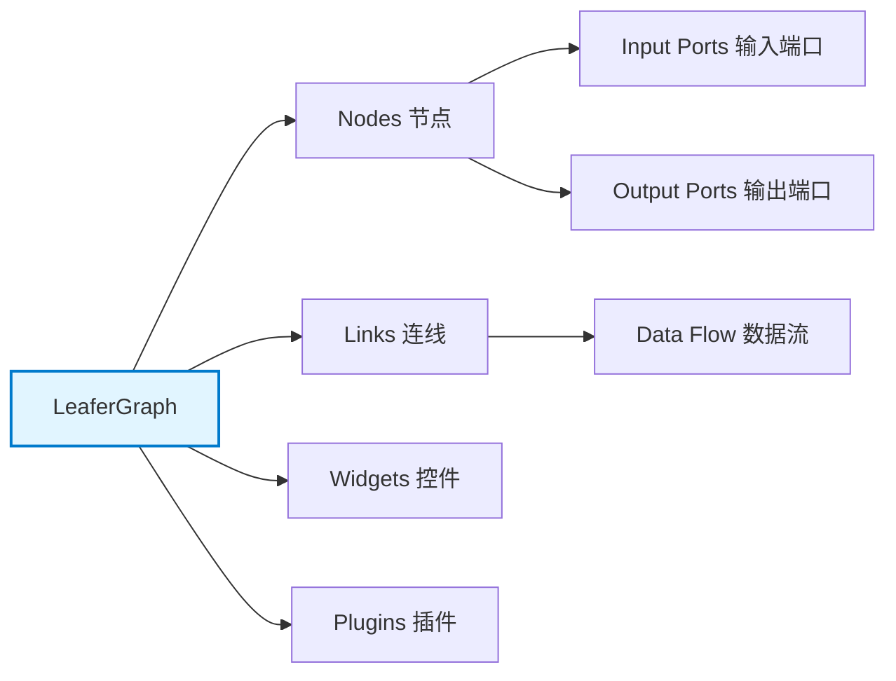
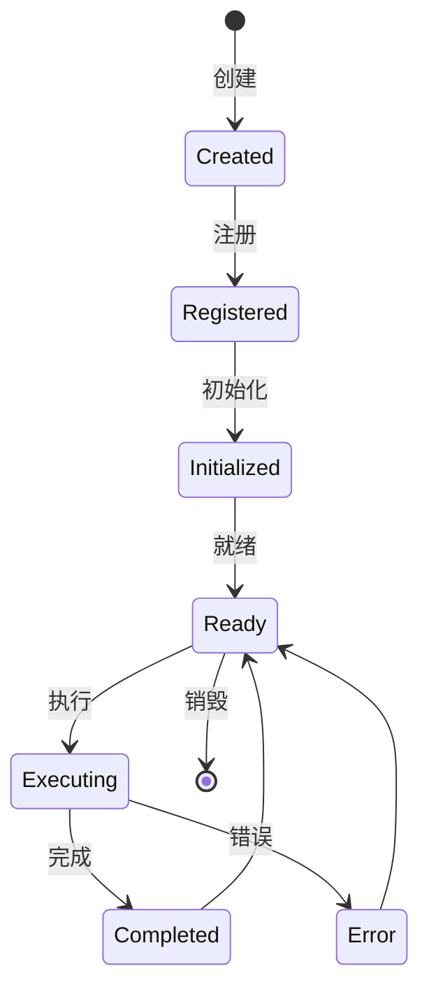
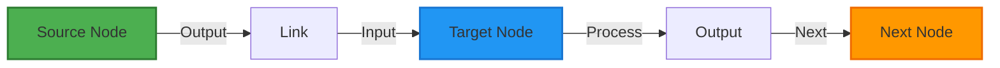

# 快速入门指南

本指南将帮助你快速上手 leafergraph 项目，了解如何创建、配置和使用节点图系统。

## 目录
- [项目概览](#项目概览)
- [环境准备](#环境准备)
- [5分钟快速开始](#5分钟快速开始)
- [核心概念](#核心概念)
- [创建第一个节点](#创建第一个节点)
- [扩展和自定义](#扩展和自定义)
- [常见问题](#常见问题)

## 项目概览



## 环境准备

### 必备工具
- Node.js 18+
- Bun（推荐）
- 现代浏览器（Chrome、Firefox、Safari、Edge）

### 安装项目
```bash
# 克隆项目
git clone <repository-url>
cd leafergraph

# 安装依赖
bun install

# 构建项目
bun run build
```

## 5分钟快速开始

### 1. 创建基础图实例

```typescript
import { leaferGraphBasicKitPlugin } from "@leafergraph/basic-kit";
import { createLeaferGraph } from "leafergraph";

const graph = createLeaferGraph(
  document.getElementById("graph-container") as HTMLElement,
  {
    plugins: [leaferGraphBasicKitPlugin]
  }
);

await graph.ready;
```

### 2. 添加节点

```typescript
// 创建节点
const node1 = graph.createNode({
  type: 'math/number',
  x: 100,
  y: 100,
  properties: {
    value: 42
  }
});

const node2 = graph.createNode({
  type: 'math/add',
  x: 300,
  y: 100
});
```

### 3. 连接节点

```typescript
// 连接节点
graph.createLink({
  source: {
    nodeId: node1.id,
    slot: 0
  },
  target: {
    nodeId: node2.id,
    slot: 0
  }
});
```

### 4. 运行图

```typescript
// 从节点开始执行
graph.playFromNode(node1.id);
```

## 核心概念

### 节点生命周期



### 数据流



## 创建第一个节点

### 1. 定义节点

```typescript
import { BaseNode, createAuthoringPlugin } from "@leafergraph/authoring";

class MyCustomNode extends BaseNode<
  { message: string },
  { input: number },
  { output: string },
  {}
> {
  static meta = {
    type: "custom/my-node",
    title: "My Custom Node",
    inputs: [{ name: "input", type: "number" }],
    outputs: [{ name: "output", type: "string" }],
    properties: [{ name: "message", type: "string", default: "Hello" }]
  };

  onExecute(ctx) {
    const input = ctx.getInput("input") ?? 0;
    ctx.setOutput("output", `${ctx.props.message}: ${input * 2}`);
  }
}

const plugin = createAuthoringPlugin({
  name: "my-custom-nodes",
  nodes: [MyCustomNode]
});
```

### 2. 注册节点

```typescript
await graph.use(plugin);
```

### 3. 使用节点

```typescript
const node = graph.createNode({
  type: 'custom/my-node',
  x: 200,
  y: 200
});
```

## 扩展和自定义

### 添加右键菜单

```typescript
import { createLeaferContextMenu } from "@leafergraph/context-menu";
import { registerLeaferGraphContextMenuBuiltins } from "@leafergraph/context-menu-builtins";

const menu = createLeaferContextMenu({
  app: graph.app,
  container: document.body
});

registerLeaferGraphContextMenuBuiltins(menu, {
  host: graph
});
```

### 添加快捷键

```typescript
import { bindLeaferGraphShortcuts } from "@leafergraph/shortcuts/graph";

const shortcuts = bindLeaferGraphShortcuts({
  target: document,
  scopeElement: document.body,
  enableExecutionBindings: true,
  host: {
    listNodeIds: () => [node1.id, node2.id],
    listSelectedNodeIds: () => graph.listSelectedNodeIds(),
    setSelectedNodeIds: (nodeIds) => graph.setSelectedNodeIds(nodeIds),
    clearSelectedNodes: () => graph.clearSelectedNodes(),
    removeNode: (nodeId) => graph.removeNode(nodeId),
    fitView: () => graph.fitView(),
    play: () => graph.play(),
    step: () => graph.step(),
    stop: () => graph.stop(),
    isContextMenuOpen: () => false
  }
});
```

### 添加历史栈

```typescript
import { bindLeaferGraphUndoRedo } from "@leafergraph/undo-redo/graph";

const history = bindLeaferGraphUndoRedo({
  host: graph,
  config: {
    maxEntries: 100,
    resetOnDocumentSync: true
  }
});
```

## 常见问题

### Q: 如何保存和加载图？

```typescript
// 保存
const snapshot = graph.getGraphDocument();
localStorage.setItem("my-graph", JSON.stringify(snapshot));

// 加载
const saved = localStorage.getItem("my-graph");
if (saved) {
  graph.replaceGraphDocument(JSON.parse(saved));
}
```

### Q: 如何自定义节点外观？

节点外观由主包负责渲染，你可以通过定义节点的 properties 和 widgets 来自定义内容区域。

### Q: 如何处理节点执行错误？

```typescript
graph.subscribeRuntimeFeedback((event) => {
  if (event.type === "node.execution" && event.event.state.status === "error") {
    console.error(
      `Node ${event.event.nodeId} error:`,
      event.event.state.lastErrorMessage ?? "Unknown error"
    );
  }
});
```

## 下一步

- 阅读 [工作区总览](./工作区总览.md) 了解完整架构
- 查看 [核心包总览](./核心包总览.md) 深入核心概念
- 参考 [API与插件接入](./API与插件接入.md) 学习插件开发
- 浏览 [作者层与模板](./作者层与模板.md) 使用模板快速开发
