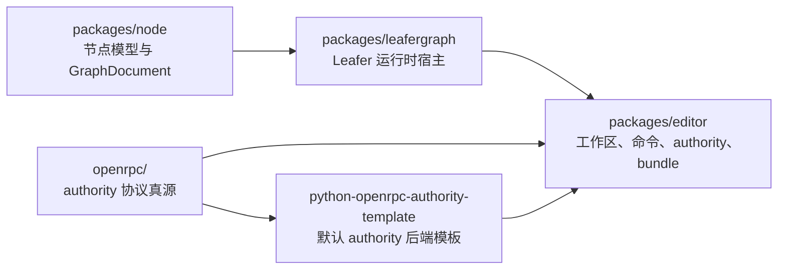

# LeaferGraph 架构蓝图

## 文档信息

- 当前状态：现状优先，保留中长期方向
- 最近校对：2026-03-23
- 适用范围：`packages/node`、`packages/leafergraph`、`packages/editor`、`openrpc/`

## 1. 当前架构结论

LeaferGraph 当前已经不是“单个 demo App + 若干实验文件”的结构，现状更接近下面这张图：

当前已经收敛出的核心事实是：

- `packages/node` 负责模型、定义、注册和 `GraphDocument`
- `packages/leafergraph` 负责场景装配、图 API、交互、局部刷新和运行反馈投影
- `packages/editor` 负责 viewport 壳层、命令、bundle loader、authority session 和 workspace UI
- `openrpc/` 是 authority 协议真源，不再藏在模板目录里

## 2. 当前仓库级结构

### 2.1 真实目录边界

当前最重要的目录职责如下：

| 目录 | 当前职责 |
| :--- | :--- |
| `packages/node` | 节点定义、节点模块、节点注册表、图文档基础模型 |
| `packages/leafergraph` | Leafer 场景宿主、图 API、交互、运行时、diff 投影 |
| `packages/editor` | Preact 壳层、viewport、菜单、命令、authority session、bundle loader |
| `openrpc` | authority OpenRPC 真源、schema、conformance 夹具 |
| `templates/backend/python-openrpc-authority-template` | 默认真实 authority 后端模板 |
| `templates/misc/browser-node-widget-plugin-template` | 外部节点/组件/蓝图 bundle 模板 |

### 2.2 已经不该再写成现状的目录

以下结构只应作为历史背景或草案，不应再写成当前现状：

- 旧的 node-sdk
- 旧的 node-templates
- 旧的 node-presets
- 早期设想里的 app 子目录
- 早期设想里的 model 子目录
- 早期设想里的 runtime 子目录
- 早期设想里的 scene 子目录
- 旧的 app 层 GraphViewport 路径

当前真实代码已经沿着另外一套目录组织前进。

## 3. 当前核心包架构

### 3.1 `packages/node`

`packages/node` 当前是节点系统的模型层入口，主要对外提供：

- `NodeDefinition`
- `NodeModule`
- `NodeRegistry`
- `createNodeApi`
- `installNodeModule(...)`
- `GraphDocument`
- `CapabilityProfile`

这层的关键特征是：

- 不依赖 Leafer 场景对象
- 不承担 editor UI 职责
- 为主包和外部插件提供统一模型语言

### 3.2 `packages/leafergraph`

当前主包的实际内部重心主要落在这几个子目录：

| 子目录 | 当前职责 |
| :--- | :--- |
| `src/api` | 对外 facade、图 API 类型、diff 类型、插件类型 |
| `src/graph` | 运行时装配、restore、mutation、scene runtime、feedback projection |
| `src/node` | 节点壳、节点布局、节点运行时、端口命中与节点视图 |
| `src/link` | 连线几何、连线视图与路径更新 |
| `src/interaction` | 交互运行时、连接预览、右键菜单基础设施 |
| `src/widgets` | widget registry、widget lifecycle、widget interaction、内建 widget |

当前主包不是“只做渲染”，而是同时承担：

- 图文档装配
- 图操作应用
- 节点 / 连线 / widget 局部刷新
- 运行反馈投影
- 视图控制与交互基础设施

### 3.3 `packages/editor`

当前 editor 的结构已经明显从旧 demo 页面收敛为几个正式区域：

| 子目录 | 当前职责 |
| :--- | :--- |
| `src/shell` | `EditorProvider`、工作区状态、onboarding、workspace 编排 |
| `src/ui` | viewport、节点库、预览、设置、检查器、状态条 |
| `src/commands` | 命令总线、history、clipboard、节点/连线/画布命令 |
| `src/menu` | 菜单绑定与菜单解析器 |
| `src/loader` | bundle 校验、脚本装载、依赖求解、持久化 |
| `src/session` | authority client、transport、session、OpenRPC 生成代码 |
| `src/backend` | authority source/runtime 适配 |
| `src/demo` | preview、本地 authority worker、Python host demo bootstrap |

## 4. 当前主包运行时链

### 4.1 装配入口

当前主包装配主线已经明确收口到：

1. `packages/leafergraph/src/index.ts`
2. `createLeaferGraphRuntimeAssembly(...)`
3. `createLeaferGraphSceneRuntimeAssembly(...)`
4. `LeaferGraphApiHost`

其中：

- `index.ts` 负责公共导出和 `LeaferGraph` facade
- `graph_runtime_assembly.ts` 负责按固定顺序装配各宿主
- `graph_scene_runtime_assembly.ts` 负责 scene runtime 侧组合
- `graph_api_host.ts` 负责把内部运行时收口成公共 API

### 4.2 运行时链条中的关键宿主

当前最关键的宿主包括：

- `LeaferGraphBootstrapHost`
- `LeaferGraphCanvasHost`
- `LeaferGraphSceneRuntimeHost`
- 节点运行时宿主
- 交互运行时宿主
- Widget 环境宿主
- `LeaferGraphLocalRuntimeAdapter`

这条链比早期“入口文件直接 new 一堆对象”清晰得多，也意味着文档不应再把 `index.ts` 写成唯一实现中心。

### 4.3 当前数据与反馈方向

主包当前已经有三条不同但相关的输入：

1. 正式文档输入
   - `replaceGraphDocument(...)`
2. 正式操作输入
   - `applyGraphOperation(...)`
3. 运行反馈输入
   - `projectRuntimeFeedback(...)`

以及一条文档增量输入：

4. `applyGraphDocumentDiff(...)`

这几个入口不应再被混成“统一刷新函数”。

## 5. 当前 editor 消费链

### 5.1 运行时装配链

当前 editor 的主消费链大致是：

1. `EditorProvider`
2. `runtimeSetup`
3. `GraphViewport`
4. `createDocumentSessionBinding(...)`
5. `LeaferGraph`

其中 `runtimeSetup` 来自 bundle loader，`documentSessionBinding` 来自 authority 或 loopback session。

### 5.2 authority 消费链

当前 authority 消费链已经分层为：

- OpenRPC 真源：`openrpc/`
- editor 生成器：`packages/editor/tools/generate_from_openrpc.ts`
- 生成目录：`packages/editor/src/session/authority_openrpc/_generated/`
- runtime/adapter：`packages/editor/src/session/authority_openrpc/runtime.ts`
- transport/client：`graph_document_authority_transport.ts`
- session：`graph_document_session.ts`

这意味着 editor 当前已经不该再被描述成“完全手写 authority 协议”。

### 5.3 当前 viewport 与菜单边界

viewport 当前真实入口是：

- `packages/editor/src/ui/viewport/Connected.tsx`
- `packages/editor/src/ui/viewport/View.tsx`

右键菜单当前真实入口是：

- 主包基础设施：`packages/leafergraph/src/interaction/context_menu.ts`
- editor 菜单绑定：`packages/editor/src/menu/context_menu_bindings.ts`
- editor 菜单解析：`packages/editor/src/menu/context_menu_resolver.ts`

因此当前菜单架构应理解为：

- 主包提供菜单基础设施
- editor 负责菜单语义与命令接线

## 6. 当前 authority 与 OpenRPC 位置

### 6.1 协议真源

当前 authority 协议真源固定是：

- `openrpc/authority.openrpc.json`
- `openrpc/schemas/`
- `openrpc/conformance/`

环境变量固定是：

- `LEAFERGRAPH_OPENRPC_ROOT`

### 6.2 当前默认 authority 后端

当前仓库默认真实 authority 后端模板是：

- `templates/backend/python-openrpc-authority-template`

当前 editor 公开 authority demo 页面也收口到：

- `authority-python-host-demo.html`

旧 Node host demo 和旧 `authority-host-demo.html` 不应再被写成现行入口。

## 7. 当前应该坚持的设计红线

### 7.1 不把 editor 装载协议写成主包公共 API

必须持续区分：

- 主包 API：`LeaferGraph`、`NodeModule`、`registerWidget(entry)`、`GraphOperation`
- editor 装载协议：`EditorBundleManifest`、`LeaferGraphEditorBundleBridge`

### 7.2 不把某个外部应用协议直接抬进核心层

当前长期方向仍然是：

- 核心层维护 canonical graph model
- 外部应用通过 adapter 接入
- runtime feedback 允许来自浏览器外部系统

### 7.3 不把 authority 文档同步和运行反馈混为一谈

当前已明确存在两类通道：

- 文档同步：
  - `authority.document`
  - `authority.documentDiff`
- 运行反馈：
  - `runtimeFeedback`

二者都会影响 UI，但职责不同。

## 8. 中长期方向

### 8.1 继续向 runtime-agnostic 主包推进

当前中长期方向仍然成立：

- 主包继续保持 runtime-agnostic
- 本地执行器保留为验证和离线链路
- 正式权威状态默认以后端 authority 为主

### 8.2 继续把“多应用接入”放在 adapter 层

后续仍然推荐把：

- `CapabilityProfile`
- `RuntimeAdapter`
- 未来 `AppAdapter`

作为多应用接入的边界，而不是针对单个应用重写主包模型。

### 8.3 继续让文档追随现状，而不是追随旧蓝图

这份蓝图以后继续更新时，默认遵守：

- 当前目录和当前入口先写
- 理想目录和未来重构后写
- 历史路径只在明确标记区出现

## 9. 当前结论

当前 LeaferGraph 的架构已经形成了比较清楚的三层结构：

- `packages/node` 提供节点和图文档模型
- `packages/leafergraph` 提供 Leafer-first 图运行时宿主
- `packages/editor` 提供编辑器壳层、bundle 装载和 authority 会话

而 `openrpc/` 与 Python authority 模板则把“协议真源”和“默认后端实现”补到了这张图里。

因此现在最重要的不是再发明一套新的理想目录，而是继续沿着这套已经落地的结构推进：

- 保持边界清楚
- 保持现状文档准确
- 继续收敛 authority/OpenRPC/runtime/bundle 的交汇点
