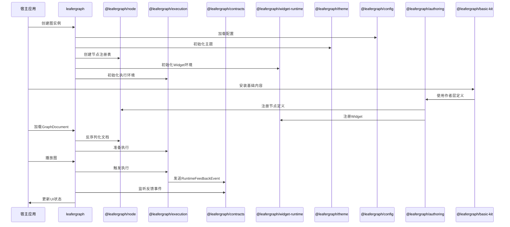
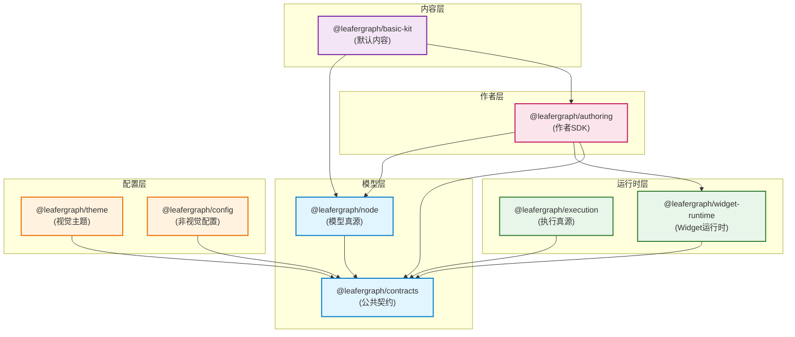

# 核心包总览

这份文档合并了工作区里各个核心真源包的 README，目的是先把“谁是哪个真源”说清楚，再把跨包依赖方向说清楚。

## 核心包交互流程图

## 核心包职责边界图

## 包职责

| 包 | 主要职责 |
| --- | --- |
| `@leafergraph/node` | 模型真源：节点定义、模块、图文档、注册表、序列化 |
| `@leafergraph/execution` | 执行真源：图执行、传播、反馈、内建执行节点 |
| `@leafergraph/contracts` | 公共契约：选项、插件、Widget 条目、运行反馈、diff helper |
| `@leafergraph/theme` | 视觉主题真源：preset、mode 和视觉 token |
| `@leafergraph/config` | 非视觉配置真源：graph、widget、menu 和 Leafer 配置 |
| `@leafergraph/widget-runtime` | Widget runtime 真源：注册表、生命周期、编辑和交互 helper |
| `@leafergraph/basic-kit` | 默认内容包：系统节点和基础 Widget |

## 边界

- `@leafergraph/node` 回答“图模型是什么”。
- `@leafergraph/execution` 回答“图怎么跑”。
- `@leafergraph/contracts` 回答“哪些协议可以跨包共享”。
- `@leafergraph/theme` 回答“长什么样”。
- `@leafergraph/config` 回答“默认行为怎么配”。
- `@leafergraph/widget-runtime` 回答“Widget 怎么渲染和编辑”。
- `@leafergraph/basic-kit` 回答“默认会带哪些内容”。

## 常见查找

| 如果你要找 | 先看 |
| --- | --- |
| 节点模型真源 | `@leafergraph/node` |
| 图执行与反馈 | `@leafergraph/execution` |
| 跨包协议和运行反馈 | `@leafergraph/contracts` |
| 主题和 token | `@leafergraph/theme` |
| 图、widget、menu 配置 | `@leafergraph/config` |
| Widget runtime 行为 | `@leafergraph/widget-runtime` |
| 默认内容和开箱体验 | `@leafergraph/basic-kit` |
