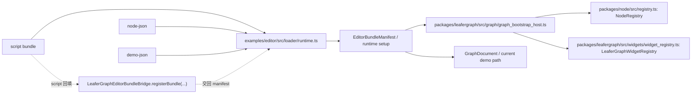

# 节点 / 组件 / 蓝图加载说明

## 文档信息

- 当前状态：现状优先，持续维护
- 最近校对：2026-03-23
- 适用范围：
  - `examples/editor/src/loader/`
  - `examples/editor/src/session/`
  - `examples/editor/src/shell/provider.tsx`
  - `templates/misc/browser-node-widget-plugin-template`

## 1. 定位与术语映射

这份文档只解释 editor 装载层，不解释主包全部运行时。

当前必须同时区分两套名字：

| 说明层术语 | 代码真实名字 | 当前语义 |
| :--- | :--- | :--- |
| 蓝图 | `demo` | 提供一份正式 `GraphDocument`，决定当前文档候选 |
| 组件 | `widget` | 提供 Widget renderer 和必要插件安装逻辑 |
| 节点 | `node` | 提供节点定义、节点插件和快速创建入口 |
| bundle | `bundle` | editor 装载层的统一交付单位 |

这里的关键边界是：

- `demo / node / widget` 是 editor 装载协议的真实槽位名
- 这些名字不等于主包长期领域模型
- `LeaferGraphEditorBundleBridge.registerBundle(...)` 只属于 editor 接入层协议

## 2. 当前加载体系总览

当前 editor 有两条 bundle 来源：

1. 本地导入
   - 文件选择器读取 bundle 或结构化 JSON
   - 经 `src/loader/runtime.ts` 解析后进入 catalog
2. 远端 authority 同步
   - authority 通过 `frontendBundles.sync` 推送结构化包
   - 经 `src/session/graph_document_authority_transport.ts` 收口后进入相同 catalog

两条来源最终都会汇合到同一套 editor 内部状态：

- `EditorBundleCatalogState`
- `EditorBundleRecordState`
- `EditorBundleRuntimeSetup`

运行时真正传给 `GraphViewport` 的只有三类结果：

- `document`
- `plugins`
- `quickCreateNodeType`

也就是说，bundle 不会直接操作画布；它们先进入 catalog，再由 runtime setup 选择哪些记录真正参与运行。

## 3. 当前支持的 bundle 形态

### 3.1 manifest 形态

`examples/editor/src/loader/types.ts` 当前定义了三类 manifest：

- `EditorDemoBundleManifest`
- `EditorPluginBundleManifest`
- `EditorBundleManifest`

其中：

- `demo` manifest 必须直接携带 `document`
- `node` / `widget` manifest 统一通过 `plugin` 安装
- `quickCreateNodeType` 只对 `node` / `widget` 插件 bundle 有意义

### 3.2 authority / loader 支持的前端 bundle 内容格式

当前结构化 bundle 源只支持三种格式：

- `script`
- `node-json`
- `demo-json`

含义分别是：

| 格式 | 适用槽位 | 当前行为 |
| :--- | :--- | :--- |
| `script` | `demo` / `node` / `widget` | 执行 IIFE 或脚本源码，等待顶层 bridge 注册 manifest |
| `node-json` | `node` | 直接携带 `NodeDefinition`，由 loader 包成插件 manifest |
| `demo-json` | `demo` | 直接携带正式 `GraphDocument` |

当前没有 `widget-json`。原因不是单纯“忘了做”，而是组件 bundle 往往不仅是静态定义，还会携带 renderer 和安装逻辑，所以仍然需要 `script`。

## 4. 本地加载链

### 4.1 本地导入主链

当前本地导入的真实路径是：

1. 用户在 editor 里选择本地文件
2. `src/shell/provider.tsx` 调用 loader
3. `src/loader/runtime.ts` 根据槽位和内容格式解析
4. 如为脚本，则先 `ensureEditorBundleRuntimeGlobals(...)`
5. 脚本顶层调用 `LeaferGraphEditorBundleBridge.registerBundle(...)`
6. loader 产出 `EditorBundleRecordState`
7. provider 更新 catalog
8. `resolveEditorBundleRuntimeSetup(...)` 计算当前有效 `document + plugins`
9. `GraphViewport` 收到新的 runtime setup

### 4.2 本地导入时的全局对象

脚本 bundle 当前依赖两个全局对象：

- `LeaferGraphRuntime`
- `LeaferGraphEditorBundleBridge`

这两个对象由 editor 装载层提供，不属于主包公共 API。

### 4.3 当前 demo 选择规则

`demo` 槽位当前仍然有单当前值语义：

- catalog 里可以同时存在多条 `demo` 记录
- 但同一时刻只会有一个 `enabled = true` 的当前 demo
- `setCurrentDemoBundle(...)` 和 `upsertEditorBundleRecord(...)` 都会维护这个约束

因此：

- 蓝图记录可以并存
- 当前画布只能消费其中一条当前蓝图

### 4.4 本地导入后的默认行为

当前文档行为需要特别说明：

- 导入 `node` / `widget` bundle 会扩展可用插件集合
- 导入 `demo` bundle 不等于立刻整图替换
- 只有它成为当前 demo，并且 runtime setup 重算后，才会影响 `GraphViewport` 的 effective document

这也是为什么“导入蓝图 bundle”不应再被文档写成“自动切画布”。

## 5. authority 远端加载链

### 5.1 当前 authority 传输层位置

当前 editor authority 接线的关键文件是：

- `examples/editor/src/session/graph_document_authority_transport.ts`
- `examples/editor/src/session/authority_openrpc/`
- `examples/editor/src/session/websocket_remote_authority_transport.ts`
- `examples/editor/src/session/message_port_remote_authority_transport.ts`
- `examples/editor/src/session/node_process_remote_authority_client.ts`

这条链现在已经开始消费共享 OpenRPC 生成物，而不是只靠手写常量。

### 5.2 authority 当前会推送哪些东西

对 bundle 和运行态最相关的 authority 事件有三类：

- `authority.document` / `authority.documentDiff`
- `runtimeFeedback`
- `frontendBundles.sync`

它们的职责不同：

| 事件 | 作用 |
| :--- | :--- |
| `authority.document` | 推整份 authoritative document |
| `authority.documentDiff` | 推正式文档增量 |
| `runtimeFeedback` | 推运行态反馈，不直接代表文档变更 |
| `frontendBundles.sync` | 推前端 bundle catalog 更新 |

### 5.3 `frontendBundles.sync` 的当前处理方式

`createTransportRemoteAuthorityClient(...)` 目前会：

1. 维护一份按 `packageId` 聚合的前端 bundle package catalog
2. 把 `full / upsert / remove` 三种同步模式统一折叠成当前快照
3. 向上游暴露 `subscribeFrontendBundles(...)`

然后 provider 再把这些远端 bundle package 转成 editor 侧的 remote bundle records。

### 5.4 authority 下发的 bundle 当前支持矩阵

当前可安全表达的远端 bundle 语义是：

| 来源 | 槽位 | 格式 | 当前是否支持 |
| :--- | :--- | :--- | :--- |
| authority | `node` | `node-json` | 支持 |
| authority | `demo` | `demo-json` | 支持 |
| authority | `demo/node/widget` | `script` | 支持 |
| authority | `widget` | 纯 JSON | 不支持 |

### 5.5 authority bundle 与浏览器持久化的边界

当前 remote bundle record 不会写入浏览器持久化。

也就是说：

- 本地 bundle 会进入 IndexedDB
- authority 推来的 bundle 只保留在当前远端会话生命周期内
- 断开连接后，remote record 不会被当成本地扩展继续长期保留

## 6. 当前运行时装配与依赖求解

### 6.1 catalog 只是目录，不等于有效运行时

单条 bundle record 至少会经历这些状态判断：

- 是否加载成功
- 是否启用
- 依赖 bundle 是否满足
- 是否成为当前 demo

最终 `resolveEditorBundleRuntimeSetup(...)` 才会给出：

- 当前有效 `document`
- 当前有效 `plugins`
- 当前有效 `quickCreateNodeType`

### 6.2 依赖求解规则

当前依赖字段是 `requires?: string[]`。

依赖判断的实际语义是：

- 当前 bundle 声明的 `requires` 必须在 catalog 中找到至少一条有效候选
- 若依赖缺失，记录会进入 `dependency-missing`
- 依赖没满足时，即使该记录 `enabled = true`，也不会成为 `active`

### 6.3 quick create 类型的当前决策

`quickCreateNodeType` 当前用于 editor 右键创建和节点库默认创建入口。

当前推荐做法仍然是：

1. 先准备组件 bundle
2. 再准备节点 bundle
3. 最后准备蓝图 bundle

这样当前蓝图被激活时，不会因为依赖节点或组件缺失而出现空壳或错误提示。

## 7. 浏览器持久化与恢复

### 7.1 当前持久化实现

本地 bundle 持久化集中在：

- `examples/editor/src/loader/persistence.ts`

当前实现使用的是 IndexedDB，而不是 localStorage。

主要字段包括：

- `key`
- `slot`
- `bundleId`
- `fileName`
- `sourceCode`
- `enabled`
- `savedAt`

### 7.2 当前恢复顺序

页面重新打开后，provider 会按这类顺序恢复：

1. 先处理 bootstrap/preloaded bundles
2. 再读取 IndexedDB 中的 persisted local bundles
3. 再重算 catalog 与 runtime setup

恢复的本质不是“拿回旧内存对象”，而是“重新执行或重新解析一遍同一份 bundle 源”。

### 7.3 当前持久化边界

当前持久化只覆盖本地导入状态，不覆盖：

- authority 推来的 remote bundle
- authority 当前文档
- authority 运行时反馈历史

## 8. 旧方案注册代码落点

这一节描述的是当前旧方案前端节点 / 组件注册链的现状，不是新模块方案，也不代表未来唯一推荐接入方式。

### 8.1 注册职责矩阵

| 层级 | 包 | 核心文件 | 职责 |
| :--- | :--- | :--- | :--- |
| editor 装载入口 | `examples/editor` | `src/loader/runtime.ts` | 读取本地 / 远端 bundle，执行 script，接收 `LeaferGraphEditorBundleBridge.registerBundle(...)`，归一化为 editor 可消费的 manifest |
| 主包注册调度宿主 | `packages/leafergraph` | `src/graph/graph_bootstrap_host.ts` | 在图初始化时安装 module / plugin，并把 `installModule / registerNode / registerWidget` 调度到真正注册表 |
| 节点注册底座 | `packages/node` | `src/registry.ts`、`src/module.ts`、`src/definition.ts` | 保存 `NodeDefinition`，批量安装 `NodeModule`，定义节点模块与作用域边界 |
| 组件注册底座 | `packages/leafergraph` | `src/widgets/widget_registry.ts` | 保存 widget entry、归一化 renderer，并作为节点 widget 校验时的读取源 |
| 模板接入样例 | `templates/misc/browser-node-widget-plugin-template` | `src/browser/register_bundle.ts`、`src/browser/node_bundle.ts`、`src/browser/widget_bundle.ts` | 演示 bundle 顶层怎样进 bridge，以及 plugin 内怎样安装节点和组件 |

### 8.2 节点 / 组件注册链对照表

| 类型 | editor 入口 | 主包宿主 | 最终注册表 |
| :--- | :--- | :--- | :--- |
| `node` script bundle | `loadEditorBundleSource(...)` 执行脚本，等待 `registerBundle(...)` | `LeaferGraphBootstrapHost` | `packages/node/src/registry.ts` 的 `NodeRegistry` |
| `node-json` | `loadEditorFrontendBundleSource(...)` 直接包装成 plugin manifest | `LeaferGraphBootstrapHost` | `packages/node/src/registry.ts` 的 `NodeRegistry` |
| `widget` script bundle | `loadEditorBundleSource(...)` 执行脚本，等待 `registerBundle(...)` | `LeaferGraphBootstrapHost` | `packages/leafergraph/src/widgets/widget_registry.ts` 的 `LeaferGraphWidgetRegistry` |
| `demo` script / `demo-json` | editor loader 直接生成 demo manifest | 不进入节点 / 组件注册宿主 | 不进入节点 / 组件注册表，只进入当前文档选择路径 |

### 8.3 editor 接入入口

旧方案最先进入系统的不是主包注册表，而是 editor 装载层。

当前入口主要集中在 `examples/editor/src/loader/runtime.ts`：

- `loadEditorBundleSource(...)`
  - 负责本地 bundle 文本读取
  - `script` 会执行源码并等待桥接注册 manifest
- `loadEditorFrontendBundleSource(...)`
  - 负责 authority 或其它结构化来源
  - `node-json` 会先转成插件 manifest
  - `demo-json` 会直接转成 demo manifest
- `ensureEditorBundleRuntimeGlobals(...)`
  - 在浏览器全局暴露 `LeaferGraphEditorBundleBridge.registerBundle(...)`
  - 它只是一条“bundle 向 editor 回填 manifest”的握手入口

这里最重要的边界是：

- `LeaferGraphEditorBundleBridge.registerBundle(...)` 不是最终注册动作
- 它只是把 script bundle 的顶层声明交回 editor loader
- 真正是否参与运行，还要继续经过 catalog、启用态和 `resolveEditorBundleRuntimeSetup(...)`

三种本地 / 远端格式进入后的落点关系是：

- `script`
  - 先注册 manifest
  - 如果 manifest.kind 是 `node` / `widget`，后续会作为 plugin 进入主包注册宿主
- `node-json`
  - 直接转成 `NodeDefinition`
  - 再由 `createPluginFromNodeDefinition(...)` 包成 plugin manifest
  - 后续仍走主包节点注册链
- `demo-json`
  - 直接转成 `GraphDocument`
  - 只参与当前蓝图文档选择，不进入节点 / 组件注册表

### 8.4 主包注册宿主

真正负责“收插件并触发注册”的宿主是 `packages/leafergraph/src/graph/graph_bootstrap_host.ts`。

它承担的是注册调度职责，而不是最终存储职责：

- `initialize(...)`
  - 先确保内建 widget 和内建节点注册完成
  - 再安装 `modules`
  - 再安装 `plugins`
  - 最后恢复正式图文档
- `use(plugin)`
  - 组装 `LeaferGraphNodePluginContext`
  - 把 `installModule / registerNode / registerWidget` 暴露给外部 bundle plugin
- `installModule(...)`
  - 调用 `@leafergraph/node` 的 `installNodeModule(...)`
- `registerNode(...)`
  - 把节点定义转发给 `NodeRegistry`
- `registerWidget(...)`
  - 把组件条目转发给 `LeaferGraphWidgetRegistry`

因此 `graph_bootstrap_host.ts` 更准确的名字应该理解成：

- 它是“旧方案注册调度宿主”
- 不是节点定义或组件条目的最终存放地

### 8.5 节点注册表与组件注册表

旧方案里，节点和组件最终并不落在同一个包里。

节点注册表在 `packages/node`：

- `packages/node/src/registry.ts`
  - `NodeRegistry` 是节点定义的最终登记处
  - 外部 plugin 最终注册的 `NodeDefinition` 会保存在这里
  - 这里还会在注册前校验节点声明里引用的 widget 是否存在
- `packages/node/src/module.ts`
  - `installNodeModule(...)` 只负责批量安装 `NodeModule`
  - `resolveNodeModule(...)` 会先解析 scope，再把节点写入注册表
- `packages/node/src/definition.ts`
  - `NodeModule` 只承载节点定义
  - `WidgetDefinition` 是独立概念
  - 当前并不存在“把组件一起塞进 `NodeModule`”的旧方案语义

组件注册表在 `packages/leafergraph`：

- `packages/leafergraph/src/widgets/widget_registry.ts`
  - `LeaferGraphWidgetRegistry` 是组件条目的最终登记处
  - 它不仅保存组件定义，还会把 renderer 归一化成正式可执行形式
  - 节点定义里声明的 widget，也会回到这里做读取与解析

这也是为什么旧方案里会出现“节点底座在 `packages/node`，组件底座在 `packages/leafergraph`”的分层。

### 8.6 模板中的旧方案调用样例

如果只看当前仓库里的实际作者用法，最直接的样例在 `templates/misc/browser-node-widget-plugin-template/src/browser/`。

- `register_bundle.ts`
  - 顶层只做一件事：读取全局 bridge，并调用 `registerBundle(...)`
  - 这代表旧方案的 browser bundle 必须主动向 editor 回填 manifest
- `node_bundle.ts`
  - 典型节点 bundle 写法
  - 在 plugin 的 `install(ctx)` 中调用 `ctx.installModule(...)`
  - 说明旧方案节点作者的主要工作是准备好 `NodeModule`
- `widget_bundle.ts`
  - 典型组件 bundle 写法
  - 先 `ctx.registerWidget(...)`
  - 再 `ctx.installModule(...)`
  - 说明旧方案组件 bundle 往往不仅注册 renderer，还会顺手安装消费该组件的伴生节点

这套样例也反过来解释了旧方案的一个常见设计习惯：

- 节点 bundle 以“模块安装”为主
- 组件 bundle 以“组件注册 + 伴生节点安装”为主

### 8.7 这一节里最容易误解的边界

- `LeaferGraphEditorBundleBridge.registerBundle(...)` 不是最终注册
  - 它只属于 editor 装载层握手
- `NodeModule` 不等于组件模块
  - 旧方案的 `NodeModule` 只承载节点，不承载 widget
- `examples/editor` 负责接入
  - 真正的节点 / 组件登记分别落在 `packages/node` 和 `packages/leafergraph`
- 本节只描述旧方案现状
  - 不代表未来新模块接入方案必须继续保持同样分层

## 9. 模板工程与产物

### 9.1 当前模板目录

当前推荐模板是：

- `templates/misc/browser-node-widget-plugin-template`

其浏览器侧关键文件是：

- `src/browser/register_bundle.ts`
- `src/browser/node_bundle.ts`
- `src/browser/widget_bundle.ts`
- `src/browser/demo_bundle.ts`
- `src/browser/demo_alt_bundle.ts`

### 9.2 当前模板的两条产物线

模板当前同时支持：

- ESM 包接入
- browser IIFE bundle 接入

其中 browser 产物默认包括：

- `node.iife.js`
- `widget.iife.js`
- `demo.iife.js`
- `demo-alt.iife.js`

如果当前仓库还没执行模板 build，这些 `dist/browser/*` 文件可能不会常驻在仓库中；文档描述的是模板的构建目标，而不是保证它们永远已经生成。

### 9.3 当前模板的职责边界

模板当前推荐保持一包三职能分离：

- `node` bundle 负责节点类型与快速创建入口
- `widget` bundle 负责 renderer 与组件能力
- `demo` bundle 负责正式图文档

不要把三者混成一个“大而全 bundle”，否则 catalog、依赖和启用态会变得很难解释。

## 10. 当前最容易混淆的边界

### 10.1 bundle 协议不是主包公共 API

`EditorBundleManifest`、`EditorFrontendBundleSource`、`LeaferGraphEditorBundleBridge` 都属于 editor 装载层协议。

主包长期公共入口仍然是：

- `NodeModule`
- `installNodeModule(...)`
- `registerWidget(entry)`
- `LeaferGraphNodePlugin`

### 10.2 authority 文档同步不是 bundle 同步

即使 authority 同时会推：

- `authority.document`
- `authority.documentDiff`
- `frontendBundles.sync`

它们也不是同一条协议。

尤其不能把“authority 推了一份 demo-json bundle”写成“authority 已经替换了当前文档”。是否最终影响画布，还要看 provider/runtime setup 的投影规则。

### 10.3 runtime feedback 也不是 bundle 协议的一部分

`runtimeFeedback` 负责的是运行态投影，例如：

- 节点执行状态
- 图执行状态
- 连线传播动画

它不负责安装节点、组件或蓝图。

## 11. 常见问题与排查

| 现象 | 先看哪里 | 当前解释 |
| :--- | :--- | :--- |
| script 执行后 loader 提示没有 manifest | `register_bundle.ts`、`loadEditorBundleSource(...)` | 顶层没有调用 `LeaferGraphEditorBundleBridge.registerBundle(...)` |
| 导入了 demo 但画布没变化 | `setCurrentDemoBundle(...)`、runtime setup | demo 可能没成为当前 demo，或依赖没满足 |
| authority 推了 bundle 但 UI 没变化 | `frontendBundles.sync`、provider remote record 投影 | bundle 可能只进了 catalog，未变成 active |
| 刷新页面后本地 bundle 消失 | `persistence.ts`、恢复日志 | IndexedDB 里没有记录，或恢复时源码解析失败 |
| 远端 widget JSON 失败 | authority payload 格式 | 当前没有 `widget-json` 协议 |
| authority 文档变了但 bundle 没变 | 文档通道与 bundle 通道 | 这是正常情况，两条链本来就是分开的 |

## 12. 最佳实践

### 12.1 面向外部作者

- 用 ESM 包做长期公共接入，用 IIFE bundle 做 editor 本地联调
- 给 bundle id 保持稳定且可读
- 蓝图 bundle 显式声明 `requires`
- 节点 bundle 提供 `quickCreateNodeType`
- 不要把组件能力写成假想的 `widget-json`

### 12.2 面向维护者

- 任何新增 bundle 行为先判断它属于 editor 装载层还是主包模型层
- 新文档一律先写真实槽位名，再补说明层术语
- authority 链路变更时同步检查 `authority_openrpc`、transport、provider 和本文
- 不再把旧模板共享 OpenRPC 目录、旧 GraphViewport.tsx 或旧 host demo 写成现行入口

## 13. 当前结论

当前 LeaferGraph 的加载体系已经从“几个 demo 文件拼起来跑”升级成一套清晰得多的 editor 装载结构：

- 节点 bundle 负责类型和创建入口
- 组件 bundle 负责 renderer 和伴生能力
- 蓝图 bundle 负责正式图文档
- 本地与远端都会先进入 catalog
- runtime setup 才决定真正传给 viewport 的 `document + plugins`
- authority 文档同步、bundle 同步和 runtime feedback 已经是三条明确分层的通道

理解这份文档时，只要记住一句话就够了：

**bundle 先进入 editor 目录状态，再由 runtime setup 决定是否真正参与运行；它不是直接操作主包画布的旁路协议。**
