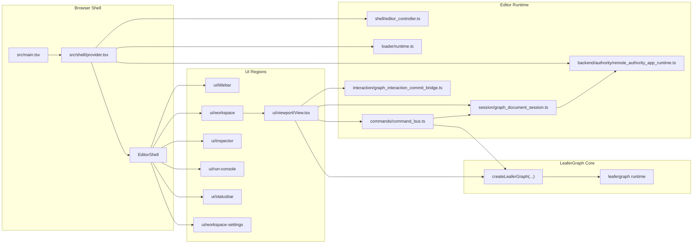
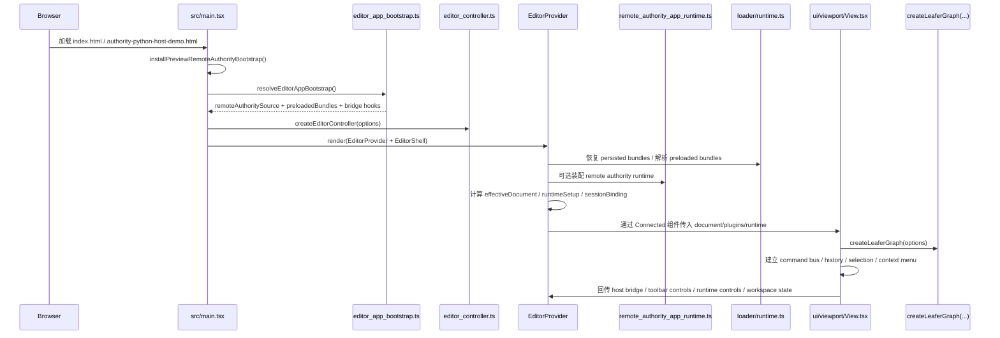
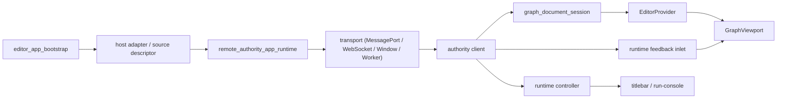
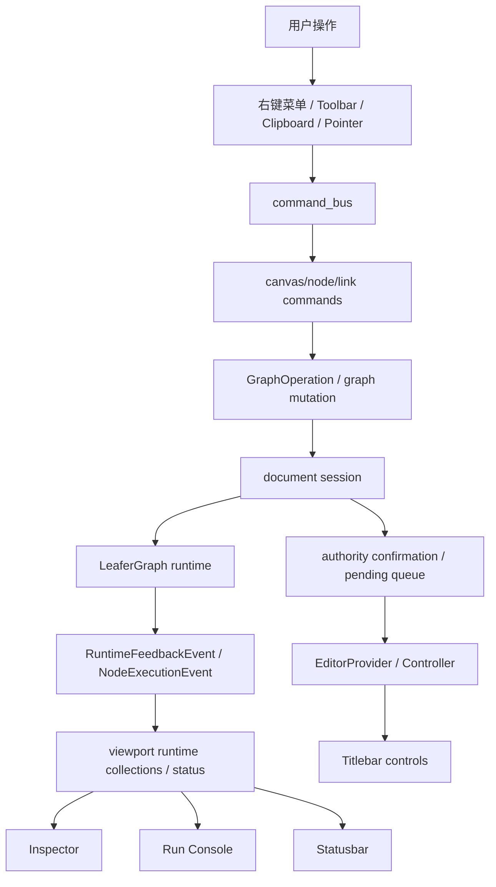

# `packages/editor` 工程百科全书

## 1. 文档定位

`packages/editor` 是 LeaferGraph 的编辑器壳层。它不负责定义底层图模型，也不直接实现 Leafer retained-mode 渲染宿主；这些能力主要来自 [`leafergraph`](../leafergraph/README.md) 与 `@leafergraph/node`。  
它的职责是把以下几类能力编排成一个可运行的前端编辑器：

- Preact UI 区域树与页面布局
- bundle 装载、持久化与插件装配
- authority source/transport/client/session 的接线
- 命令总线、历史、交互提交桥与运行控制
- LeaferGraph 画布挂载、运行反馈投影与 inspector/statusbar/run console 展示

当前工作树下，索引范围共收录 `191` 个非琐碎文件，详见 [`FILE_INDEX.md`](./FILE_INDEX.md)。

## 2. 带注释目录骨架

```text
packages/editor
├─ README.md                              # 包入口说明，跳转到深入文档
├─ ARCHITECTURE.md                        # 架构总览、生命周期、数据流、技术选型
├─ FILE_INDEX.md                          # 全量非琐碎文件索引
├─ package.json                           # scripts / exports / deps
├─ tsconfig.json                          # Preact JSX 与 leafergraph 源码 alias
├─ vite.config.ts                         # Vite 多页面、GitHub Pages base、dev server
├─ index.html                             # 默认 editor 页面入口
├─ authority-python-host-demo.html        # Python WebSocket authority demo 页面入口
├─ public
│  ├─ favicon.svg                         # 页面图标
│  └─ __testbundles                       # 手工维护的 bundle 样例，用于 loader 和 demo
├─ src
│  ├─ main.tsx                            # 浏览器启动入口
│  ├─ index.ts / backend.ts / ui.ts       # 公共导出面
│  ├─ styles.css                          # editor 官方样式聚合入口
│  ├─ app                                 # 仍在收口中的过渡层
│  ├─ backend                             # authority source/runtime 装配
│  ├─ commands                            # 命令总线、历史、节点/连线/剪贴板命令
│  ├─ debug                               # Leafer debug 配置
│  ├─ demo                                # preview/demo authority bootstrap 与 worker/service
│  ├─ interaction                         # 交互 -> 命令/operation 提交桥
│  ├─ loader                              # bundle manifest、装载、依赖、持久化
│  ├─ menu                                # 右键菜单绑定和解析
│  ├─ runtime                             # 运行反馈入口抽象
│  ├─ session                             # authority protocol / transport / session
│  ├─ shell                               # EditorProvider、EditorShell、controller、adaptive layout
│  ├─ state                               # 轻量状态控制，例如 selection
│  ├─ theme                               # 主题、背景样式、localStorage 初始化
│  └─ ui                                  # 按区域拆分的 Connected/View 模块
└─ tests                                  # 单元与集成测试，覆盖 authority/bundle/viewport/interaction
```

### 2.1 分层语义

- `shell`
  - editor 的状态编排中心。`EditorProvider` 负责把 theme、debug、bundle、authority runtime、workspace state 和 viewport host bridge 统一接到一棵 UI 树上。
- `ui`
  - 纯展示层与 provider 连接层。每个区域通常遵循 `Connected.tsx + View.tsx + types.ts + styles.css + README.md + index.ts` 模板。
- `session`
  - editor 对“正式图文档”的会话层语义：authority transport、client、service bridge、loopback/remote session、pending/confirmation/resync。
- `backend`
  - authority 来源装配层，把 `MessagePort / Worker / Window / service / transport` 收敛成统一的 `ResolvedEditorRemoteAuthorityAppRuntime`。
- `loader`
  - bundle 运行时装配层，负责 IIFE/JSON bundle 的读取、manifest 校验、依赖求解、plugin/document runtime setup 与浏览器持久化。
- `commands`
  - 命令总线与命令控制器。承接 toolbar、context menu、快捷键、交互提交。
- `interaction`
  - 把 LeaferGraph 画布交互提交为 editor 命令或正式 `GraphOperation`。
- `app`
  - 过渡层。当前仍保留 bootstrap 和少量面板/投影逻辑，但整体职责已在往 `shell/ui/backend` 迁移。

## 3. 高层架构

### 3.1 架构类型

`packages/editor` 是一个 **模块化 monolith + authority-ready frontend shell**，而不是 microservices。

它的核心不是把功能按前后端服务切碎，而是把前端内部能力拆成清晰的模块边界：

- UI composition：Preact Context + Connected/View 模式
- State orchestration：`EditorController` + `EditorProvider`
- Runtime mounting：`GraphViewport` 挂载 `LeaferGraph`
- Session/document sync：authority transport/client/session binding
- Command dispatch：`command_bus`
- Plugin/document composition：bundle loader/runtime setup

### 3.2 使用到的主要模式

- Provider + Controller
  - `EditorProvider` 持有跨区域运行态，`EditorController` 作为外部可订阅状态接口。
- Adapter-based authority
  - `remote_authority_host_adapter.ts` 把不同宿主统一成 authority source descriptor。
- Session-driven document projection
  - `graph_document_session.ts` 统一 loopback、mock remote、real remote 的文档快照、pending 队列与 authority confirmation。
- Command bus
  - `command_bus.ts` 把 context menu、toolbar、clipboard、interaction commit 收束为统一命令入口。
- Plugin / Bundle loader
  - `loader/runtime.ts` 把本地文件、preloaded bundle、authority 同步来的前端 bundle 装成 editor 运行时。

### 3.3 模块关系图



### 3.4 边界总结

- `packages/editor`
  - 负责“如何把图编辑器组织起来”。
- `packages/leafergraph`
  - 负责“图如何被渲染、交互、序列化和运行”。
- `@leafergraph/node`
  - 负责节点定义、节点类型与节点插件协议。

换句话说，editor 是 orchestration shell，不是 graph kernel。

## 4. 启动生命周期

### 4.1 主入口链

editor 当前的稳定入口链是：

1. `src/main.tsx`
2. `installPreviewRemoteAuthorityBootstrap()`
3. `resolveEditorAppBootstrap()`
4. `createEditorController()`
5. `render(<EditorProvider><EditorShell/></EditorProvider>)`
6. `EditorViewportConnected`
7. `ui/viewport/View.tsx`
8. `createLeaferGraph(...)`

### 4.2 启动时序图



### 4.3 进入稳定运行态前的关键步骤

#### A. bootstrap 解析

`src/app/editor_app_bootstrap.ts` 负责读取 `globalThis.LeaferGraphEditorAppBootstrap`，并支持这些装配项：

- `remoteAuthoritySource`
- `remoteAuthorityAdapter`
- `remoteAuthorityMessagePort`
- `remoteAuthorityWorker`
- `remoteAuthorityWindow`
- `remoteAuthorityDemoWorker`
- `preloadedBundles`
- `onViewportHostBridgeChange`

这意味着 editor 不把具体 authority 协议、URL 和 host 细节写死在主入口里，而是允许页面级注入。

#### B. Provider 状态编排

`src/shell/provider.tsx` 是整个 editor 的运行时总控。它会在挂载期间完成这些动作：

- 解析主题和 Leafer debug 初始值
- 创建 bundle catalog，并恢复浏览器中持久化的 bundle 记录
- 处理本地 bundle 文件装载、启停、卸载与 demo 激活
- 可选装配 `ResolvedEditorRemoteAuthorityAppRuntime`
- 订阅 authority 连接状态、remote document、pending 操作与前端 bundle 同步事件
- 计算 `effectiveDocument`
  - remote authority ready 时优先用 authority document
  - 否则退回本地 demo/empty document
- 计算 `runtimeSetup`
  - 从启用的 node/widget/demo bundle 得到 plugins、quickCreateNodeType 等装配结果
- 把这些状态同步到 `EditorController`

#### C. GraphViewport 挂载

`src/ui/viewport/View.tsx` 是 editor 真正触碰 `createLeaferGraph(...)` 的地方。它会继续装配：

- `createLeaferGraphContextMenu(...)`
- `createEditorCommandBus(...)`
- `createEditorCommandHistory(...)`
- `createEditorNodeSelection(...)`
- `createGraphInteractionCommitBridge(...)`
- 文档 session binding
- runtime feedback inlet
- remote runtime controller

因此，`GraphViewport` 不是单纯的“画布组件”，而是 editor 把 graph、session、commands、runtime feedback 聚到一起的执行面。

## 5. 三条核心数据流

### 5.1 Bundle 流

#### 关键事实源

- `src/app/editor_app_bootstrap.ts`
- `src/loader/runtime.ts`
- `src/loader/persistence.ts`
- `src/shell/provider.tsx`

#### 流程

1. 页面 bootstrap 提供 `preloadedBundles`
2. provider 恢复浏览器持久化 bundle 记录
3. 用户也可以通过 workspace settings/extensions 手动选择本地 bundle 文件
4. `loader/runtime.ts` 校验 manifest、槽位、依赖与 document/plugin 内容
5. provider 把 catalog 求值为当前 `runtimeSetup`
6. `runtimeSetup.plugins` 与 `effectiveDocument` 一起传给 `GraphViewport`
7. `GraphViewport` 用这些插件创建 `LeaferGraph`

#### 关键特征

- bundle 不是源码 alias 直连，而是 runtime composition
- node/widget 可叠加启用，demo 同时刻只选一个当前 demo
- bundle catalog 支持浏览器持久化恢复
- authority 也可以通过 `frontendBundles.sync` 推送前端 bundle

### 5.2 Authority 流

#### 关键事实源

- `src/backend/authority/remote_authority_app_runtime.ts`
- `src/session/graph_document_authority_transport.ts`
- `src/session/graph_document_session.ts`
- `src/session/graph_document_session_binding.ts`

#### 流程

1. bootstrap 指定 authority source 或 authority adapter descriptor
2. `remote_authority_app_runtime.ts` 把 source 装成统一 runtime
3. runtime 提供：
   - authority client
   - document
   - session binding factory
   - runtime feedback inlet
   - runtime controller
4. provider 把 remote document 与 session binding 作为 `effective*` 输入传给 `GraphViewport`
5. `GraphViewport` 通过 session 维护：
   - current document
   - pending operation ids
   - authority confirmation
   - resync 行为
6. authority 自己的 runtime feedback 和 runtime control 通过 inlet/controller 回流到 run console、statusbar 和 toolbar

#### authority 数据流图



### 5.3 编辑流

#### 关键事实源

- `src/ui/viewport/View.tsx`
- `src/interaction/graph_interaction_commit_bridge.ts`
- `src/commands/command_bus.ts`
- `src/commands/command_history.ts`
- `src/menu/context_menu_resolver.ts`

#### 流程

1. 用户操作入口
   - pointer interaction
   - context menu
   - titlebar toolbar
   - clipboard
2. `GraphViewport` 把这些动作转交给 command bus
3. command bus 调用 canvas/node/link controller
4. controller 读取 graph 快照、构造 `GraphOperation` 或直接驱动 graph
5. 如果存在 authority session，则同时等待 authority confirmation
6. 执行结果投影到：
   - selection
   - inspector
   - statusbar
   - run console
   - toolbar state

### 5.4 文档 / 命令 / 运行反馈的综合流向



## 6. 运行模式对照

| 运行模式 | authority 来源 | 文档事实真源 | 主要入口 | 适用场景 |
| :--- | :--- | :--- | :--- | :--- |
| Local loopback | 无 | 浏览器内本地 `GraphDocument` | `GraphViewport` 默认 loopback session | 干净入口、无 authority 调试 |
| Demo worker | 浏览器内 Worker | demo authority service | `remote_authority_demo_worker.ts` | 无后端时的 authority 演示 |
| MessagePort | 原生 `MessagePort` | 外部宿主 authority | `createEditorRemoteAuthorityMessagePortSource(...)` | 同页桥接、宿主嵌入 |
| Worker | `postMessage(..., [port])` | Worker authority | `createEditorRemoteAuthorityWorkerSource(...)` | 浏览器内隔离 authority |
| Window / Iframe | `window.postMessage()` + `MessagePort` | 外部窗口 authority | `createEditorRemoteAuthorityWindowSource(...)` | iframe/多窗口嵌入 |
| WebSocket host | WebSocket transport | 外部 Python/Node authority | `websocket_remote_authority_transport.ts` | 真正远端 authority demo |

### 6.1 切换逻辑

- 有 `remoteAuthoritySource`
  - `EditorControllerState.isRemoteAuthorityEnabled = true`
  - provider 优先装配 remote runtime
  - `effectiveDocument` 优先来自 authority
- 无 `remoteAuthoritySource`
  - 退回本地 loopback
  - 若未激活 demo bundle，则使用空文档

### 6.2 authority-first 的防抖与保护

为避免 authority 文档整图投影打断活跃交互，viewport 还补了一层保护：

- `authority_document_projection_gate.ts`
  - 有 marquee/reconnect/active graph interaction 时暂缓投影
- `graph_execution_feedback_guard.ts`
  - remote mode 下忽略 document projection 触发的本地 execution reset 噪声

## 7. UI、shell、session、loader、commands 与 leafergraph 的边界

### 7.1 UI vs shell

- `shell`
  - 决定状态从哪里来、怎么汇总
- `ui`
  - 决定这些状态如何显示和交互

`Connected.tsx` 是上下文接线层，`View.tsx` 是更偏纯展示层。这是当前 editor 最稳定的 UI 约定。

### 7.2 shell vs session

- `shell/provider.tsx`
  - 拥有 authority 是否启用、何时重载/重连、如何暴露控制状态的编排权
- `session/*`
  - 拥有“文档快照、pending 操作、authority confirmation、resync”这些文档同步语义

### 7.3 shell vs loader

- `loader`
  - 只负责 bundle 的事实解析与 runtime setup 生成
- `shell/provider`
  - 决定 catalog 怎样影响当前 editor 状态，以及何时把 setup 送进 viewport

### 7.4 commands vs leafergraph

- `commands`
  - 站在 editor 视角，组织“用户意图”
- `leafergraph`
  - 站在 graph kernel 视角，提供节点/连线/运行/交互宿主能力

命令层不会重复实现 graph kernel，而是把 graph kernel 暴露出的 `createNode / removeNode / createLink / getNodeSnapshot / GraphOperation` 等能力，包装成 editor 命令。

## 8. 技术选型分析

### 8.1 Preact / Hooks / Context

为什么选它：

- editor 是前端壳层，主要问题是状态编排和区域组合，不需要更重的框架约束
- 当前组件树大量依赖 Context、hooks 和轻量渲染层

在本项目中的落点：

- `src/main.tsx` 使用 `render(...)`
- `src/shell/provider.tsx` 使用 `createContext`、`useState`、`useEffect`、`useMemo`、`useCallback`
- `src/ui/*/Connected.tsx` 通过 `useEditorContext()` 连接状态

解决的问题：

- 用很小的运行时成本承接 editor shell
- 保持组件层与 graph/runtime 层解耦

官方资料：

- [Preact Getting Started](https://preactjs.com/guide/v10/getting-started)
- [Preact Hooks](https://preactjs.com/guide/v10/hooks/)

### 8.2 `@preact/preset-vite`

为什么选它：

- 让 Vite 原生支持 Preact JSX 转换与开发体验

在本项目中的落点：

- `vite.config.ts` 中 `plugins: [preact()]`

解决的问题：

- 减少手写 JSX transform 配置
- 让 `jsxImportSource: "preact"` 的 TS 配置与构建配置一致

官方资料：

- [Vite Guide](https://vite.dev/guide/)
- [`@preact/preset-vite`](https://github.com/preactjs/preset-vite)

### 8.3 Vite 多页面与 `base/publicDir` 构建能力

为什么选它：

- editor 需要至少两个 HTML 入口：
  - `index.html`
  - `authority-python-host-demo.html`
- 还需要兼容 GitHub Pages 的 `base`

在本项目中的落点：

- `vite.config.ts`
  - `rollupOptions.input = editorHtmlEntries`
  - `base = process.env.GITHUB_PAGES_BASE || "/"`

解决的问题：

- 同一包内管理多页面入口
- 保持开发、构建和静态部署的一致性

官方资料：

- [Vite Build Guide](https://vite.dev/guide/build)
- [Vite Shared Options - `base`](https://vite.dev/config/shared-options#base)

### 8.4 LeaferJS / `leafergraph`

为什么选它：

- `leafergraph` 的目标是 Leafer-first，editor 需要围绕 retained-mode scene graph，而不是 DOM-only canvas 编辑器
- `packages/editor` 只做壳层，底层渲染和节点图能力交给 `createLeaferGraph(...)`

在本项目中的落点：

- `src/ui/viewport/View.tsx` 中调用 `createLeaferGraph(...)`
- 运行反馈、节点执行、graph execution、selection、context menu context 都来自 `leafergraph`

解决的问题：

- 节点图渲染、交互、运行态和正式图文档协议由核心包统一提供
- editor 避免重复实现 graph kernel

资料入口：

- [LeaferJS 官方文档](https://www.leaferjs.com/docs/)
- 本地镜像：
  - `E:\Code\Node_editor\leafer-docs\guide\advanced\viewport.md`
  - `E:\Code\Node_editor\leafer-docs\guide\advanced\coordinate.md`
  - `E:\Code\Node_editor\leafer-docs\guide\performance.md`

### 8.5 Web Workers / MessagePort / Channel Messaging / `window.postMessage()` / WebSocket

为什么选它们：

- editor 需要支持多种 authority 宿主，不应把 authority 绑定死到某一个 transport
- authority 可能在：
  - 浏览器内 worker
  - iframe / 外部窗口
  - 同页 MessagePort bridge
  - 远端 WebSocket host

在本项目中的落点：

- Worker
  - `src/demo/remote_authority_demo_worker.ts`
  - `src/session/message_port_remote_authority_worker_host.ts`
- MessagePort / Channel Messaging
  - `src/session/message_port_remote_authority_transport.ts`
  - `src/session/message_port_remote_authority_host.ts`
  - `src/session/message_port_remote_authority_bridge_host.ts`
- `window.postMessage()`
  - `remote_authority_app_runtime.ts` 的 window source
- WebSocket
  - `src/session/websocket_remote_authority_transport.ts`
  - `src/demo/python_websocket_host_demo_bootstrap.ts`

解决的问题：

- authority transport 抽象化
- 浏览器内和跨进程/跨窗口 authority 的统一接入
- 让 editor 可以在不改 UI 核心的情况下切换 authority 背后宿主

官方资料：

- [MDN Web Workers API](https://developer.mozilla.org/en-US/docs/Web/API/Web_Workers_API)
- [MDN MessagePort](https://developer.mozilla.org/en-US/docs/Web/API/MessagePort)
- [MDN Channel Messaging API](https://developer.mozilla.org/en-US/docs/Web/API/Channel_Messaging_API)
- [MDN Window.postMessage()](https://developer.mozilla.org/en-US/docs/Web/API/Window/postMessage)
- [MDN WebSocket API](https://developer.mozilla.org/en-US/docs/Web/API/WebSockets_API)

## 9. 当前架构的强项与注意点

### 9.1 强项

- authority 接入层很清晰
  - source -> transport/client -> session binding 的分层明确
- bundle 模式已经从源码直连转为运行时装配
  - 更适合模板工程、外部 bundle 和浏览器持久化
- `GraphViewport` 把 graph kernel 与 editor command/runtime 结合得比较集中
  - 排查运行问题时有清晰主战场
- `tests/` 的覆盖主题足够广
  - authority、bundle、viewport、interaction、clipboard、debug 都有回归面

### 9.2 注意点

- `src/app` 仍是过渡层
  - `WorkspacePanels.tsx` 和 `style.css` 还在承接一部分旧逻辑
- `GraphViewport` 体量偏大
  - 它既负责 graph 挂载，又负责命令、历史、会话和运行态投影
- `src/ui/inspector` 与 `src/ui/node-library` 目前主要通过 `WorkspacePanels.tsx` 承接
  - 区域化拆分还可以继续下沉

## 10. 阅读顺序建议

如果第一次接触这个包，建议按下面顺序读源码：

1. `src/main.tsx`
2. `src/app/editor_app_bootstrap.ts`
3. `src/shell/editor_controller.ts`
4. `src/shell/provider.tsx`
5. `src/ui/viewport/Connected.tsx`
6. `src/ui/viewport/View.tsx`
7. `src/loader/runtime.ts`
8. `src/backend/authority/remote_authority_app_runtime.ts`
9. `src/session/graph_document_session.ts`
10. `src/commands/command_bus.ts`

## 11. 资料来源

检索日期：`2026-03-22`

### 官方与一手资料

- Preact
  - [Getting Started](https://preactjs.com/guide/v10/getting-started)
  - [Hooks](https://preactjs.com/guide/v10/hooks/)
- Vite
  - [Guide](https://vite.dev/guide/)
  - [Build](https://vite.dev/guide/build)
  - [Shared Options - `base`](https://vite.dev/config/shared-options#base)
- LeaferJS
  - [官方文档首页](https://www.leaferjs.com/docs/)
  - 本地镜像：`E:\Code\Node_editor\leafer-docs`
- MDN
  - [Web Workers API](https://developer.mozilla.org/en-US/docs/Web/API/Web_Workers_API)
  - [MessagePort](https://developer.mozilla.org/en-US/docs/Web/API/MessagePort)
  - [Channel Messaging API](https://developer.mozilla.org/en-US/docs/Web/API/Channel_Messaging_API)
  - [Window.postMessage()](https://developer.mozilla.org/en-US/docs/Web/API/Window/postMessage)
  - [WebSocket API](https://developer.mozilla.org/en-US/docs/Web/API/WebSockets_API)

### 本文重点依据的源码入口

- `src/main.tsx`
- `src/app/editor_app_bootstrap.ts`
- `src/shell/provider.tsx`
- `src/shell/editor_controller.ts`
- `src/ui/viewport/View.tsx`
- `src/session/graph_document_session.ts`
- `src/backend/authority/remote_authority_app_runtime.ts`
- `src/loader/runtime.ts`
- `src/commands/command_bus.ts`
