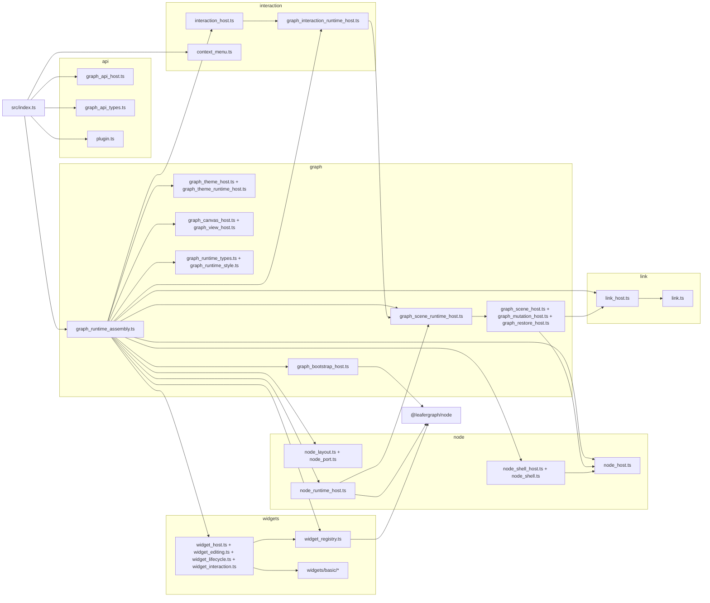

# leafergraph

`leafergraph` 是当前工作区里的 Leafer-first 节点图主包。

它的职责不是承接 editor 页面壳层，也不是复制 `@leafergraph/node` 的 SDK 能力，而是作为唯一图运行时宿主，负责下面这些长期能力：

- 正式图输入恢复
- 节点、连线、Widget 的场景渲染与局部刷新
- 插件安装、模块安装与 Widget 注册
- 主题、交互、右键菜单与 Widget 编辑宿主
- 对 editor 和外部工程暴露稳定的公共 API

相关文档：

- [渲染刷新策略](./渲染刷新策略.md)

## 架构总览

当前主包已经整理成 `api / graph / interaction / node / link / widgets` 六类源码目录。

它们之间的关系可以概括为：

- `api`
  - 定义主包公共契约与对外 facade
- `graph`
  - 负责图运行时装配、启动、恢复、场景刷新和主题驱动
- `interaction`
  - 负责节点拖拽、缩放、折叠和右键菜单
- `node`
  - 负责节点外壳、布局、端口和节点运行时桥接
- `link`
  - 负责连线路径几何和连线视图管理
- `widgets`
  - 负责 Widget 注册、生命周期调度、编辑宿主和内建基础控件



## 运行时装配链

主包当前通过 [graph_runtime_assembly.ts](./src/graph/graph_runtime_assembly.ts) 串起运行时。

装配顺序可以理解成下面几步：

1. 通过 `graph_entry_runtime.ts` 准备默认图状态容器和入口级默认配置
2. 创建画布宿主
3. 通过 `graph_widget_runtime_host.ts` 创建 Widget 注册表、主题宿主和编辑宿主
4. 创建 `NodeRegistry`
5. 通过 `graph_scene_runtime_assembly.ts` 拼装节点、连线、Widget、交互和恢复宿主
6. 创建启动宿主
7. 用 `graph_api_host` 对外暴露稳定 API

这条链的目标是让 `src/index.ts` 只承担：

- 入口导出
- 宿主创建
- 最小 API 转发

## 目录结构

```text
packages/leafergraph
├─ README.md
├─ package.json
└─ src
   ├─ index.ts
   ├─ api
   ├─ graph
   ├─ interaction
   ├─ link
   ├─ node
   └─ widgets
      └─ basic
```

## 文件说明

### 根入口

| 文件 | 说明 |
| --- | --- |
| `src/index.ts` | 主包公共入口，负责导出公共 API、类型和 `LeaferGraph` 宿主工厂。 |

### `src/api`

| 文件 | 说明 |
| --- | --- |
| `src/api/plugin.ts` | 主包公共协议中心，定义插件上下文、Widget 渲染协议、主题上下文和初始化选项。 |
| `src/api/graph_api_types.ts` | 定义节点创建、更新、移动、缩放和连线操作的公共输入类型。 |
| `src/api/graph_api_host.ts` | 对外 facade，负责把内部运行时壳面收拢成稳定 API。 |

### `src/graph`

| 文件 | 说明 |
| --- | --- |
| `src/graph/graph_runtime_assembly.ts` | 主包运行时总装配器，按固定顺序拼装全部宿主。 |
| `src/graph/graph_entry_runtime.ts` | 入口运行时创建模块，负责默认图状态容器、默认装配参数和 `ready` 链初始化。 |
| `src/graph/graph_widget_runtime_host.ts` | Widget 基础环境装配模块，负责主题宿主、Widget 注册表和编辑宿主初始化。 |
| `src/graph/graph_scene_runtime_assembly.ts` | 场景运行时装配模块，负责节点、连线、Widget、交互和恢复宿主的接线。 |
| `src/graph/graph_bootstrap_host.ts` | 启动装配宿主，负责内建 Widget 注册、模块安装、插件安装和初始图恢复。 |
| `src/graph/graph_canvas_host.ts` | 画布宿主，负责创建 Leafer App、根图层和视口基础配置。 |
| `src/graph/graph_scene_host.ts` | 场景桥接宿主，负责节点视图、连线视图与 Widget 写回的场景级入口。 |
| `src/graph/graph_scene_runtime_host.ts` | 场景运行时壳面，统一收口场景刷新、连线刷新和正式图变更。 |
| `src/graph/graph_mutation_host.ts` | 正式图变更宿主，负责节点和连线的增删改移。 |
| `src/graph/graph_restore_host.ts` | 图恢复宿主，负责把正式图快照恢复到运行时场景。 |
| `src/graph/graph_theme_host.ts` | 主题宿主，负责主题模式状态与主题切换调度。 |
| `src/graph/graph_theme_runtime_host.ts` | 主题运行时桥接宿主，负责主题切换后的节点、连线和编辑宿主刷新。 |
| `src/graph/graph_view_host.ts` | 视图宿主，负责坐标换算、聚焦、选中反馈和 `fitView()`。 |
| `src/graph/graph_runtime_types.ts` | 图运行时共享类型定义。 |
| `src/graph/graph_runtime_style.ts` | 图运行时默认样式、尺寸和主题常量。 |

### `src/interaction`

| 文件 | 说明 |
| --- | --- |
| `src/interaction/context_menu.ts` | 右键菜单基础设施，负责 Leafer 菜单事件归一化和 DOM 菜单管理。 |
| `src/interaction/graph_interaction_runtime_host.ts` | 交互运行时壳面，负责把拖拽、缩放、折叠等能力收敛给交互层使用。 |
| `src/interaction/interaction_host.ts` | 交互宿主，负责节点拖拽、缩放、折叠按钮和窗口级指针生命周期。 |

### `src/link`

| 文件 | 说明 |
| --- | --- |
| `src/link/link.ts` | 连线几何工具，负责路径、端点和切线计算。 |
| `src/link/link_host.ts` | 连线宿主，负责连线视图创建、移除和联动刷新。 |

### `src/node`

| 文件 | 说明 |
| --- | --- |
| `src/node/node_host.ts` | 节点视图宿主，负责节点视图创建、刷新和销毁。 |
| `src/node/node_layout.ts` | 节点布局模块，负责节点壳、端口区和 Widget 区的尺寸计算。 |
| `src/node/node_port.ts` | 端口布局模块，负责输入输出端口的锚点和几何计算。 |
| `src/node/node_runtime_host.ts` | 节点运行时宿主，负责节点快照、折叠态、尺寸约束和 Widget 动作回抛。 |
| `src/node/node_shell.ts` | 节点外壳视图构造模块。 |
| `src/node/node_shell_host.ts` | 节点外壳宿主，负责缺失态、外壳渲染和 resize 约束解析。 |

### `src/widgets`

| 文件 | 说明 |
| --- | --- |
| `src/widgets/widget_registry.ts` | 主包唯一 Widget 注册表。 |
| `src/widgets/widget_host.ts` | Widget 渲染宿主，负责 mount、update、destroy 和缺失态回退。 |
| `src/widgets/widget_editing.ts` | Widget 编辑宿主，负责文本编辑、菜单和焦点 DOM 管理。 |
| `src/widgets/widget_interaction.ts` | Widget 交互工具，负责命中识别和常用交互绑定。 |
| `src/widgets/widget_lifecycle.ts` | Widget 生命周期适配工具，把生命周期对象转成正式 renderer。 |

### `src/widgets/basic`

| 文件 | 说明 |
| --- | --- |
| `src/widgets/basic/index.ts` | 基础 Widget 库入口，负责汇总内建基础控件条目。 |
| `src/widgets/basic/template.ts` | 基础 Widget 生命周期模板和通用控制器。 |
| `src/widgets/basic/types.ts` | 基础 Widget 共享类型定义。 |
| `src/widgets/basic/theme.ts` | 基础 Widget 亮暗主题 token 定义。 |
| `src/widgets/basic/constants.ts` | 基础 Widget 共享尺寸与样式常量。 |
| `src/widgets/basic/field_view.ts` | 可复用字段底座封装。 |
| `src/widgets/basic/readonly_widget.ts` | 只读字段控件实现。 |
| `src/widgets/basic/text_widget.ts` | `input` / `textarea` 控件实现。 |
| `src/widgets/basic/select_widget.ts` | `select` 控件实现。 |
| `src/widgets/basic/checkbox_widget.ts` | `checkbox` 控件实现。 |
| `src/widgets/basic/radio_widget.ts` | `radio` 控件实现。 |
| `src/widgets/basic/toggle_widget.ts` | `toggle` 控件实现。 |
| `src/widgets/basic/slider_widget.ts` | `slider` 控件实现。 |
| `src/widgets/basic/button_widget.ts` | `button` 控件实现。 |

## 文档约定

当前主包源码已经统一补充文件头文档注释，约定如下：

- `src/index.ts`
  - 使用 `@packageDocumentation`，作为包级文档锚点
- 其它源码文件
  - 使用 TSDoc 风格的文件头摘要和 `@remarks`
  - 顶部注释只说明文件职责，不重复抄写实现细节
- 导出的类、接口、函数
  - 保持原有必要注释
  - 只在复杂约束、运行时边界或非直觉行为处补充说明

## 与其它包的边界

- `@leafergraph/node`
  - 只负责 Node SDK、注册、实例化、序列化和模块作用域
- `leafergraph`
  - 只负责图运行时宿主、渲染、交互基础设施和公共 API
- `packages/editor`
  - 只负责页面壳、工作分页、本地 bundle 装配和命令接线

## 常用命令

在 workspace 根目录执行：

```bash
bun run build:leafergraph
bun run dev:editor
bun run build
```

如果修改了主包公开类型、运行时装配或 Widget 宿主，优先至少执行：

```bash
bun run build:leafergraph
```
