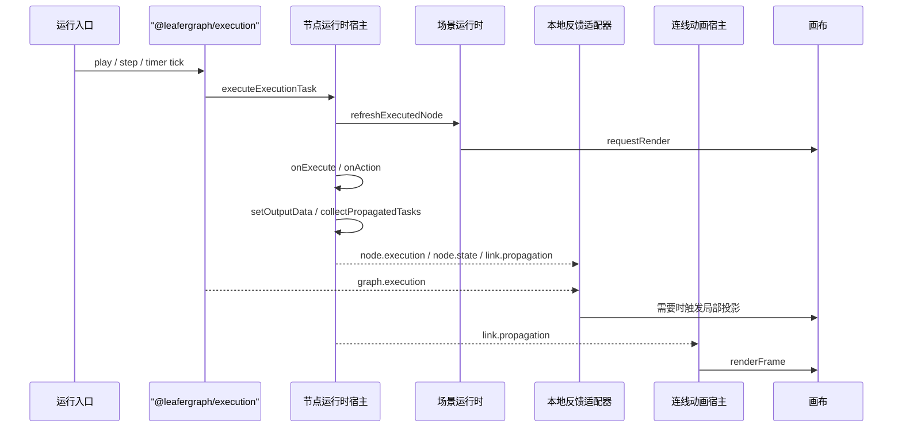

# `leafergraph` 渲染刷新策略

## 文档信息

- 当前状态：现状说明
- 最近校对：2026-03-31
- 适用范围：`packages/leafergraph` 刷新链、执行投影与性能排查
- 互补文档：
  - 包入口看 [`README.md`](./README.md)
  - 外部使用看 [`使用与扩展指南.md`](./使用与扩展指南.md)
  - 总装配链看 [`内部架构地图.md`](./内部架构地图.md)

这份文档记录 `leafergraph` 当前真实使用的刷新路径，方便后续做性能排查、authority 集成和增量投影优化。

## 术语表

### `整图替换`

清空当前运行时状态和图层，再重新挂载全部节点与连线。

### `批量全场景刷新`

不清空正式文档，但会批量刷新全部节点壳，或者批量重算全部相关连线。

### `局部刷新`

只刷新一个节点、部分连线、单个 widget，或者一条 diff 对应的局部投影。

### `纯渲染触发`

不修改正式文档，也不重建图元结构，只请求 Leafer 重绘一帧，或强制刷新 overlay / 粒子动画。

## 1. 主包刷新地图

### 1.1 整图替换

当前真正的整图替换只有一条主链：

- `LeaferGraph.replaceGraphDocument(...)`
- `LeaferGraphApiHost.replaceGraphDocument(...)`
- `bootstrapRuntime.replaceGraphDocument(...)`
- `restoreHost.replaceGraphDocument(...)`

核心入口：

- `src/public/leafer_graph.ts`
- `src/api/graph_api_host.ts`
- `src/graph/host/bootstrap.ts`
- `src/graph/host/restore.ts`

实际影响范围：

- 销毁旧节点上的 widget 生命周期
- 清空交互态、图级执行态、节点执行态和视图级状态
- 清空节点层和连线层
- 根据新 document 重新挂载全部节点和全部连线

### 1.2 批量全场景刷新

当前主包明确存在一条批量全场景刷新链：

- 主题切换
- `themeRuntimeHost.refreshThemeScene()`
- `sceneRuntime.refreshAllNodeViews()`
- `sceneRuntime.refreshAllConnectedLinks()`
- `sceneRuntime.requestRender()`

核心入口：

- `src/graph/theme/runtime.ts`
- `src/graph/host/scene_runtime.ts`

这不是整图替换，因为不会清空运行时容器，也不会重新恢复 document，但仍然属于高成本路径。

### 1.3 单节点整壳重建

`node_host.refreshNodeView(...)` 是当前最容易被误判的一类路径。

它不是整图替换，但对单个节点来说是“整壳重建”：

- 先销毁该节点旧的 widget 实例
- 重新计算 shell layout
- 重新生成新的 shellView
- 在原节点根 `Group` 上 `removeAll()`
- 把新的 children 和新的 widgetLayer 再挂回去

核心入口：

- `src/node/node_host.ts`

### 1.4 局部刷新

#### 节点与连线正式变更

`src/graph/host/mutation.ts` 已经把大部分正式变更收敛到局部刷新：

- `createNode(...)`
- `removeNode(...)`
- `updateNode(...)`
- `moveNode(...)`
- `resizeNode(...)`
- `createLink(...)`
- `removeLink(...)`
- `moveNodesByDelta(...)`

这些路径会把影响面收敛在目标节点和相关连线附近，最后统一 `requestRender()`。

#### 连线路径局部刷新

`link_host.updateConnectedLinksForNodes(...)` 是典型的局部几何刷新：

- 只扫描与目标节点集合相关的连线
- 对命中的连线调用 `refreshLinkPath(...)`
- 本质上只是更新 `link.view.path`

#### Widget 局部更新

`widget_host.updateNodeWidgetValue(...)` 是最轻量的正式数据更新路径之一：

- 只修改目标 widget 的 `value`
- 调用对应 renderer 的 `update(...)`
- 然后 `requestRender()`

主包里与这条链的接线点位于：

- `src/graph/host/scene_runtime.ts`

#### 运行反馈局部投影

`node/runtime/controller.ts` 会把本地执行反馈和外部 runtime feedback 投影成局部刷新：

- `projectExternalNodeExecution(...)`
- `projectExternalNodeState(...)`
- `projectExternalLinkPropagation(...)`
- `emitNodeWidgetAction(...)`
- `dispatchConnectionsChange(...)`

核心入口：

- `src/node/runtime/controller.ts`
- `src/graph/feedback/projection.ts`

#### Diff 增量投影

`LeaferGraph.applyGraphDocumentDiff(...)` 是主包当前最重要的增量路径。

它会优先尝试局部投影：

- `node.create / node.remove / node.move / node.resize`
- `link.create / link.remove / link.reconnect`
- `node.update`
- `node.widget.value.set`

局部应用失败时才回退到整图替换。

## 2. 纯渲染触发

### `requestRender()`

运行时装配层把通用渲染请求统一定义为：

- `app.forceRender()`

### `renderFrame()`

动画专用帧推进使用：

- `app.forceUpdate()`
- `app.forceRender(undefined, true)`

核心入口：

- `src/graph/assembly/runtime.ts`

### 数据流动画 overlay

`link/animation/controller.ts` 是典型的纯视觉层刷新：

- 不改正式 document
- 不改节点壳
- 不改正式连线路径
- 只更新 overlayGroup 和粒子图元

核心入口：

- `src/link/animation/controller.ts`

## 3. 执行期刷新机制

执行期需要先区分两层职责：

- `@leafergraph/execution`
  - 负责图级执行状态机、队列推进、timer、执行反馈
- `leafergraph`
  - 负责把执行状态投影到节点壳、连线、Widget 和运行反馈 superset

也就是说，旧的主包 execution shim 已不存在；图级执行真源现在是 `@leafergraph/execution` 的 `LeaferGraphGraphExecutionHost`。

### 3.1 本地执行主链

主包内与这条链直接相关的入口是：

- `src/node/runtime/controller.ts`
- `src/graph/feedback/local_runtime_adapter.ts`
- `src/graph/feedback/projection.ts`
- `src/graph/host/scene_runtime.ts`

### 3.2 图级入口与节点入口

#### `graph.play / graph.step / graph.stop`

这条入口的图级状态机位于 `@leafergraph/execution`：

- `play()` 和 `step()` 收集入口任务并推进队列
- `stop()` 清理 run 关联的 timer 并切回 `idle`
- 图级宿主会广播 `graph.execution`

这些变化本身不直接重建节点和连线；真正的节点壳和连线刷新，仍然发生在 `node/runtime/controller.ts` 的 `executeExecutionTask(...)` 及其后续投影链里。

#### `playFromNode(...)`

`playFromNode(...)` 仍然是主包 façade 提供的本地调试入口：

- 直接创建入口任务
- 在本地 drain 执行队列
- 不启动完整图级运行态 UI

所以它更接近“本地调试一条执行链”，而不是“启动整个图执行会话”。

### 3.3 单个节点执行时序

当前实现里，单节点执行的可视同步大致遵循：

1. 设置节点执行态为 `running`
2. 先做一次 `refreshExecutedNode(...)`
3. 执行节点定义的 `onExecute(...)` 或事件输入命中的 `onAction(...)`
4. 如果调用 `setOutputData(...)`，收集传播任务并发出 `link.propagation`
5. 更新最终执行态为 `success` 或 `error`
6. 在 `finally` 中再次刷新当前节点壳和关联连线

最重要的边界是：

- 执行前刷新负责“进入运行态可见”
- 执行后刷新负责“执行结果可见”
- 两次刷新都只针对当前节点和它关联的连线

### 3.4 `system/timer` 的特殊路径

`system/timer` 的注册和 tick 现在也归 `@leafergraph/execution` 管理：

- 注册阶段
  - 建立或重置 timer
  - 维持图级运行态
- tick 阶段
  - 重新创建入口任务
  - 进入正常节点执行链
  - 才会继续刷新节点、传播和动画

一句话概括：

- timer 注册让图继续“活着”
- timer tick 才让画面继续“动起来”

### 3.5 按对象看执行期刷新粒度

#### 节点

节点可视刷新依赖 `refreshNodeView(...)`，常见触发点包括：

- `refreshExecutedNode(...)`
- `executeExecutionTask(...)` 的 `finally`
- `projectExternalNodeExecution(...)`
- `dispatchConnectionsChange(...)`

这条路径对单节点来说是整壳重建，但保留节点根 `view`，因此交互绑定可以重新附着。

#### 连线

执行期的正式连线路径刷新只走：

- `updateConnectedLinks(nodeId)`
- `updateConnectedLinksForNodes(nodeIds)`

它只重算受影响连线的几何，不重建整个连线层。

#### Widget

Widget 在执行期有三条更新路径：

1. 节点壳刷新带出的 widget 重建
2. `updateNodeWidgetValue(...)` 的单 widget 快速路径
3. 节点执行逻辑直接改 `widgets / properties / title`，最后依靠节点刷新统一带出

#### 动画

数据流动画来自 `link.propagation`：

- 不改正式 document
- 不改正式连线路径
- 只更新 overlay 粒子并调用 `renderFrame()`

#### 画布

执行期不会重新 mount 顶层画布对象：

- `App`
- `root`
- `linkLayer`
- `nodeLayer`
- `viewport`

大多数执行反馈最终只是：

- `requestRender()`
- 或动画路径里的 `renderFrame()`

## 4. 本地执行 vs 外部 runtime feedback

### 本地执行

本地执行路径是：

- `graph.play / graph.step / playFromNode(...)`
- 本地主包调用执行内核推进
- 主包自己刷新节点和连线
- `src/graph/feedback/local_runtime_adapter.ts` 把执行反馈和节点状态包装成 `RuntimeFeedbackEvent`

### 外部 runtime feedback

远端执行投影路径是：

- editor 或其他宿主收到后端反馈
- 调用 `graph.projectRuntimeFeedback(feedback)`
- `src/graph/feedback/projection.ts` 把事件分发给 graph host、node host 或 link host

这意味着：

- 外部反馈不会重新发明第二套刷新逻辑
- 节点刷新、连线刷新、动画刷新仍然复用现有主包宿主
- 不同点只在于“谁先产出事件”，不是“谁决定怎么刷新”

### 与 `authority.document` / `authority.documentDiff` 的边界

这三条通道一定要分开看：

- `runtimeFeedback`
  - 偏执行态投影
  - 走 `graph.projectRuntimeFeedback(...)`
  - 目标是局部可视反馈
- `authority.document`
  - 偏正式文档全量同步
  - 走 `graph.replaceGraphDocument(...)`
  - 会触发整图替换
- `authority.documentDiff`
  - 偏正式文档增量同步
  - 走 `graph.applyGraphDocumentDiff(...)`
  - 局部成功时不整图替换，失败才 fallback

## 5. Editor 消费链

editor 侧最关键的四条消费路径仍然是：

| 来源 | editor 调用 | 主包行为 | 刷新级别 |
| --- | --- | --- | --- |
| `authority.document` | `replaceGraphDocument(...)` | `restoreHost.replaceGraphDocument(...)` | 整图替换 |
| `authority.documentDiff` | `applyGraphDocumentDiff(...)` | 局部投影，失败再 fallback | 局部刷新 / 整图回退 |
| `runtimeFeedbackInlet` | `projectRuntimeFeedback(...)` | 执行反馈局部投影 | 局部刷新 |
| `node-library-preview` | `replaceGraphDocument(...)` | 独立预览图整图恢复 | 整图替换 |

## 6. 当前优化观察

按当前实现看，刷新成本大致可以这样理解：

- 最重的是 `replaceGraphDocument(...)`
  - 会清空容器、清空图层、重新 mount 全部节点和连线
- 次重的是 `refreshAllNodeViews()` 和单节点 `refreshNodeView(...)`
  - 不会整图恢复，但会重建节点壳和 widget 子树
- 高频但相对轻的是 `updateConnectedLinksForNodes(...)` 和 widget `update(...)`
  - 前者主要改连线路径
  - 后者主要改单个 widget 值和对应 renderer
- 纯动画层主要集中在 `link/animation/controller.ts`
  - 更像 overlay 重绘问题，不属于正式图状态替换

这份文档只记录当前现状，不在这里展开新的重构方案或性能优化 TODO。
