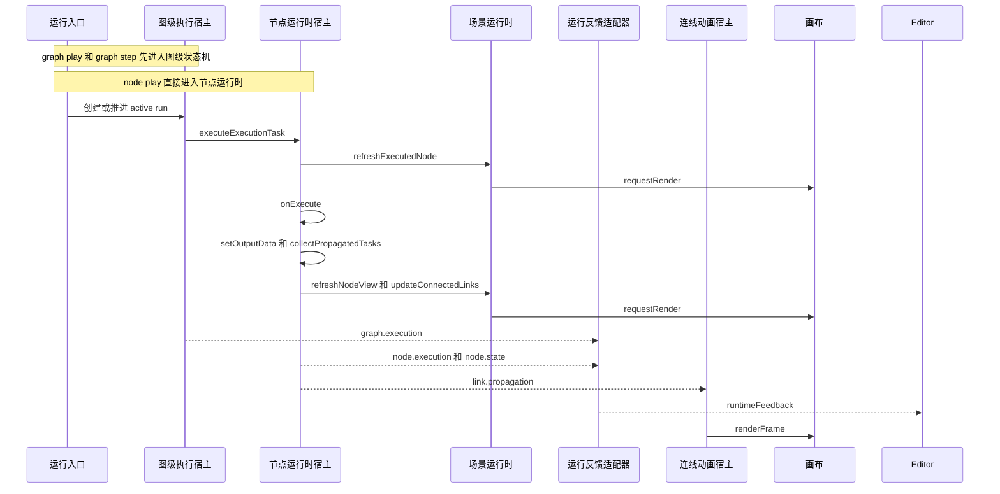
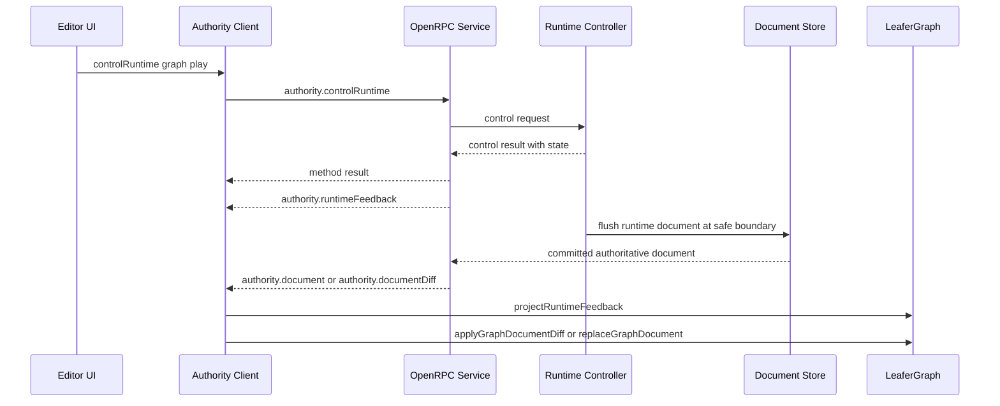

# `leafergraph` 渲染刷新策略

这份文档记录 `leafergraph` 当前真实使用的刷新路径，方便后续做性能排查、authority 集成和增量投影优化。

它回答的是这几个问题：

- 哪些地方会做整图替换
- 哪些地方会批量刷新整批节点或连线
- 哪些地方只做局部刷新
- 哪些地方其实只是请求渲染一帧

## 术语表

### `整图替换`

清空当前运行时状态和图层，再重新挂载全部节点与连线。

这类路径的典型特征是：

- 清空 `graphNodes / graphLinks / nodeViews / linkViews`
- 清空 `nodeLayer / linkLayer`
- 重新 `mountNodeView(...)`
- 重新 `mountLinkView(...)`

### `批量全场景刷新`

不清空正式文档，但会批量刷新全部节点壳，或者批量重算全部相关连线。

这类路径不会重建整张图的数据容器，但会触达当前场景里的大部分图元。

### `局部刷新`

只刷新一个节点、部分连线、单个 widget，或者一条 diff 对应的局部投影。

这是当前运行期最常见的路径，目标是把修改范围收敛在受影响对象附近。

### `纯渲染触发`

不修改正式文档，也不重建图元结构，只请求 Leafer 重绘，或强制刷新 overlay / 粒子动画。

## 主包刷新地图

### 1. 整图替换

当前真正的整图替换只有一条主链：

- `LeaferGraph.replaceGraphDocument(...)`
- `LeaferGraphApiHost.replaceGraphDocument(...)`
- `bootstrapRuntime.replaceGraphDocument(...)`
- `restoreHost.replaceGraphDocument(...)`

核心入口：

- `src/index.ts`
- `src/api/graph_api_host.ts`
- `src/graph/graph_bootstrap_host.ts`
- `src/graph/graph_restore_host.ts`

实际影响范围：

- 销毁旧节点上的 widget 生命周期
- 清空交互态、图级执行态、节点执行态和视图级状态
- 清空节点层和连线层
- 根据新 document 重新挂载全部节点和全部连线

典型触发场景：

- 主包初始化时恢复初始 document
- 外部主动调用 `replaceGraphDocument(...)`
- editor 收到 authority full document 投影并选择整图同步

### 2. 批量全场景刷新

当前主包明确存在一条批量全场景刷新链：

- 主题切换
- `themeRuntimeHost.refreshThemeScene()`
- `sceneRuntime.refreshAllNodeViews()`
- `sceneRuntime.refreshAllConnectedLinks()`
- `sceneRuntime.requestRender()`

核心入口：

- `src/graph/graph_theme_runtime_host.ts`
- `src/graph/graph_scene_runtime_host.ts`

实际影响范围：

- 所有节点都会执行一次 `refreshNodeView(...)`
- 所有当前图中的相关连线都会重新计算路径
- 最后统一请求一帧渲染

补充说明：

- 这里不是整图替换，因为不会清空运行时容器，也不会重新恢复 document
- 但它仍然属于高成本路径，因为会批量重建全部节点壳

### 3. 单节点整壳重建

`node_host.refreshNodeView(...)` 是当前最容易被误判的一类路径。

它不是整图替换，但对单个节点来说是“整壳重建”：

- 先销毁该节点旧的 widget 实例
- 重新计算 shell layout
- 重新生成新的 shellView
- 在原节点根 Group 上 `removeAll()`
- 把新的 children 和新的 widgetLayer 再挂回去

核心入口：

- `src/node/node_host.ts`

典型触发场景：

- `updateNode(...)`
- `resizeNode(...)`
- `setNodeCollapsed(...)`
- 节点执行反馈刷新
- 连接变化后触发的节点回调
- 外部 runtime feedback 投影到节点执行态

### 4. 局部刷新

#### 节点与连线正式变更

`graph_mutation_host` 已经把大部分正式变更收敛到局部刷新：

- `createNode(...)`
  - 挂载一个新节点，然后 `requestRender()`
- `removeNode(...)`
  - 移除节点与相关连线，然后 `requestRender()`
- `updateNode(...)`
  - 刷新目标节点壳
  - 只重算该节点关联连线
  - `requestRender()`
- `moveNode(...)`
  - 只回写坐标
  - 只重算该节点关联连线
  - `requestRender()`
- `resizeNode(...)`
  - 刷新目标节点壳
  - 只重算该节点关联连线
  - `requestRender()`
- `createLink(...)` / `removeLink(...)`
  - 只影响目标连线和相关运行反馈
  - `requestRender()`
- `moveNodesByDelta(...)`
  - 批量回写多选节点坐标
  - 只重算这些节点关联连线
  - `requestRender()`

核心入口：

- `src/graph/graph_mutation_host.ts`
- `src/link/link_host.ts`

#### 连线路径局部刷新

`link_host.updateConnectedLinksForNodes(...)` 是典型的局部几何刷新：

- 只扫描与目标节点集合相关的连线
- 对命中的连线调用 `refreshLinkPath(...)`
- 本质上只是更新 `link.view.path`

这条路径不会重建连线对象，也不会触达无关节点。

#### Widget 局部更新

`widget_host.updateNodeWidgetValue(...)` 是目前最轻量的正式数据更新路径之一：

- 只修改目标 widget 的 `value`
- 调用对应 renderer 的 `update(...)`
- 然后 `requestRender()`

这条路径不会重建整个节点壳。

核心入口：

- `src/widgets/widget_host.ts`
- `src/graph/graph_scene_runtime_host.ts`

#### 运行反馈局部投影

`node_runtime_host` 会把本地执行反馈和外部 runtime feedback 投影成局部刷新：

- `projectExternalNodeExecution(...)`
  - 更新节点执行态
  - 刷新该节点壳
  - 刷新该节点关联连线
- `projectExternalNodeState(...)`
  - `execution` 原因时刷新目标节点
  - `connections` 原因时只刷新目标节点关联连线
- `projectExternalLinkPropagation(...)`
  - 写回输入输出运行值
  - 只请求渲染
- `emitNodeWidgetAction(...)`
  - 调节点定义动作
  - 不重建整图，只请求渲染
- `dispatchConnectionsChange(...)`
  - 触发节点连接变化生命周期
  - 刷新目标节点壳
  - 刷新目标节点关联连线

核心入口：

- `src/node/node_runtime_host.ts`

#### Diff 增量投影

`LeaferGraph.applyGraphDocumentDiff(...)` 是主包当前最重要的增量路径。

它会优先尝试局部投影：

- `node.create / node.remove / node.move / node.resize`
- `link.create / link.remove / link.reconnect`
- `node.update`
- `node.widget.value.set`

处理策略：

- 能安全局部应用时，直接走现有局部 API
- `node.widget.value.set` 优先走 widget 快速路径
- 一旦目标图元缺失或增量条件不满足，就返回 `requiresFullReplace = true`

这意味着它本身是“局部优先，失败回退整图”的路径。

核心入口：

- `src/index.ts`
- `src/api/graph_document_diff.ts`

## 纯渲染触发

### `requestRender()`

运行时装配层把通用渲染请求统一定义为：

- `app.forceRender()`

这条路径代表“请求 Leafer 再渲染一帧”，不等于重建图元。

### `renderFrame()`

动画专用帧推进使用：

- `app.forceUpdate()`
- `app.forceRender(undefined, true)`

它比普通 `requestRender()` 更强，主要给高频动画或 overlay 更新使用。

核心入口：

- `src/graph/graph_runtime_assembly.ts`

### 数据流动画 overlay

`link_data_flow_animation_host` 是典型的纯视觉层刷新：

- 不改正式 document
- 不改节点壳
- 不改正式连线路径
- 只更新 overlayGroup 和粒子图元

它会直接调用：

- `overlayGroup.forceUpdate()`
- `particle.glow.forceUpdate()`
- `particle.core.forceUpdate()`
- `renderFrame()`

所以它属于动画层局部刷新，不应和正式图更新混在一起看。

核心入口：

- `src/link/link_data_flow_animation_host.ts`

## 执行期刷新机制

这一节只讨论“节点开始运行之后”的刷新链，重点回答下面这些问题：

- 哪些变化只是图级状态机推进
- 哪些变化会真的改节点壳、连线路径或 widget
- 哪些变化只会产生运行反馈事件
- 哪些变化只是要求 Leafer 重绘一帧

### 执行期术语澄清

执行期里最容易混淆的是下面六类变化：

- `图级执行状态变化`
  - 由 `graph_execution_runtime_host` 维护 `activeRun / queue / stepCount / timer`
  - 会发出 `graph.execution` 事件
  - 默认不直接重建节点和连线
- `节点壳刷新`
  - 由 `refreshNodeView(...)` 触发
  - 对单个节点来说是整壳重建
  - 会销毁旧 widget 实例并重新挂载节点子树
- `正式连线路径刷新`
  - 由 `updateConnectedLinks(...)` 或 `updateConnectedLinksForNodes(...)` 触发
  - 本质上是重算受影响连线的 `Arrow.path`
  - 不会在执行链里批量重建全部连线对象
- `Widget 增量更新`
  - 由 `updateNodeWidgetValue(...)` 触发
  - 只调用目标 widget renderer 的 `update(...)`
  - 不等于节点整壳重建
- `动画 overlay 刷新`
  - 由 `link.propagation` 驱动 `link_data_flow_animation_host`
  - 只更新连线层上的粒子 overlay
  - 不改正式连线路径，也不改节点壳
- `画布帧请求`
  - `requestRender()` 对应普通一帧请求
  - `renderFrame()` 对应动画场景里的强制更新和强制渲染
  - 它们只是渲染入口，不等于一定发生结构重建

补充说明：

- 下面提到的“正式文档字段”，指未来能回写到 `GraphDocument` 的节点字段，例如 `title / properties / widgets / flags / data / layout`
- `executionState / inputValues / outputValues / graph execution state / overlay 粒子` 不算这里说的正式文档字段

### 本地执行主链

这张图只画标准主链，真实实现里还有两点需要单独记住：

- `link_data_flow_animation_host` 并不是通过 `runtimeAdapter` 订阅连线传播，它直接订阅 `nodeRuntimeHost.subscribeLinkPropagation(...)`
- `graph.execution`、`node.execution`、`node.state`、`link.propagation` 是并行出现的几种反馈，不是“先适配器、后动画”的单线管道

核心入口：

- `src/graph/graph_execution_runtime_host.ts`
- `src/node/node_runtime_host.ts`
- `src/graph/graph_local_runtime_adapter.ts`
- `src/link/link_data_flow_animation_host.ts`

### 图级入口与节点入口

#### `graph.play / graph.step / graph.stop`

这条入口主要发生在 `graph_execution_runtime_host.ts`：

- `play()` 和 `step()` 先收集全部 `system/on-play` 启动事件节点，创建图级 `activeRun`
- 图级宿主维护的是：
  - `runId`
  - `queue`
  - `stepCount`
  - `activeTimersByKey`
  - `state.status`
- 图级宿主会广播：
  - `started`
  - `advanced`
  - `drained`
  - `stopped`
- 这些变化本身不直接清空图层，也不直接重建节点壳
- 真正的节点和连线刷新，仍然发生在它调用 `nodeRuntimeHost.executeExecutionTask(...)` 之后

`stop()` 的职责也主要是状态机和 timer：

- 停止当前 `activeRun`
- 清理该 run 关联的全部定时器
- 把图级状态切回 `idle`
- 发出 `graph.execution stopped`
- 它本身不是整图替换，也不会主动重建所有节点壳

#### `playFromNode(...)`

节点入口发生在 `node_runtime_host.ts`：

- `playFromNode(...)` 不进入图级 `activeRun`
- 它直接创建一个入口任务 `createEntryExecutionTask(...)`
- 随后在本地 while 循环里持续 drain 任务队列
- 它不会维护图级 `running / stepping` 状态，也不会触发图级 timer 状态机
- 所以 `node.play` 更接近“本地调试一条执行链”，而不是“启动整个图运行”

### 单个节点执行时序

`executeExecutionTask(...)` 是执行期最核心的真实刷新入口。按当前实现，它的时序可以拆成下面九步：

1. 先根据 `task.nodeId` 读取节点和节点定义；节点不存在、没有 `onExecute(...)`、或命中递归保护时，会直接返回，不刷新场景。
2. 创建本次执行的 `executionContext`，并复制一份 `activeNodeIds`，用于阻止单链路递归回流。
3. 把当前节点执行态更新成 `running`，并记录 `lastExecutedAt`。
4. 立刻调用 `refreshExecutedNode(nodeId)`：
   - `sceneRuntime.refreshNodeView(state)`
   - `sceneRuntime.updateConnectedLinks(nodeId)`
   - `sceneRuntime.requestRender()`
   这一步的职责是“让运行中外观先可见”，例如状态灯、标题、样式和端口锚点先切到最新运行态。
5. 调用 `notifyNodeStateChanged(nodeId, "execution")`，把节点已进入执行态这件事广播出去。
6. 进入节点定义自己的 `onExecute(...)`。这一步才是真正运行节点逻辑的地方，节点可以在这里：
   - 改 `title`
   - 改 `properties`
   - 改 `widgets`
   - 改 `data / flags`
   - 通过 `api.setOutputData(...)` 产生下游传播
7. 如果节点调用了 `api.setOutputData(...)`，内部会先触发一次 `notifyNodeStateChanged(..., "execution")`，再进入 `collectPropagatedTasks(...)`：
   - 把输出 payload 写到下游节点的 `inputValues`
   - 生成 `link.propagation` 事件
   - 收集下游节点执行任务
   - 这里不会直接重算全部连线路径，传播只是把数据和任务排到下游
8. `onExecute(...)` 成功或失败后，都会更新该节点的最终执行态：
   - 成功时写 `success`
   - 失败时写 `error`
   - 然后发出 `node.execution` 事件
9. 在 `finally` 里无条件再做一次场景同步：
   - 刷新当前节点壳
   - 刷新当前节点关联连线
   - `requestRender()`
   - 再发一次 `node.state execution`
   这一步的职责是“把执行结果回写到 UI”，例如执行后标题、属性、widget 值、错误态、输出端样式等。

最重要的边界是：

- 执行前刷新负责“进入运行态可见”
- 执行后刷新负责“执行结果可见”
- 两次刷新都只针对当前节点和它关联的连线，不是整图替换

### `system/timer` 的特殊路径

`system/timer` 比普通节点多一层“图级定时器注册”，它的刷新链不能只看 `onExecute(...)` 本身。

#### 第一次命中 `timer` 节点时

- `timer_node.ts` 会先从 `widgets` 和 `properties` 共同解析：
  - `intervalMs`
  - `immediate`
- 如果当前来源是图级执行，并且 payload 里存在 `registerGraphTimer(...)`，它会先把自己注册到图级宿主的 `activeTimersByKey`
- 这次注册发生在 `graph_execution_runtime_host.registerGraphTimer(...)`
- 注册动作本身只会：
  - 建立或重置 `setTimeout(...)`
  - 把 `timerActivatedDuringAdvance` 标成 `true`
  - 让图级状态机进入 `running`
- 它本身不是节点壳刷新，也不是连线路径刷新

#### `immediate=false` 的首拍

- 节点仍然会执行自己的 `onExecute(...)`
- 但它不会立刻 `setOutputData(...)`
- 它只会把：
  - `properties.intervalMs`
  - `properties.immediate`
  - `properties.status`
  - `widgets.intervalMs`
  - `widgets.immediate`
  - `title`
  写到节点运行时状态
- 这些字段最终依靠 `executeExecutionTask(...)` 的 `finally` 阶段那次 `refreshNodeView(...)` 才进入可视节点壳
- 所以首拍的可视结果通常是“节点自己变成 WAIT 状态”，而不是链路立刻继续传播

#### `immediate=true` 或后续 timer tick

- 节点会正常写 `runCount / status / title / widgets`
- 然后调用 `api.setOutputData(...)`
- 传播出来的 `link.propagation` 会驱动动画 overlay
- 下游任务进入队列后，会继续触发后续节点执行和局部刷新
- 当真正的 timer tick 到达时，是 `handleGraphTimerTick(...)` 重新创建一次入口任务，再走完整的节点执行链

一句话概括：

- timer 注册让图级状态机继续活着
- timer tick 才让节点、连线、动画真正继续刷新

### 按对象看执行期刷新粒度

#### 节点

节点可视刷新依赖 `refreshNodeView(...)`，它发生在：

- `refreshExecutedNode(...)`
- `executeExecutionTask(...)` 的 `finally`
- `projectExternalNodeExecution(...)`
- `dispatchConnectionsChange(...)`

这条路径的真实行为是：

- 销毁旧 widget 实例
- 重算节点 shell layout
- 重新生成 `shellView`
- 在原节点根 `Group` 上 `removeAll()`
- 把新的 children 和新的 widget layer 再挂回去

这里最关键的事实有两个：

- 它对单节点来说是整壳重建
- 但它保留节点根 `view` 本身，所以 editor 绑在根上的拖拽、菜单、选区和 resize 绑定可以重新附着，而不是整节点对象被替换掉

执行期里常见的节点变化包括：

- 执行状态灯变化
- 节点标题变化
- 属性值文本变化
- 端口可视状态变化
- widget 区域内容变化
- 错误态和成功态变化

#### 连线

执行期的正式连线路径刷新只走：

- `updateConnectedLinks(nodeId)`
- `updateConnectedLinksForNodes(nodeIds)`

它的真实粒度比节点壳更轻：

- 只扫描和目标节点相关的连线
- 对命中的连线调用 `refreshLinkPath(...)`
- `refreshLinkPath(...)` 只是重算曲线，再把结果写回 `link.view.path`

这意味着：

- 节点执行时不会因为连线刷新而重建整个连线层
- `setOutputData(...)` 把数据写到下游节点 `inputValues` 时，不等于正式连线路径已刷新
- 连线路径刷新仍然依赖节点刷新阶段或显式 `updateConnectedLinks(...)`

#### Widget

执行期里 widget 有三条不同的更新路径，不能混在一起看：

##### 1. 节点壳刷新带出的 widget 重建

当 `refreshNodeView(...)` 发生时：

- 旧 widget renderer 先 `destroy()`
- 新的 widget layer 会重新创建
- 节点当前 `widgets` 数组里的值会重新参与渲染

这条路径最重，但最稳，因为整个 widget 子树会重新对齐当前节点状态。

##### 2. `updateNodeWidgetValue(...)` 的快速路径

这条路径只会：

- 改目标 widget 的 `value`
- 调用目标 renderer 的 `update(...)`
- `requestRender()`

它是“单 widget 增量更新”，不是整节点重建。

##### 3. 节点执行逻辑直接改 `widgets / properties / title`

很多运行期可视变化走的是这条路径，尤其是 `system/timer`：

- 节点定义直接改 `node.properties`
- 同步改 `node.widgets[index].value`
- 可能顺带改 `node.title`

这类变化不会自动走 widget renderer 的 `update(...)`

它最终依赖的是：

- 执行后那次 `refreshNodeView(...)`
- 让节点壳和 widget 子树按最新节点状态整体重建

所以 `system/timer` 的可视变化，本质上是“节点刷新把新字段带出来”，不是“独立 widget diff 热更新”。

#### 动画

执行期必须把“正式连线”和“数据流动画 overlay”分开看：

- 正式连线属于 `link_host.ts`
- 数据流动画属于 `link_data_flow_animation_host.ts`

`link.propagation` 命中之后，动画宿主会：

- 为目标连线创建粒子 `glow` 和 `core`
- 把粒子挂到连线层上的 `overlayGroup`
- 每帧重新采样曲线位置
- 调用：
  - `overlayGroup.forceUpdate()`
  - `particle.glow.forceUpdate()`
  - `particle.core.forceUpdate()`
  - `renderFrame()`

这里要特别记住三件事：

- 它不改正式 document 字段
- 它不改 `Arrow.path`
- 它不重建节点壳

整图替换时，这层 overlay 会被清空再补回：

- `restoreHost.replaceGraphDocument(...)` 会先 `dataFlowAnimationHost.clear()`
- 再 `linkLayer.removeAll()`
- 然后 `dataFlowAnimationHost.restoreLayer()`

但普通执行期不会清空连线层，它只会在已有连线层上叠一层动画粒子。

#### 画布

执行期里的画布层是最容易被误判成“每次都重建”的地方，但当前实现并不是这样：

- `graph_canvas_host.ts` 只在 runtime 装配阶段创建一次：
  - `App`
  - `root`
  - `linkLayer`
  - `nodeLayer`
  - `viewport`
- 执行期不会重新 mount 这些顶层对象
- 大多数执行反馈最终只是：
  - `requestRender()`
  - 或者动画路径里的 `renderFrame()`

当前画布配置还明确打开了：

- `usePartRender: true`
- `usePartLayout: true`

所以执行期默认依赖 Leafer 的局部渲染和局部布局能力，而不是每次把整棵场景树都重画一遍。

### 本地执行 vs 外部 runtime feedback

本地执行和远端 authority 投影，复用的是同一套 runtime host，但入口不一样。

#### 本地执行

本地执行路径是：

- `graph.play / graph.step / playFromNode(...)`
- 本地主包自己调用 `executeExecutionTask(...)`
- 本地主包自己刷新节点和连线
- 本地主包自己广播 `graph.execution / node.execution / node.state / link.propagation`

随后 `graph_local_runtime_adapter.ts` 会把这些事件统一包成 `RuntimeFeedbackEvent`。

#### 外部 runtime feedback

远端执行投影路径是：

- editor 或其它宿主收到后端 `runtimeFeedback`
- 调用 `graph.projectRuntimeFeedback(feedback)`
- `projectExternalRuntimeFeedback(...)` 把事件分发给：
  - `projectExternalGraphExecution(...)`
  - `projectExternalNodeExecution(...)`
  - `projectExternalNodeState(...)`
  - `projectExternalLinkPropagation(...)`

这意味着：

- 外部反馈不会重新发明第二套刷新逻辑
- 节点刷新、连线刷新、动画刷新仍然复用现有主包宿主
- 不同点只在于“谁先产出事件”，不是“谁决定怎么刷新”

#### 和 `authority.document` / `authority.documentDiff` 的边界

这三条通道一定要分开看：

- `runtimeFeedback`
  - 偏执行态投影
  - 走 `graph.projectRuntimeFeedback(...)`
  - 目标是局部可视反馈
- `authority.document`
  - 偏正式文档全量同步
  - 走 `graph.replaceGraphDocument(...)`
  - 会触发整图替换
- `authority.documentDiff`
  - 偏正式文档增量同步
  - 走 `graph.applyGraphDocumentDiff(...)`
  - 局部成功时不整图替换，失败才 fallback

所以远端 authority 模式下，最常见的组合是：

- 执行动画和执行态走 `runtimeFeedbackInlet`
- 正式节点结构和属性同步走 `authority.document` 或 `authority.documentDiff`

#### remote authority 前后端执行链

当前 `python-openrpc-authority-template + editor remote authority` 这条真实链路里，执行链默认是“后端 authoritative，前端负责控制和投影”。

更具体地说：

- 前端负责发控制命令：
  - `authority.controlRuntime`
  - 请求类型包括 `graph.play / graph.step / graph.stop / node.play`
- 后端负责真正执行：
  - 维护图级 run、step、timer、节点执行队列
  - 运行节点逻辑
  - 产出 runtime feedback
  - 决定什么时候 flush 正式文档
- 前端收到结果后不自己重跑一遍执行链，只做两类投影：
  - `runtimeFeedback` 投影到当前图实例
  - `authority.document` 或 `authority.documentDiff` 投影到正式文档

这条链里要特别区分三件事：

- `authority.controlRuntime`
  - 只是控制命令入口
  - 它不直接把完整动画和场景结果塞回响应体
- `authority.runtimeFeedback`
  - 是执行态反馈通道
  - 用来驱动运行中的节点状态、连线传播和动画投影
- `authority.document` / `authority.documentDiff`
  - 是正式文档同步通道
  - 用来让前端权威文档追平后端当前已提交状态

所以如果问“现在后端执行链是否由后端掌控然后通过 API 来反馈”，当前 remote authority 模式下答案是“是”：

- 执行控制在后端
- 前端通过 API 发命令
- 后端通过 notification 和方法结果把状态反馈回来
- 前端只做 projection，不做 authoritative execution

补充例外：

- 上面这个结论只针对 remote authority 模式
- 如果 editor 处在本地模式，`graph.play()`、`graph.step()`、`graph.playFromNode()` 仍然是前端本地执行链

### 执行期刷新矩阵

| 触发源 | 是否改正式文档字段 | 是否重建节点壳 | 是否重算正式连线路径 | 是否只做 widget 增量更新 | 是否触发动画 overlay | 最终画布调用 |
| --- | --- | --- | --- | --- | --- | --- |
| `graph.play / graph.step / graph.stop` 状态机推进 | 否 | 否 | 否 | 否 | 否 | 无或后续节点执行触发 |
| `playFromNode(...)` 创建并 drain 任务 | 否 | 否 | 否 | 否 | 否 | 无或后续节点执行触发 |
| `executeExecutionTask(...)` 执行前的 `refreshExecutedNode(...)` | 否 | 是 | 是 | 否 | 否 | `requestRender()` |
| 节点 `onExecute(...)` 直接改 `title / properties / widgets / data / flags` | 视节点定义而定 | 否 | 否 | 否 | 否 | 依赖后续节点刷新 |
| `setOutputData(...)` 和 `collectPropagatedTasks(...)` | 否 | 否 | 否 | 否 | 是 | 动画侧 `renderFrame()` |
| `executeExecutionTask(...)` 的 `finally` | 可能是 | 是 | 是 | 否 | 间接 | `requestRender()` |
| `updateNodeWidgetValue(...)` | 是 | 否 | 否 | 是 | 否 | `requestRender()` |
| `projectExternalNodeExecution(...)` | 可能是 | 是 | 是 | 否 | 否 | `requestRender()` |
| `projectExternalLinkPropagation(...)` | 否 | 否 | 否 | 否 | 是 | `requestRender()` 加动画侧 `renderFrame()` |
| `link_data_flow_animation_host` 每帧推进 | 否 | 否 | 否 | 否 | 是 | `renderFrame()` |

看这张表时要注意：

- “是否改正式文档字段”看的是节点当前可序列化字段，不是执行态和输入输出运行值
- `executeExecutionTask(...)` 里真正改字段的是节点定义 `onExecute(...)`，不是 `finally` 本身
- `finally` 的职责主要是把前面已经发生的字段变化和执行态变化真正刷新进场景

### 典型场景走读

#### `node.play`

`node.play` 的典型路径是：

1. `playFromNode(nodeId)` 创建入口任务。
2. 直接在本地 while 循环里 drain 任务，不进入图级 `activeRun`。
3. 命中的每个节点先进入 `running`，立即触发一次 `refreshExecutedNode(...)`。
4. 节点自身 `onExecute(...)` 运行，可能修改标题、属性、widget 或调用 `setOutputData(...)`。
5. 如果有下游链路，`collectPropagatedTasks(...)` 会把 payload 写入下游节点输入值，并生成下游任务。
6. 当前节点在 `finally` 中再刷新一次节点壳和关联连线。
7. 如果过程中有 `link.propagation`，动画 overlay 会在连线层上播放粒子。

这条链的特点是：

- 没有图级 `running / stepping`
- 但节点壳刷新、连线路径刷新、动画刷新都是真实发生的

#### `graph.step`

`graph.step` 的典型路径是：

1. 图级宿主先创建 `activeRun`，收集全部 `system/on-play` 启动事件节点。
2. 状态切到 `stepping`。
3. 只从队列里取出一个任务，调用一次 `executeExecutionTask(...)`。
4. 当前节点会完成完整的“执行前刷新 -> `onExecute(...)` -> 执行后刷新”。
5. 图级宿主把 `stepCount` 加一，并发出 `graph.execution advanced`。
6. 如果队列还没空，状态保持 `stepping`。
7. 如果队列空了而且没有活跃 timer，状态回到 `idle`。

这条链的重点是：

- 单步模式控制的是“每次只消费一个图级任务”
- 不是“只做一半节点刷新”
- 一旦某个节点被执行，它自己的节点壳刷新、连线刷新和动画反馈仍然会完整发生

#### `graph.play + system/timer`

这条路径最适合拿来区分“状态机推进”和“真实场景刷新”：

1. `graph.play()` 创建 `activeRun`，状态切到 `running`。
2. 图级宿主持续 drain 入口队列，直到当前轮没有可立即执行的任务。
3. 当链路命中 `system/timer` 时，节点会先注册图级 timer。
4. 如果 `immediate=false`，首拍通常只把 timer 节点自己刷新成 WAIT 状态，不立刻往下游传播。
5. 图级状态因为已有活跃 timer 而保持 `running`，即使当前队列已经空了。
6. 后续某次 `setTimeout(...)` 到期，`handleGraphTimerTick(...)` 再把 timer 节点重新封装成入口任务。
7. 这个任务进入 `executeExecutionTask(...)` 后，timer 节点刷新、下游传播、动画 overlay 和后续节点刷新才继续发生。

这条链的关键结论是：

- timer 让图继续“活着”
- 但真正让画面继续动起来的，仍然是 timer tick 之后那次正常节点执行

#### 外部 `runtimeFeedback`

远端执行反馈的典型路径是：

1. editor 通过 `runtimeFeedbackInlet` 收到后端反馈。
2. `View.tsx` 调用 `graph.projectRuntimeFeedback(feedback)`。
3. 主包按事件类型把反馈投影给 graph host、node host 或 link host。
4. `node.execution` 会更新节点执行态，并通过 `refreshExecutedNode(...)` 触发节点壳和关联连线刷新。
5. `link.propagation` 会写回最小输入输出运行值，并驱动本地数据流动画宿主播放 overlay。
6. 整个过程不会自动执行 `replaceGraphDocument(...)`，除非另一路 `authority.document` 或 `authority.documentDiff` 进来。

这条链的重点是：

- 远端执行反馈默认优先走局部刷新
- 它和 full document restore 是两条并行同步链
- 排查“动画被冲掉”时，通常要同时看 `runtimeFeedback` 和 `authority.document` 有没有交错到达

## Editor 消费链

editor 侧有 4 条最关键的刷新消费路径。

### 1. `authority.document`

full projection 会直接调用：

- `graph.replaceGraphDocument(document)`

随后外部宿主再同步：

- `syncNodeBindingsFromDocument(...)`
- `syncLinkBindingsFromDocument(...)`

这里前两步才是图刷新，后两步只是宿主绑定同步。

核心入口：

- 外部宿主的文档投影接线处

### 2. `authority.documentDiff`

diff projection 会优先调用：

- `graph.applyGraphDocumentDiff(diff, document)`

如果主包返回失败或要求 fallback，宿主才会退回：

- `graph.replaceGraphDocument(document)`

这条链代表 remote authority 场景下宿主侧的“增量优先”策略。

### 3. `runtimeFeedbackInlet`

运行反馈进入 editor 后，会走：

- `graph.projectRuntimeFeedback(feedback)`

这条链复用的是主包已有的局部执行反馈投影能力，不会直接触发整图替换。

### 4. `node-library-preview`

节点库悬浮预览当前仍是整图替换模型：

- 创建独立预览图实例
- `graph.replaceGraphDocument(previewDocument)`
- `graph.fitView(40)`

它不走 diff，也不做局部投影。

### editor 对照表

| 来源 | editor 调用 | 主包行为 | 刷新级别 |
| --- | --- | --- | --- |
| `authority.document` | `replaceGraphDocument(...)` | `restoreHost.replaceGraphDocument(...)` | 整图替换 |
| `authority.documentDiff` | `applyGraphDocumentDiff(...)` | 局部投影，失败再 fallback | 局部刷新 / 整图回退 |
| `runtimeFeedbackInlet` | `projectRuntimeFeedback(...)` | 执行反馈局部投影 | 局部刷新 |
| `node-library-preview` | `replaceGraphDocument(...)` | 独立预览图整图恢复 | 整图替换 |

补充说明：

- `syncNodeBindingsFromDocument(...)`
- `syncLinkBindingsFromDocument(...)`

它们只是 editor 菜单绑定和上下文目标同步，不是主包图元刷新本身。

## 当前优化观察

按当前实现看，刷新成本大致可以这样理解：

- 最重的是 `replaceGraphDocument(...)`
  - 它会清空容器、清空图层、重新 mount 全部节点和连线
- 次重的是 `refreshAllNodeViews()` 和单节点 `refreshNodeView(...)`
  - 它们不会整图恢复，但会重建节点壳和 widget 子树
- 高频但相对轻的是 `updateConnectedLinksForNodes(...)` 和 widget `update(...)`
  - 前者主要改连线路径
  - 后者主要改单个 widget 值和对应 renderer
- 纯动画层主要集中在 `link_data_flow_animation_host`
  - 它更像 overlay 重绘问题，不属于正式图状态替换

这份文档只记录当前现状，不在这里展开新的重构方案或性能优化 TODO。
