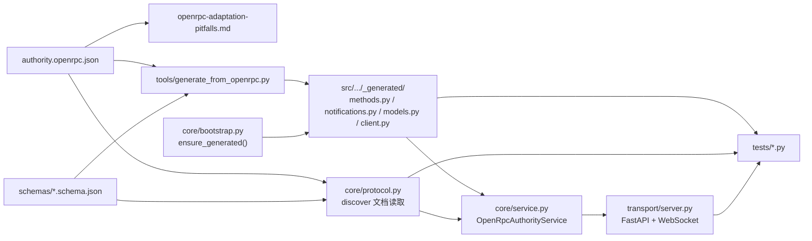
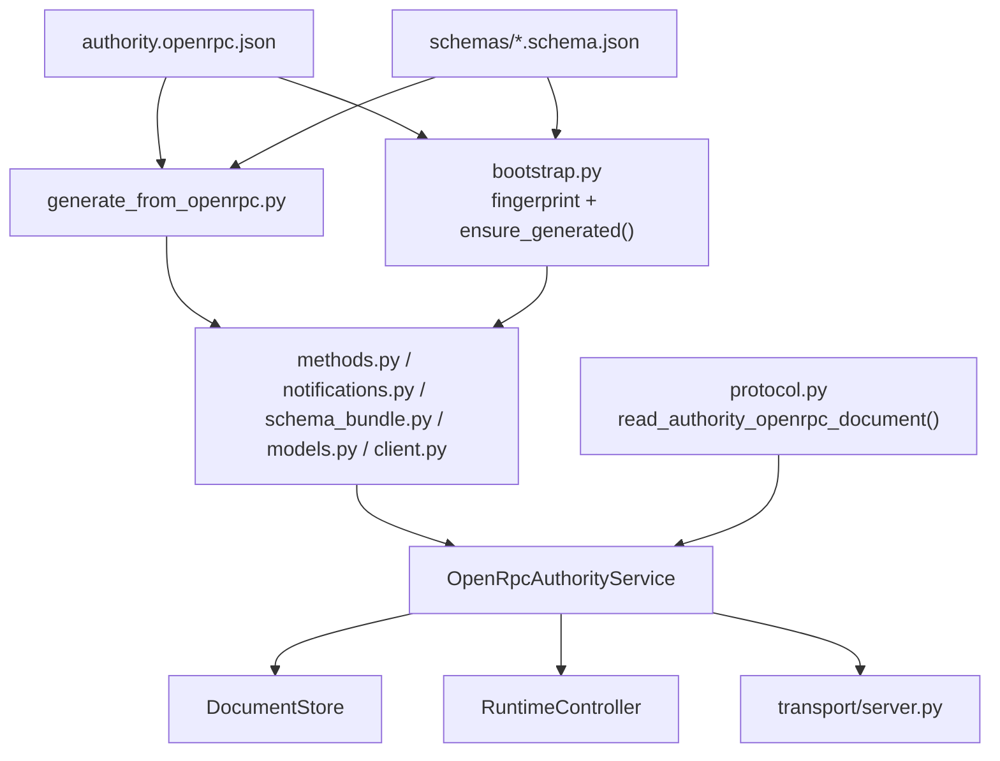
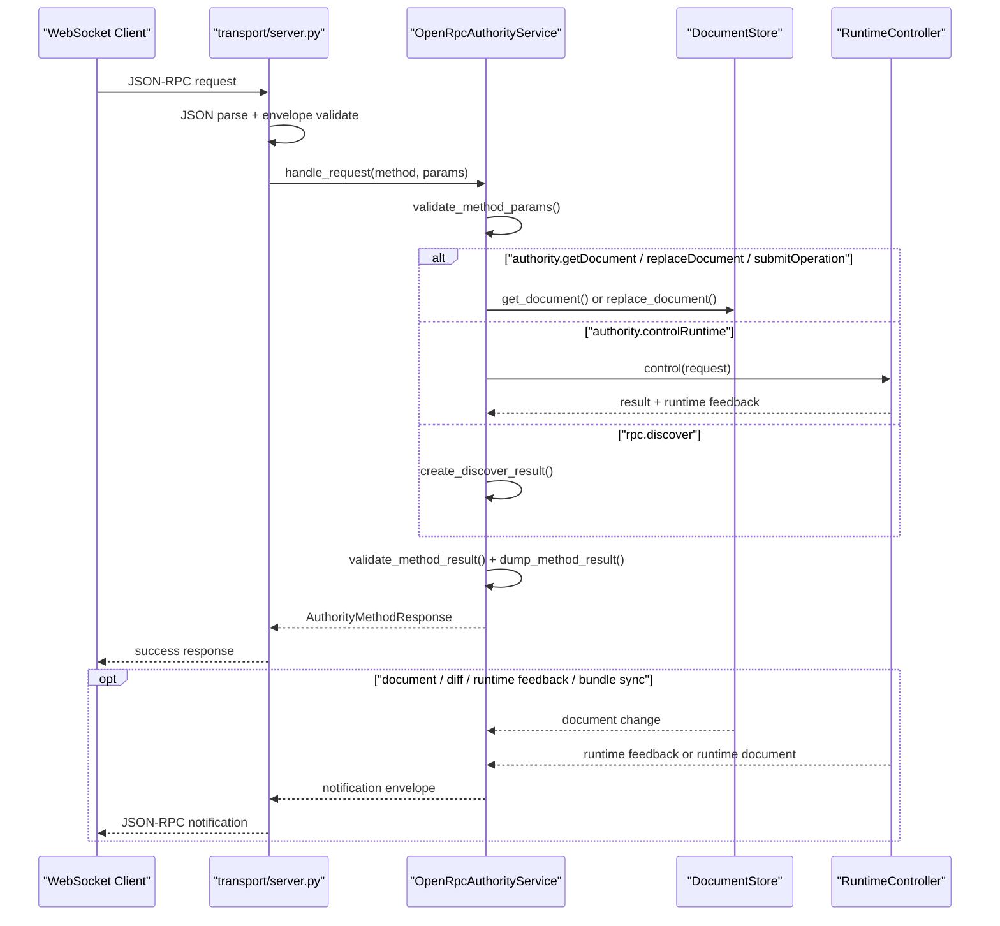
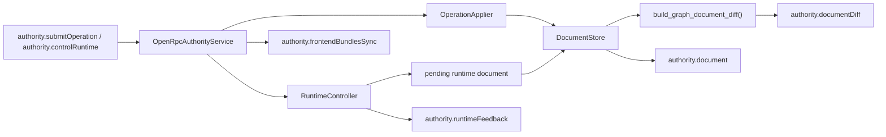

# `openrpc/` 与 Python 后端调用链说明

这份文档面向需要接入、维护或审计 LeaferGraph authority 协议的工程师。

它不讨论 editor UI 细节，也不把 Python 模板当成“黑盒服务”介绍，而是聚焦 3 件事：

1. 仓库根 `openrpc/` 里什么是真源，什么是派生产物。
2. Python OpenRPC backend 怎样从共享 OpenRPC 文档生成并消费 typed 模型。
3. 一个请求进入 `WS /authority` 后，如何流经 transport、service、runtime、document diff 与 notification 发射。

---

## OpenRPC 真源与目录骨架

仓库根 `openrpc/` 是 authority 协议的唯一真源目录。

```text
openrpc/
├─ authority.openrpc.json                  # 正式 OpenRPC 文档本体，method / notification 真源
├─ schemas/                                # 被 OpenRPC 文档通过 $ref 引用的共享 JSON Schema
│  ├─ graph_document.schema.json           # 权威图文档结构
│  ├─ graph_operation.schema.json          # 正式图操作联合
│  ├─ runtime_control_request.schema.json  # 运行控制请求联合
│  ├─ runtime_control_result.schema.json   # 运行控制结果与图级执行状态
│  ├─ runtime_feedback_event.schema.json   # 统一运行反馈事件联合
│  ├─ graph_document_diff.schema.json      # authority.documentDiff 的 diff 结构
│  └─ ...                                  # 其余复用子 schema
├─ README.md                               # 目录总入口与约束摘要
├─ openrpc-adaptation-pitfalls.md          # 适配踩雷清单与边界提醒
└─ ...                                     # conformance、参考文档与配套说明
```

当前路径契约固定为：

- 正式真源目录：`openrpc/`
- 环境变量覆盖：`LEAFERGRAPH_OPENRPC_ROOT`
- 变量语义：必须指向包含 `authority.openrpc.json`、`schemas/`、`conformance/` 的目录根
- 未设置时，Python 模板默认回退到仓库根 `openrpc/`
- 当前不再支持旧 `templates/backend/shared/openrpc` 路径

与之对应的 Python 消费端位于：

```text
templates/backend/python-openrpc-authority-template/
├─ tools/generate_from_openrpc.py
├─ src/leafergraph_python_openrpc_authority_template/
│  ├─ entry.py
│  ├─ __init__.py
│  ├─ core/
│  │  ├─ bootstrap.py
│  │  ├─ protocol.py
│  │  ├─ schema_runtime.py
│  │  ├─ jsonrpc.py
│  │  ├─ service.py
│  │  ├─ document_store.py
│  │  ├─ operation_applier.py
│  │  ├─ runtime_controller.py
│  │  ├─ frontend_bundles.py
│  │  └─ document_diff.py
│  ├─ transport/server.py
│  └─ _generated/                          # 由共享 OpenRPC 文档派生，不是手写真源
└─ tests/
```

### 目录边界

| 路径 | 身份 | 作用 |
| :--- | :--- | :--- |
| `authority.openrpc.json` | 真源 | 定义正式 methods、results、notifications 与 `$ref` 入口。 |
| `schemas/*.schema.json` | 真源 | 定义共享结构，供 OpenRPC 文档与跨语言实现复用。 |
| `openrpc-adaptation-pitfalls.md` | 说明文档 | 记录适配这套协议时最容易踩雷的边界。 |
| `tools/generate_from_openrpc.py` | 生成器 | 把真源协议编译成 Python 常量、typed models 与 client。 |
| `src/.../_generated/*` | 派生产物 | 生成后的 methods、notifications、models、client 与 schema bundle。 |
| `core/*.py` / `transport/server.py` | Python 实现 | 使用真源和派生产物完成 JSON-RPC 分发、文档 authority、runtime 控制与通知发射。 |

### 高层关系图



---

## 当前正式契约清单

### 通道模型

当前 authority 暴露两条通道：

- `GET /health`
  只做健康检查，不属于 OpenRPC。
- `WS /authority`
  正式 authority 通道，固定走 JSON-RPC 2.0。

这意味着：

- `rpc.discover`、`authority.getDocument`、`authority.submitOperation`、`authority.replaceDocument`、`authority.controlRuntime` 都只存在于 `WS /authority` 上。
- `/health` 不能被当成 OpenRPC method，也不应被写进 OpenRPC methods 列表。

### 正式 methods 与 notifications

当前 `authority.openrpc.json` 中的正式契约如下。

| 契约名 | 类型 | Python 入口 | 返回或发射位置 |
| :--- | :--- | :--- | :--- |
| `rpc.discover` | method | `OpenRpcAuthorityService.handle_request()` | `core/protocol.py` 的 `create_discover_result()`，再由 `transport/server.py` 包成 success response。 |
| `authority.getDocument` | method | `OpenRpcAuthorityService.handle_request()` | `DocumentStore.get_document()` 的快照结果。 |
| `authority.submitOperation` | method | `OpenRpcAuthorityService.handle_request()` | `OperationApplier.apply()` 产出的 authority 确认结果，必要时附带新文档。 |
| `authority.replaceDocument` | method | `OpenRpcAuthorityService.handle_request()` | `DocumentStore.replace_document()` 与 `RuntimeController.replace_document()`。 |
| `authority.controlRuntime` | method | `OpenRpcAuthorityService.handle_request()` | `RuntimeController.control()` 的结果，并在安全边界 flush 挂起文档。 |
| `authority.document` | notification | `OpenRpcAuthorityService.create_document_notification()` | authority 完整文档推送。 |
| `authority.documentDiff` | notification | `OpenRpcAuthorityService.create_document_diff_notification()` | `transport/server.py` 在已有 baseline 时优先发 diff。 |
| `authority.runtimeFeedback` | notification | `OpenRpcAuthorityService.create_runtime_feedback_notification()` | runtime controller 回流的统一执行反馈。 |
| `authority.frontendBundlesSync` | notification | `OpenRpcAuthorityService.create_frontend_bundles_sync_notification()` | 前端 bundle 目录同步事件；默认模板发空目录 full snapshot。 |

`authority.documentDiff` 是当前真实契约的一部分。任何只写“3 条 notification”的说明，都会与现状不一致。

### 共享 schema 分组

| Schema | 语义职责 | Python 使用点 |
| :--- | :--- | :--- |
| `graph_document.schema.json` | authoritative `GraphDocument` 顶层结构 | `authority.getDocument` result、`authority.document`、`authority.replaceDocument`、`DocumentStore`、`RuntimeController`。 |
| `graph_operation.schema.json` | `authority.submitOperation` 的正式操作联合 | 生成后的 `AuthoritySubmitOperationParams`，以及 `OperationApplier` 的分支实现。 |
| `operation_context.schema.json` | 操作提交上下文 | `authority.submitOperation` params 的 `context` 部分。 |
| `replace_document_context.schema.json` | 整图替换上下文 | `authority.replaceDocument` params 的 `context` 部分。 |
| `runtime_control_request.schema.json` | `node.play / graph.play / graph.step / graph.stop` 请求联合 | `authority.controlRuntime` params。 |
| `runtime_control_result.schema.json` | 运行控制结果与图级执行状态快照 | `authority.controlRuntime` result。 |
| `runtime_feedback_event.schema.json` | 统一 runtime feedback 联合 | `authority.runtimeFeedback` 的 payload 校验与发射。 |
| `graph_document_diff.schema.json` | authority 增量文档 diff 结构 | `authority.documentDiff` payload。 |
| `frontend_bundles_sync_event.schema.json` | 前端 bundle 目录快照 / 增量事件 | `authority.frontendBundlesSync` payload。 |
| 其余 `graph_node_*` / `graph_link_*` / `capability_profile` / `adapter_binding` | 给上层 schema 拆分复用字段 | 由生成器装配进 `METHOD_SPECS`、`NOTIFICATION_SPECS` 与 typed models。 |

### 协议层错误码

`core/jsonrpc.py` 固定实现了标准 JSON-RPC 2.0 错误码映射：

| 名称 | code | 使用场景 |
| :--- | :--- | :--- |
| `parse_error` | `-32700` | 非法 JSON。 |
| `invalid_request` | `-32600` | envelope 不是合法 JSON-RPC request。 |
| `method_not_found` | `-32601` | method 不在 `ALL_AUTHORITY_METHODS` 中。 |
| `invalid_params` | `-32602` | 通过 generated model 校验失败。 |
| `internal_error` | `-32603` | service 或运行时内部未捕获异常。 |

业务拒绝不走这条错误通道，而是通过合法 `result` 返回 `accepted=false` 或 `changed=false`。

---

## Python 后端消费链

### 从真源到 `_generated`

Python 模板不是手写一套平行协议常量，而是显式依赖仓库根 `openrpc/` 与 `LEAFERGRAPH_OPENRPC_ROOT` 这套路径契约：

1. `entry.py` 与包根 `__init__.py` 在启动时先执行 `ensure_generated()`。
2. `core/bootstrap.py` 通过 `get_openrpc_path()` 读取 `authority.openrpc.json`；该路径先看 `LEAFERGRAPH_OPENRPC_ROOT`，未设置时回退到仓库根 `openrpc/authority.openrpc.json`。
3. `compute_openrpc_fingerprint()` 把下面 3 类输入一起算指纹：
   - `authority.openrpc.json`
   - `schemas/*.json`
   - `tools/generate_from_openrpc.py`
4. 若 `_generated/` 缺失或 `.fingerprint` 过期，`ensure_generated()` 会调用 `tools/generate_from_openrpc.py --write` 重生全部生成物。
5. service、transport、导出 client 与 tests 都统一依赖 `_generated/*`，而不是重写常量。

### 生成器职责

`tools/generate_from_openrpc.py` 当前做 5 件事：

| 生成物 | 来源 | 作用 |
| :--- | :--- | :--- |
| `methods.py` | OpenRPC `methods[]` | 生成 method 常量与 `ALL_AUTHORITY_METHODS`。 |
| `notifications.py` | OpenRPC `x-notifications[]` | 生成 notification 常量与 `ALL_AUTHORITY_NOTIFICATIONS`。 |
| `schema_bundle.py` | `schemas/*.json` + method / notification spec | 固化 schema bundle、method spec、notification spec。 |
| `models.py` | `schema_runtime.py` + `schema_bundle.py` | 生成 typed params/result/notification 模型入口与校验函数。 |
| `client.py` | methods + notifications + models | 生成 typed `AuthorityRpcClient`。 |

它只支持模板当前实际使用的 JSON Schema 子集，例如 `$ref`、`type`、`properties`、`required`、`enum`、`const`、`oneOf`、`anyOf`、`allOf`、`additionalProperties` 与常见长度 / 数值约束。遇到未知 schema 关键字会直接失败，而不是静默退化。

### 关键 Python 文件索引

| 文件 | 角色 | 依赖关系 |
| :--- | :--- | :--- |
| `entry.py` | 进程入口 | 先 `ensure_generated()`，再转给 `transport.server.main()`。 |
| `__init__.py` | 包对外导出 | 先 `ensure_generated()`，再导出 `AuthorityRpcClient`、`OpenRpcAuthorityService`、`create_authority_app` 等。 |
| `core/bootstrap.py` | 生成引导与指纹守卫 | 依赖共享 OpenRPC 真源、schema 目录和生成器脚本。 |
| `core/protocol.py` | discover 文档与 authority 常量 | 直接读取共享 OpenRPC 文档，`rpc.discover` 结果从这里返回。 |
| `core/schema_runtime.py` | 运行时 schema 编译器 | 把 schema bundle 编译成 Pydantic model / TypeAdapter。 |
| `core/jsonrpc.py` | JSON-RPC 2.0 envelope 与错误码 | 被 transport 和 generated client 共用。 |
| `core/service.py` | authority 编排核心 | 把 generated models、document store、operation applier、runtime controller 串起来。 |
| `core/document_store.py` | authoritative 文档真源 | 管 revision、比较内容变化、广播快照。 |
| `core/operation_applier.py` | 正式图操作执行器 | 实现当前支持的 9 个 `GraphOperation` 分支。 |
| `core/runtime_controller.py` | 最小运行时与反馈源 | 处理 `node.play` / `graph.play` / `graph.step` / `graph.stop`，发出 graph/node/link feedback。 |
| `core/document_diff.py` | 增量 diff 构造器 | 在 transport 层已有 baseline 时，把整图变化压缩成 `authority.documentDiff`。 |
| `core/frontend_bundles.py` | 前端 bundle catalog 提供者 | 默认返回空 `frontendBundles.sync` full snapshot。 |
| `transport/server.py` | FastAPI authority 服务 | 暴露 `/health` 与 `/authority`，负责 request 校验、response/error/notification 发包。 |
| `_generated/client.py` | typed 客户端 | 为测试与外部 Python 调用方提供 discover / getDocument / submitOperation / replaceDocument / controlRuntime。 |

### 消费链总图



---

## WebSocket 请求、响应与通知生命周期

### 请求进入 `WS /authority` 后会发生什么

1. `transport/server.py` 接收 WebSocket 文本帧。
2. 先 `json.loads()`；失败时回 `-32700`。
3. 再用 `JsonRpcRequestEnvelope.model_validate()` 校验 envelope；失败时回 `-32600`。
4. 通过 `_generated/methods.py` 的 `ALL_AUTHORITY_METHODS` 判断 method 是否已注册；否则回 `-32601`。
5. 进入 `OpenRpcAuthorityService.handle_request()`。
6. `handle_request()` 用 `_generated/models.py` 的 `validate_method_params()` 校验 params；失败时抛 `AuthorityInvalidParamsError`，由 transport 映射成 `-32602`。
7. service 根据 method 分派到 document / operation / runtime 路径。
8. 结果值再经 `validate_method_result()` 与 `dump_method_result()` 规范化。
9. `transport/server.py` 把结果包进 success envelope 发回客户端。

### 请求-响应-通知时序图



### transport 里与 notification 相关的关键逻辑

`transport/server.py` 不是简单“原样转发 notification”，而是额外做了 3 层行为收敛：

1. **首包 bundle snapshot**
   - 每个 WebSocket 连接建立后，都会先收到一条 `authority.frontendBundlesSync` full snapshot。
2. **baseline-aware 文档同步**
   - 服务端为每个连接分别维护 `queued_baseline_document` / `sent_baseline_document`。
   - 若连接已有 baseline，则优先尝试通过 `build_graph_document_diff()` 发送 `authority.documentDiff`。
   - 若不能 diff，例如 `documentId` 已变化，则回退成整图 `authority.document`。
3. **跳过同连接回声**
   - 如果变更来自当前连接，且 response 已经直接带回了新 document，transport 会跳过同连接的重复整图通知。

---

## 运行时与文档同步机制

### `OpenRpcAuthorityService` 的组合方式

`OpenRpcAuthorityService` 是 Python 模板里最关键的编排层，它把 4 个能力源组装到一起：

| 组件 | 默认实现 | 职责 |
| :--- | :--- | :--- |
| `DocumentStore` | `InMemoryDocumentStore` | authoritative `GraphDocument` 真源、revision 递增、快照订阅。 |
| `OperationApplier` | `OpenRpcOperationApplier` | 执行 `document.update`、`node.*`、`link.*` 图操作。 |
| `RuntimeController` | `InMemoryGraphRuntimeController` | 提供最小执行闭环，并产生 runtime feedback 与运行中文档变化。 |
| `FrontendBundleCatalogProvider` | `StaticFrontendBundleCatalogProvider` | 对外发出 `frontendBundles.sync` 快照。 |

### 为什么有“运行中暂存文档，再延后 flush”

service 层显式区分了两类文档变化影响：

- `structural`
  - 例如 `node.create`、`node.remove`、`link.create`、`link.reconnect`
  - 会影响图结构，通常直接替换 runtime 或停止当前运行。
- `live-safe`
  - 例如 `document.update`、`node.move`、`node.resize`、只改 `title/properties/widgets/data/flags` 的 `node.update`
  - 可以在运行中热应用。

当 runtime 处于 active 状态时，service 的行为不是“每次都立刻推整图”，而是：

1. runtime 的文档变化先进入 `_pending_runtime_document`。
2. runtime feedback 继续实时发送。
3. 等 graph execution 回到非 active 状态，再通过 `_flush_pending_runtime_document()` 把挂起文档落回 `DocumentStore` 并触发通知。

这样做的直接目的，是避免“运行反馈刚投影出来，整图 restore 又把它冲掉”。

### 文档与反馈流图



### `authority.documentDiff` 如何构造

`core/document_diff.py` 负责把两份文档的差异压缩成可重放的 diff：

- 先比较顶层 `appKind`、`meta`、`capabilityProfile`、`adapterBinding`，必要时生成 `document.update`。
- 再比较 nodes：
  - 节点新增 -> `node.create`
  - 节点删除 -> `node.remove`
  - 节点位置变化 -> `node.move`
  - 节点尺寸变化 -> `node.resize`
  - 部分值级变化 -> 进入 `fieldChanges`
  - 遇到不安全的结构变化，例如 `type` 变化，则直接声明 `can_diff=false`，要求整图同步。
- 最后比较 links：
  - 新增 / 删除 -> `link.create` / `link.remove`
  - 端点变化 -> `link.reconnect`
  - 非端点字段变化但端点不变 -> 回退成 remove + create

因此，`authority.documentDiff` 不是独立第二套协议，而是 authority 对共享 `GraphOperation` 的“增量投影”。

---

## 测试证据与真实调用场景

下面这几组 tests 共同构成了“共享 OpenRPC 真源已被 Python 端真实消费”的证据链。

| 测试文件 | 证明主题 | 它证明了什么 |
| :--- | :--- | :--- |
| `tests/test_openrpc_contract.py` | 契约一致性 | `authority.openrpc.json` 中的 methods / notifications 与 `_generated` 常量完全一致；`rpc.discover` 直接返回共享文档本体；生成器 `--check` 在干净工作树可通过。 |
| `tests/test_server.py` | transport 层行为 | `/health` 与 `/authority` 两条通道同时存在；WebSocket 首包会发送 `authority.frontendBundlesSync` full snapshot；标准错误码 `-32700/-32600/-32601/-32602/-32603` 都按预期工作；observer 连接能收到 `authority.documentDiff`。 |
| `tests/test_generated_client.py` | typed client round-trip | `_generated/client.py` 生成的 `AuthorityRpcClient` 可以真实连接 live authority，完成 discover、getDocument、replaceDocument、submitOperation、controlRuntime，并消费 document、document diff、runtime feedback、bundle sync。 |
| `tests/test_runtime.py` | runtime 行为与 service 协调 | service 在 replaceDocument、submitOperation、graph.step / graph.play / timer 场景下，能正确推进文档、revision、runtime feedback 与运行态文档同步。 |
| `tests/test_conformance_assets.py` | 共享 conformance 资产完整性 | `conformance/manifest.json` 中的场景 id 唯一、fixtures 全部存在、methods / notifications 与共享 OpenRPC 真源一致，并且 `Core` / `Advanced` 必需场景没有漏项。 |
| `tests/test_conformance_runner.py` | 跨语言 conformance 回放 | 使用共享 `conformance/manifest.json` 与 `fixtures/` 对 live authority 逐场景回放 `core` / `advanced` 断言；既可自动拉起 Python 参考模板，也可通过环境变量指向外部语言实现。 |

### 这些测试与文档章节的对应关系

| 文档问题 | 对应测试证据 |
| :--- | :--- |
| “谁是真源、谁是派生产物？” | `test_openrpc_contract.py` |
| “discover 是否直接返回共享文档？” | `test_openrpc_contract.py` |
| “WebSocket 通道是否按 JSON-RPC 2.0 正常工作？” | `test_server.py` |
| “document diff 与 frontend bundle snapshot 是否真的会发？” | `test_server.py`、`test_generated_client.py` |
| “typed client 是否真的吃到了 `_generated` 模型？” | `test_generated_client.py` |
| “runtime feedback 与文档 flush 机制是否跑得通？” | `test_generated_client.py`、`test_runtime.py` |
| “共享 conformance 资产有没有漂移或漏场景？” | `test_conformance_assets.py` |
| “这套协议能否按跨语言共享场景真正回放到 live authority？” | `test_conformance_runner.py` |

### 共享 conformance 资产如何被 Python 模板消费

跨语言 conformance 资产位于：

- `openrpc/CROSS_LANGUAGE_CONFORMANCE.md`
- `openrpc/conformance/manifest.json`
- `openrpc/conformance/fixtures/`

Python 模板通过下面两个测试入口直接消费这套共享资产：

- `tests/test_conformance_assets.py`
  把 `manifest.json` 当成机器可读真相来源，检查场景、fixture 和 OpenRPC 方法名是否对齐。
- `tests/test_conformance_runner.py`
  把 manifest 中的 `core` / `advanced` 场景真正打到 live authority 上，验证请求、响应、observer notification、runtime feedback 与 diff fallback 行为。

runner 默认行为如下：

- 若未设置 `LEAFERGRAPH_AUTHORITY_CONFORMANCE_HTTP_BASE_URL` 与 `LEAFERGRAPH_AUTHORITY_CONFORMANCE_WS_URL`，则自动拉起当前 Python 参考模板。
- 若同时设置了这两个环境变量，则把同一套共享场景打到外部 authority。
- `LEAFERGRAPH_AUTHORITY_CONFORMANCE_LEVEL` 可选值固定为 `core`、`advanced`、`all`，用于按层级裁剪回放范围。

当前推荐命令是：

```powershell
uv run pytest tests/test_conformance_assets.py
uv run pytest tests/test_conformance_runner.py
```

---

## 协议变更与维护规则

### 什么时候必须同步全链路

只要改了下面任一项，就不能只停在 OpenRPC 文档层：

- `authority.openrpc.json`
- `schemas/*.schema.json`
- `tools/generate_from_openrpc.py`

原因是 `core/bootstrap.py` 的指纹包含这三类输入，Python 模板会基于它们判断 `_generated/` 是否过期。

### 安全修改协议的顺序

1. 先改 `authority.openrpc.json` 与相关 `schemas/*.schema.json`。
2. 运行生成器，刷新 `_generated/`。
3. 检查 `methods.py`、`notifications.py`、`models.py` 是否与预期一致。
4. 检查 `core/service.py` 与 `transport/server.py` 是否已经支持新的 method / notification 语义。
5. 跑 `test_openrpc_contract.py`，确保 discover 与常量仍然对齐。
6. 跑 `test_server.py` 与 `test_generated_client.py`，确认 wire 行为与 typed client 没有脱节。
7. 若改动触及 runtime 或 diff，继续跑 `test_runtime.py`。

### 不应做的事

- 不要手改 `_generated/` 试图“快速修协议”。
- 不要让 `rpc.discover` 返回自定义 wrapper，而不是共享文档本体。
- 不要只改 Python 常量，不改 `authority.openrpc.json`。
- 不要把 `GET /health` 塞进 OpenRPC methods。
- 不要忘记 `authority.documentDiff` 已是当前正式 notification。

### 实施前后的静态检查清单

- `authority.openrpc.json` 中 methods 名 == `_generated/methods.py` 中 `ALL_AUTHORITY_METHODS`
- `authority.openrpc.json` 中 notifications 名 == `_generated/notifications.py` 中 `ALL_AUTHORITY_NOTIFICATIONS`
- `core/protocol.py` 的 `create_discover_result()` 返回共享文档本体
- `core/service.py` 使用的是 generated 校验入口，而不是手写散落常量
- `transport/server.py` 同时支持 full document 与 document diff 两条 authority 文档通知路径

---

## 结论

仓库根 `openrpc/` 不是“给 discover 展示的静态文档目录”，而是 LeaferGraph authority 协议的唯一真源。Python OpenRPC backend 则是这份真源的一个严格消费者：

- 启动时通过 `ensure_generated()` 追齐生成物。
- 请求进入 `/authority` 后，通过 generated model 校验 params/result。
- service 层把图文档、图操作、运行控制与通知发射统一收敛。
- transport 层再把整图、增量 diff、runtime feedback 和 bundle snapshot 安全送到连接端。

这就是为什么维护这套协议时，必须同时看 `openrpc/`、Python 实现、`_generated/` 和 tests，而不能只看其中任意一侧。
