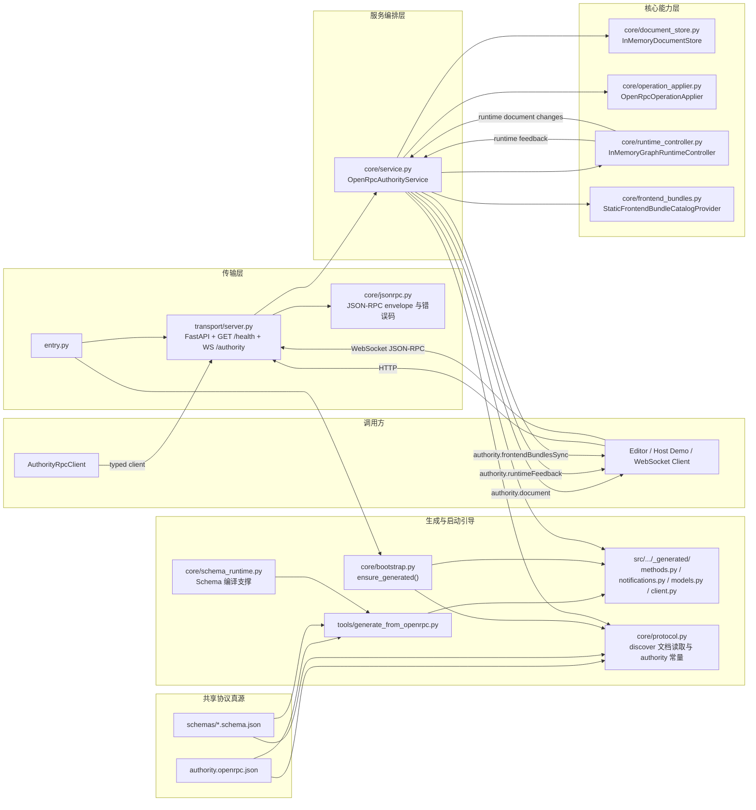

# Python OpenRPC Authority Template

这是一份“精简 OpenRPC authority 模板”。

它的目标不是复刻仓库里此前那套更重的完整 runtime 示例，而是提供一个更小、更干净的 OpenRPC-first 起点：

- authority 协议保持完整
- 默认提供文档 authority 与最小可执行运行时
- 复杂运行语义改成可注入扩展点

默认运行时当前只覆盖模板内建的最小节点执行闭环，不包含节点包目录扫描和 frontend bundle 热更新。

## 目录结构

```text
templates/backend/python-openrpc-authority-template/
  pyproject.toml
  README.md
  tools/
    generate_from_openrpc.py
  src/
    leafergraph_python_openrpc_authority_template/
      core/
        bootstrap.py
        document_store.py
        frontend_bundles.py
        jsonrpc.py
        operation_applier.py
        protocol.py
        runtime_controller.py
        schema_runtime.py
        service.py
      transport/
        server.py
      _generated/
        ...
      entry.py
      __init__.py
  tests/
```

## 架构概览



## 默认能力边界

默认模板内建 4 个最小角色：

- `InMemoryDocumentStore`
  持有权威 `GraphDocument`，管理 revision，并向订阅者广播文档变化。
- `OpenRpcOperationApplier`
  处理共享 OpenRPC 当前声明的 9 个 `GraphOperation` 分支。
- `InMemoryGraphRuntimeController`
  提供最小的 `node.play / graph.play / graph.step / graph.stop` 运行闭环，并把运行中产生的文档变化回写到 authority 文档真源。
- `OpenRpcAuthorityService`
  负责把 typed params/result、store、operation applier、runtime controller 串起来。

默认运行时当前内建这些节点类型：

- `system/on-play`
- `system/timer`
- `template/execute-counter`
- `template/execute-display`

默认不提供这些能力：

- 节点包目录扫描
- frontend bundle 热更新
- 通用节点包发现与自动装载

`authority.frontendBundlesSync` 默认仍会发送一条合法 full snapshot，只是 `packages` 为空数组。

## 协议约定

- `GET /health`：健康检查
- `WS /authority`：JSON-RPC 2.0 authority 通道
- `rpc.discover`：返回共享 OpenRPC 文档
- 共享真源：`openrpc/authority.openrpc.json`
- 协议说明：`openrpc/README.md`
- 跨语言 conformance：`openrpc/CROSS_LANGUAGE_CONFORMANCE.md`
- conformance 资产入口：`openrpc/conformance/README.md`
- 适配踩雷清单：`openrpc/openrpc-adaptation-pitfalls.md`
- 统一环境变量：`LEAFERGRAPH_OPENRPC_ROOT`
- 环境变量语义：必须指向包含 `authority.openrpc.json`、`schemas/`、`conformance/` 的目录根；未设置时默认回退到仓库根 `openrpc/`

固定 methods：

- `authority.getDocument`
- `authority.submitOperation`
- `authority.replaceDocument`
- `authority.controlRuntime`

固定 notifications：

- `authority.document`
- `authority.documentDiff`
- `authority.runtimeFeedback`
- `authority.frontendBundlesSync`

## 生成策略

- `tools/generate_from_openrpc.py` 是仓内自建轻量生成器。
- 输入只认共享 OpenRPC 文档及其 `$ref` schema。
- 生成物写到 `src/leafergraph_python_openrpc_authority_template/_generated/`。
- `_generated/` 是按需生成产物，不提交为手写源码真源。
- `entry.py`、包导出和测试都会先走 bootstrap；若 `_generated/` 缺失或过期，会自动重生。

生成器当前只支持仓库已使用的 schema 子集：

- `$ref`
- `type`
- `properties`
- `required`
- `enum`
- `const`
- `array`
- `additionalProperties`
- `oneOf`
- `anyOf`
- `allOf`
- 常见长度 / 数值约束

遇到未支持 schema 关键字会直接失败，不会静默降级成 `Any`。

## 命令

在模板目录执行：

```bash
uv sync
uv run python tools/generate_from_openrpc.py --write
uv run python tools/generate_from_openrpc.py --check
uv run pytest tests
uv run python -m leafergraph_python_openrpc_authority_template.entry
```

## Conformance 验收

共享 conformance 资产位于：

- `openrpc/CROSS_LANGUAGE_CONFORMANCE.md`
- `openrpc/conformance/manifest.json`
- `openrpc/conformance/fixtures/`

当前 Python 模板已经把自己作为这套共享资产的第一位参考消费者，推荐至少跑下面两组测试：

```powershell
uv run pytest tests/test_conformance_assets.py
uv run pytest tests/test_conformance_runner.py
```

如果你想只验证 `core` 层级，可以在可见 PowerShell 里这样执行：

```powershell
$env:LEAFERGRAPH_AUTHORITY_CONFORMANCE_LEVEL = "core"
uv run pytest tests/test_conformance_runner.py
Remove-Item Env:LEAFERGRAPH_AUTHORITY_CONFORMANCE_LEVEL
```

若要拿这套 runner 去验收外部语言后端，则额外设置：

- `LEAFERGRAPH_AUTHORITY_CONFORMANCE_HTTP_BASE_URL`
- `LEAFERGRAPH_AUTHORITY_CONFORMANCE_WS_URL`
- `LEAFERGRAPH_AUTHORITY_CONFORMANCE_LEVEL`

默认监听：

- `http://127.0.0.1:5503/health`
- `ws://127.0.0.1:5503/authority`

环境变量：

- `LEAFERGRAPH_PYTHON_OPENRPC_BACKEND_HOST`
- `LEAFERGRAPH_PYTHON_OPENRPC_BACKEND_PORT`
- `LEAFERGRAPH_PYTHON_OPENRPC_BACKEND_NAME`

## 需要改

- 初始文档内容
- 你的业务 `OperationApplier`
- 你的业务 `RuntimeController`
- 默认内建节点执行器
- frontend bundle catalog 来源
- authority 名称、日志前缀和部署参数

## 不要改

- `GET /health` 与 `WS /authority` 的稳定路径
- 仓库根 `openrpc/` 与 `LEAFERGRAPH_OPENRPC_ROOT` 这套统一路径契约
- JSON-RPC 2.0 基础 wire shape
- 正式 methods / notifications 命名
