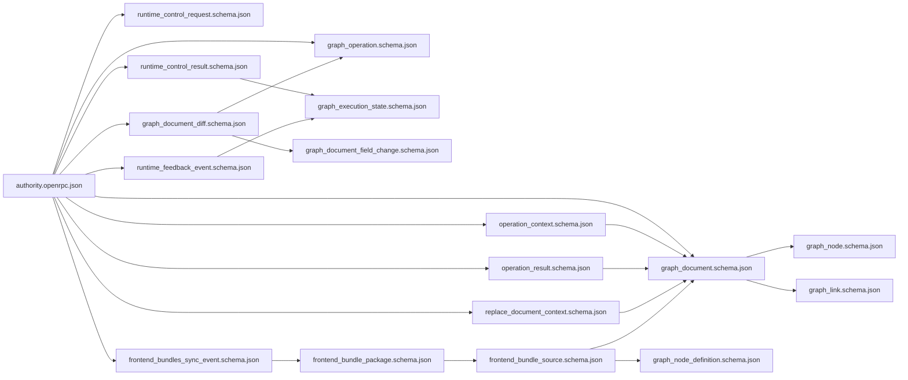

# `shared/openrpc` JSON 全量参考

这份文档专门解释 `templates/backend/shared/openrpc` 目录下的全部 `.json` 文件。

它回答 3 个问题：

1. 哪些文件是 authority 协议真源，哪些文件是被真源引用的拆分 schema。
2. 每个 JSON 文件负责描述什么结构、被谁消费、又依赖谁。
3. 这些 JSON 文件最终怎样落到 `authority.getDocument`、`authority.submitOperation`、`authority.replaceDocument`、`authority.controlRuntime` 和 4 条 notifications 上。

当前目录下共有 **31** 个 JSON 文件：

- 根协议文档：1 个
- `schemas/` 拆分 schema：30 个

---

## 目录骨架

```text
shared/openrpc/
├─ authority.openrpc.json                    # 唯一 OpenRPC 真源，声明 methods / notifications
└─ schemas/
   ├─ graph_document.schema.json             # authoritative GraphDocument
   ├─ graph_node.schema.json                 # 图中节点实例
   ├─ graph_link.schema.json                 # 图中连线实例
   ├─ graph_operation.schema.json            # submitOperation 的正式联合
   ├─ runtime_control_request.schema.json    # controlRuntime 请求联合
   ├─ runtime_feedback_event.schema.json     # runtimeFeedback 事件联合
   ├─ frontend_bundles_sync_event.schema.json# frontendBundlesSync 事件
   └─ ...                                    # 其余被根 schema 复用的原语与子结构
```

### 真源边界

- `authority.openrpc.json`
  是 authority 协议的根真源，定义正式 methods、results、notifications 与错误码语义入口。
- `schemas/*.schema.json`
  是被根真源通过 `$ref` 组织起来的拆分真源；它们不是派生产物，而是协议本身的一部分。
- `_generated/*`
  不在本目录里，也不是这份文档的主角；它们属于 Python / editor 等消费者对本目录真源的编译结果。

### 分组总览

| 分组 | 文件数 | 关注点 |
| :--- | ---: | :--- |
| 根协议文档 | 1 | methods / notifications / errors / `$ref` 总入口 |
| 文档与基础模型 | 3 | GraphDocument、本体能力画像、应用绑定 |
| node / link 原语 | 10 | 节点、连线及节点定义所需子结构 |
| operation / context / result | 6 | 图操作、上下文、authority 回执、增量 diff |
| runtime control / state / feedback | 8 | 运行控制、图级状态、4 类 runtime feedback |
| frontend bundle sync | 3 | 远端前端 bundle 目录同步 |

---

## 依赖关系图



## Method / Notification 消费图

```mermaid
flowchart TB
    mDiscover["rpc.discover"]
    mGetDoc["authority.getDocument"]
    mSubmit["authority.submitOperation"]
    mReplace["authority.replaceDocument"]
    mRuntime["authority.controlRuntime"]

    nDocument["authority.document"]
    nDiff["authority.documentDiff"]
    nRuntime["authority.runtimeFeedback"]
    nBundles["authority.frontendBundlesSync"]

    root["authority.openrpc.json"]
    graphDoc["graph_document.schema.json"]
    graphOp["graph_operation.schema.json"]
    opCtx["operation_context.schema.json"]
    opResult["operation_result.schema.json"]
    replaceCtx["replace_document_context.schema.json"]
    runtimeReq["runtime_control_request.schema.json"]
    runtimeResult["runtime_control_result.schema.json"]
    runtimeEvent["runtime_feedback_event.schema.json"]
    diffDoc["graph_document_diff.schema.json"]
    bundleEvent["frontend_bundles_sync_event.schema.json"]

    mDiscover --> root
    mGetDoc --> graphDoc
    mSubmit --> graphOp
    mSubmit --> opCtx
    mSubmit --> opResult
    mReplace --> graphDoc
    mReplace --> replaceCtx
    mRuntime --> runtimeReq
    mRuntime --> runtimeResult

    nDocument --> graphDoc
    nDiff --> diffDoc
    nRuntime --> runtimeEvent
    nBundles --> bundleEvent
```



---

## 根协议文档

| 文件 | 角色 | 顶层结构 | 关键字段 | 被谁引用 | 它引用谁 |
| :--- | :--- | :--- | :--- | :--- | :--- |
| `authority.openrpc.json` | authority 协议唯一根真源 | `OpenRPC 1.3.2` 文档对象 | `info`、`servers`、`methods`、`x-notifications`、标准 JSON-RPC errors | `rpc.discover` 直接返回它；Python 生成器、editor 生成器、协议常量与文档说明都以它为入口 | `graph_document`、`graph_operation`、`operation_context`、`operation_result`、`replace_document_context`、`runtime_control_request`、`runtime_control_result`、`runtime_feedback_event`、`graph_document_diff`、`frontend_bundles_sync_event` |

### 它怎样进入 method / notification

- `rpc.discover` 不返回某个业务 schema，而是直接返回这份根文档本体。
- 其余 4 个 methods 和 4 条 notifications 的 params / result 名称都在这里挂到具体 schema。
- 这也是外部实现判断“当前 authority 支持哪些能力”的唯一发现入口。

---

## 文档与基础模型

| 文件 | 角色 | 顶层结构 | 关键字段 | 被谁引用 | 它引用谁 |
| :--- | :--- | :--- | :--- | :--- | :--- |
| `graph_document.schema.json` | authoritative `GraphDocument` 顶层结构 | `object` | `documentId`、`revision`、`appKind`、`nodes`、`links`、`meta` | `authority.getDocument`、`authority.replaceDocument`、`authority.document`、`operation_context`、`operation_result`、`replace_document_context`、`frontend_bundle_source` | `adapter_binding`、`capability_profile`、`graph_node`、`graph_link` |
| `capability_profile.schema.json` | 描述 authority / adapter 的能力画像 | `object` | `id`、`features`、`data` | `graph_document`、`graph_operation` 的 `document.update` 分支 | 无 |
| `adapter_binding.schema.json` | 记录当前文档和外部应用或 adapter 的绑定信息 | `object` | `adapterId`、`appKind`、`schemaVersion`、`data` | `graph_document`、`graph_operation` 的 `document.update` 分支 | 无 |

### 这一组怎样被使用

- `authority.getDocument` 的 result 与 `authority.document` 的 payload 都直接是 `graph_document.schema.json`。
- `authority.replaceDocument` 同时在 params 和 result 上使用 `graph_document.schema.json`，配合 `replace_document_context.schema.json` 决定整图替换是否成立。
- `capability_profile` 与 `adapter_binding` 不单独暴露为 method，但它们是 `GraphDocument` 顶层稳定语义的一部分，允许 authority 把能力画像与应用绑定一起推给前端。

---

## Node / Link 原语

| 文件 | 角色 | 顶层结构 | 关键字段 | 被谁引用 | 它引用谁 |
| :--- | :--- | :--- | :--- | :--- | :--- |
| `graph_node.schema.json` | 图中节点实例 | `object` | `id`、`type`、`title`、`layout`、`properties`、`inputs` | `graph_document` | `graph_node_layout`、`graph_node_flags`、`graph_node_property_spec`、`graph_node_slot_spec`、`graph_node_widget_spec` |
| `graph_node_layout.schema.json` | 节点位置与尺寸 | `object` | `x`、`y`、`width`、`height` | `graph_node` | 无 |
| `graph_node_flags.schema.json` | 节点交互状态标记 | `object` | `collapsed`、`pinned`、`disabled`、`selected` | `graph_node`、`graph_operation` 的 `node.create` / `node.update` | 无 |
| `graph_node_property_spec.schema.json` | 节点 property 的声明信息 | `object` | `name`、`type`、`default`、`options`、`widget` | `graph_node`、`graph_node_definition`、`graph_operation` | `graph_node_widget_spec` |
| `graph_node_slot_spec.schema.json` | 节点输入输出槽位声明 | `object` | `name`、`type`、`label`、`optional`、`color`、`shape` | `graph_node`、`graph_node_definition`、`graph_operation` | 无 |
| `graph_node_widget_spec.schema.json` | 节点 widget 运行形态 | `object` | `type`、`name`、`value`、`options` | `graph_node`、`graph_node_definition`、`graph_node_property_spec`、`graph_document_field_change`、`graph_operation` | 无 |
| `graph_node_resize.schema.json` | 节点定义级的 resize 能力配置 | `object` | `enabled`、`lockRatio`、`minWidth`、`minHeight`、`maxWidth`、`maxHeight` | `graph_node_definition` | 无 |
| `graph_node_definition.schema.json` | 供 bundle 暴露的节点定义模板 | `object` | `type`、`title`、`category`、`description`、`inputs`、`outputs` | `frontend_bundle_source` 的 `node-json` 分支 | `graph_node_property_spec`、`graph_node_resize`、`graph_node_slot_spec`、`graph_node_widget_spec` |
| `graph_link.schema.json` | 图中正式连线实例 | `object` | `id`、`source`、`target`、`label`、`data` | `graph_document` | `graph_link_endpoint` |
| `graph_link_endpoint.schema.json` | 连线端点位置 | `object` | `nodeId`、`slot` | `graph_link`、`graph_operation` 的 `link.create` / `link.reconnect` | 无 |

### 这一组怎样被使用

- `authority.getDocument`、`authority.replaceDocument`、`authority.document` 最终都通过 `graph_document -> graph_node / graph_link` 把节点图本体发出去。
- `graph_node_definition.schema.json` 不属于运行中文档，而是前端 bundle catalog 的一部分；它只会通过 `authority.frontendBundlesSync` 间接出现。
- `graph_node_widget_spec` 同时存在于节点定义、节点实例和 diff 字段变更里，是“定义时声明”和“运行时值变化”之间的桥。

---

## Operation / Context / Result

| 文件 | 角色 | 顶层结构 | 关键字段 | 被谁引用 | 它引用谁 |
| :--- | :--- | :--- | :--- | :--- | :--- |
| `graph_operation.schema.json` | 正式 `GraphOperation` 联合 | `oneOf` | `document.update`、`node.create`、`node.update`、`node.move`、`node.resize`、`node.remove`、`link.create`、`link.reconnect`、`link.remove` | `authority.submitOperation`、`graph_document_diff` | `capability_profile`、`adapter_binding`、`graph_link_endpoint`、`graph_node_flags`、`graph_node_property_spec`、`graph_node_slot_spec`、`graph_node_widget_spec` |
| `operation_context.schema.json` | submitOperation 的上下文 | `object` | `currentDocument`、`pendingOperationIds` | `authority.submitOperation` | `graph_document` |
| `operation_result.schema.json` | submitOperation 的 authority 回执 | `object` | `accepted`、`changed`、`revision`、`reason`、`document` | `authority.submitOperation` | `graph_document` |
| `replace_document_context.schema.json` | replaceDocument 的上下文 | `object` | `currentDocument` | `authority.replaceDocument` | `graph_document` |
| `graph_document_diff.schema.json` | authority 文档增量 diff | `object` | `documentId`、`baseRevision`、`revision`、`emittedAt`、`operations`、`fieldChanges` | `authority.documentDiff` | `graph_operation`、`graph_document_field_change` |
| `graph_document_field_change.schema.json` | 文档 diff 中“值级变更”联合 | `oneOf` | `node.title.set`、`node.property.set`、`node.property.unset`、`node.data.set`、`node.data.unset`、`node.flag.set`、`node.widget.value.set`、`node.widget.replace`、`node.widget.remove` | `graph_document_diff` | `graph_node_widget_spec` |

### 这一组怎样被使用

- `authority.submitOperation` 通过 `graph_operation + operation_context -> operation_result` 构成完整一次 authority 操作往返。
- `authority.replaceDocument` 不走 `graph_operation`，而是用 `replace_document_context` 把整图替换与当前 baseline 对齐起来。
- `authority.documentDiff` 不是第二套独立操作系统，而是把正式 `GraphOperation` 和少量值级 `fieldChanges` 组合成增量同步包。

---

## Runtime Control / State / Feedback

| 文件 | 角色 | 顶层结构 | 关键字段 | 被谁引用 | 它引用谁 |
| :--- | :--- | :--- | :--- | :--- | :--- |
| `runtime_control_request.schema.json` | runtime 控制请求联合 | `oneOf` | `node.play`、`graph.play`、`graph.step`、`graph.stop` | `authority.controlRuntime` params | 无 |
| `runtime_control_result.schema.json` | runtime 控制结果 | `object` | `accepted`、`changed`、`reason`、`state` | `authority.controlRuntime` result | `graph_execution_state` |
| `graph_execution_state.schema.json` | 图级执行状态快照 | `object` | `status`、`runId`、`queueSize`、`stepCount`、`startedAt`、`stoppedAt` | `runtime_control_result`、`runtime_feedback_graph_execution_event` | 无 |
| `runtime_feedback_event.schema.json` | 统一 runtime feedback 联合 | `oneOf` | `graph.execution`、`node.execution`、`node.state`、`link.propagation` | `authority.runtimeFeedback` | `runtime_feedback_graph_execution_event`、`runtime_feedback_node_execution_event`、`runtime_feedback_node_state_event`、`runtime_feedback_link_propagation_event` |
| `runtime_feedback_graph_execution_event.schema.json` | 图级执行事件 | `object` | `event.type`、`event.state`、`runId`、`source`、`nodeId`、`timestamp` | `runtime_feedback_event` | `graph_execution_state` |
| `runtime_feedback_node_execution_event.schema.json` | 节点执行链事件 | `object` | `chainId`、`rootNodeId`、`nodeId`、`sequence`、`executionContext`、`state` | `runtime_feedback_event` | 无 |
| `runtime_feedback_node_state_event.schema.json` | 节点状态变化事件 | `object` | `nodeId`、`state.status`、`runCount`、`lastErrorMessage` | `runtime_feedback_event` | 无 |
| `runtime_feedback_link_propagation_event.schema.json` | 链路传播事件 | `object` | `linkId`、`chainId`、`sourceNodeId`、`sourceSlot`、`targetNodeId`、`targetSlot`、`payload` | `runtime_feedback_event` | 无 |

### 这一组怎样被使用

- `authority.controlRuntime` 只负责同步 request / result 往返；它不承载持续事件流。
- 真正的持续运行反馈全部走 `authority.runtimeFeedback`，并统一收敛到 `runtime_feedback_event.schema.json` 的 4 个分支。
- `graph_execution_state` 既是同步 result 的状态快照，也是 `graph.execution` feedback 里的状态骨架，因此是控制流与事件流的共享模型。

---

## Frontend Bundle Sync

| 文件 | 角色 | 顶层结构 | 关键字段 | 被谁引用 | 它引用谁 |
| :--- | :--- | :--- | :--- | :--- | :--- |
| `frontend_bundles_sync_event.schema.json` | 远端前端 bundle 目录同步事件 | `object` | `type`、`mode`、`packages`、`removedPackageIds`、`emittedAt` | `authority.frontendBundlesSync` | `frontend_bundle_package` |
| `frontend_bundle_package.schema.json` | 一个 bundle 包的聚合描述 | `object` | `packageId`、`version`、`nodeTypes`、`bundles` | `frontend_bundles_sync_event` | `frontend_bundle_source` |
| `frontend_bundle_source.schema.json` | 单个 bundle 源条目联合 | `oneOf` | `format=script`、`format=node-json`、`format=demo-json` | `frontend_bundle_package` | `graph_node_definition`、`graph_document` |

### 这一组怎样被使用

- `authority.frontendBundlesSync` 是这组 schema 的唯一正式出口。
- `frontend_bundle_source` 同时支持 3 类来源：
  - `script`
  - `node-json`
  - `demo-json`
- 其中 `node-json` 复用 `graph_node_definition.schema.json`，`demo-json` 复用 `graph_document.schema.json`，这就是 bundle catalog 和主图文档之间的连接点。

---

## 稳定字段与扩展口

### 已经稳定的协议骨架

- method 名与 notification 名
- `GraphDocument` 顶层的 `documentId / revision / appKind / nodes / links`
- `GraphOperation` 的 `type` 判别字段和各 operation 的最小必填骨架
- runtime control 的 `type`
- graph execution state 的 `status / queueSize / stepCount`
- bundle sync 的 `type / mode / packages / removedPackageIds`

### 故意保留宽松表达的扩展口

- `graph_document.meta`
- `capability_profile.data`
- `adapter_binding.data`
- `graph_node.properties`
- `graph_node.data`
- `graph_node_widget_spec.options`
- `graph_node_property_spec.options`
- `runtime_feedback_link_propagation_event.event.payload`
- `runtime_feedback_node_execution_event.event.executionContext.payload`

这些字段的“宽松”是协议设计选择，不代表 schema 漏建模。它们的作用是让 authority、adapter、editor 和 runtime 能保留跨语言扩展空间，而不会频繁打断主协议骨架。

---

## 读图顺序建议

如果你第一次接触这套协议，建议按下面顺序阅读：

1. `authority.openrpc.json`
2. `graph_document.schema.json`
3. `graph_operation.schema.json`
4. `runtime_control_request.schema.json`
5. `runtime_feedback_event.schema.json`
6. `frontend_bundles_sync_event.schema.json`

然后再回头看 node / link / widget / bundle 等子 schema，会更容易把它们放到正确的语义位置上。
